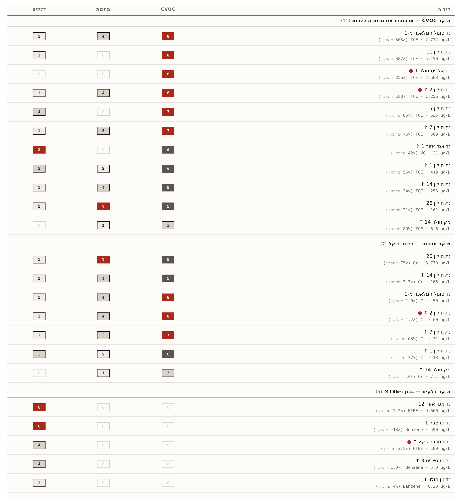

# דוח ניטור איכות מי תהום — אזור התעשייה חולון
## גרסה 4 | מאי 2026

---

## 1. תקציר מנהלים

אזור התעשייה חולון, שהוקם בשנות החמישים על שטח של 3,077 דונם בצפון-מזרח העיר, נושא עומס מורש כבד של זיהום מי תהום מתעשיות ציפוי המתכות והדלק שפעלו בו במשך עשורים. הסקירה הנוכחית בוחנת **25 קידוחי ALERT** המתועדפים מתוך **80 קידוחי ניטור פעילים** ב-5 השנים האחרונות (27 קידוחי ניטור כללי + 53 קידוחי ניטור דלק; המאגר ההיסטורי כולל 111 קידוחים, חלקם מבוטלים), המכילים ריכוזים חורגים מתקן מי שתייה ו/או מגמות עלייה מובהקות.

**ארבעה מוקדי זיהום פעילים — תמונת מצב 2022–2026:**

1. **CVOC (ממסים אורגניים מוכלרים) — מרכז ודרום-מזרח האזור**
   - **חומרה**: אינדקס 8 (מקסימום)
   - **מזהמים עיקריים**: TCE, PCE, vinyl chloride
   - **מגמה**: ריכוזים גבוהים מאוד (עד 68 מאות פעמים התקן) המשתנים בין קידוחים. בקידוחים מסוימים (חולון 11) ירידה מתמשכת מ-2012; בקידוחים אחרים (סונול המלאכה) ריכוזים גבוהים לאחר מחזורי שיקום שדווחו כ"מלאים" — ממצא המצביע על מקור DNAPL בעומק שלא הוסר.

2. **דלקים (בנזן, MTBE) — אזור הצפון, מתחם אגד**
   - **חומרה**: אינדקס 8 (מקסימום)
   - **מזהמים עיקריים**: בנזן, MTBE, טולואן
   - **מגמה**: 19 קידוחי ניטור במתחם חנייה של אגד מציגים ריכוזים חמורים (עד 85,000% מהתקן). רוב הקידוחים בעלי מגמה יורדת במהלך 2022–2025; קידוח אחד (אגד-12) מציג מגמה עולה מובהקת. הדפוס עקבי עם דליפה מתמשכת ממערכת אחסון דלק תת-קרקעית.

3. **כרום (Cr) — אזור המזרח ודרום-מזרח**
   - **חומרה**: אינדקס 7–8 בקידוחים נבחרים
   - **מזהמים עיקריים**: כרום (עד 8,072% מהתקן בקידוח חולון-26)
   - **מגמה**: שני קידוחים מציגים ריכוזים ומגמות בעיסה. קידוח חולון-26 עם שני דיגומים בלבד בתקופה 2022–2023; קידוח חולון-14 בעל מגמה עלייה סטטיסטית-מובהקת לאורך שנים, עם פוטנציאל הגעה למקורות מי שתייה במהלך 2027+.

4. **TCE במורד הזרם — גישה לקידוח הפקה**
   - **חומרה**: אינדקס 4 (בינוני), אך משמעות רגולטורית גבוהה
   - **מזהמים עיקריים**: TCE (88.5% מהתקן)
   - **מגמה**: ריכוז בקידוח הפקה מק חולון 14 עם מגמות עלייה בפרמטרים נעני-מערכת (ארסן, סידן, מגנזיום). טרם חציה את התקן אך הקרבה מוזעקת.

**הסיפור העדכני**: מאז דוח רשות המים 2021, קידוחים חדשים חשפו היקף זיהום בחלק המזרחי שלא תועד קודם (חולון 21–26). בנוסף, **שני קידוחי מפתח הפסיקו ניטור** — חולון-2 (CVOC + METALS, מ-2022) ונד המרכבה ק2 (FUEL, מ-2021) — מה שמצמצם את היכולת להעריך מגמות נוכחיות בשני מוקדים קריטיים. הדוח זה מציע עדיפויות ניטור עדכניות ובירורים הנדסיים על מצב השיקום בתדירגן.

---

## 2. ההקשר הגיאוגרפי-תעשייתי

אזור התעשייה חולון משתרע על 3,077 דונם בצפון-מזרח העיר חולון (דוח רשות המים 2021, עמ' 30). הוא הוקם בשנות החמישים סביב תעשיות הציפוי, הטקסטיל והאלקטרוניקה, ובשנים שלפני הקמת מערכת הביוב המוסדרת — עד שנות השבעים — שפכי המפעלים הוזרמו לקרקע דרך תעלות עפר, בורות ספיגה ותיעול גלוי. סקר חולון-בת ים 2007 (תה"ל, עמ' 21) חישב כי מפעלי ציפוי טיפוסיים צרכו 500–2,500 ק"ג TCE לשנה, מתוכם 100–500 ק"ג הוזרמו ישירות לשפכים.

**איור 1**: מפת אזור התעשייה חולון — 25 קידוחי ALERT צבועים לפי רמת חומרה, מפעלי ציפוי היסטוריים (משולשים), מתחמי דלק (ריבועים), כיוון זרימת מי תהום (דרום-מערב).

הסקר ההיסטורי 2007 (תה"ל, עמ' 74) זיהה 12 מתחמי תעשייה בחולון עם פוטנציאל זיהום מוגבר (ניקוד > 2.5): כור מתכת, תדירגן (המלאכה), תרשיש (היוצר/הסולל), אלגונל (הפטיש), אמקור פליז (הפלד), בהק (הכישור), תדיראן קשר (השופטים), לודג'יה (המנור), ארקר (עקיבא), תעשיות ברגים (בצלאל), המגדר (תמנע) ונצח גונן (הנפח). דוח אקולוג 2012 (חלק 1, עמ' 3) הרחיב לרשימה של 16 מפעלים גדולים שנכללו במודל ההסעה. כמעט כל המפעלים הגדולים נסגרו עד תחילת שנות ה-2000 (דוח 2021, עמ' 30: "כמעט כל המפעלים שזיהמו את הקרקע והמים נסגרו לפני עשרות שנים").

**ההקשר ההידרוגיאולוגי** (לפי דוח רשות המים 2021, עמ' 30–32): כיוון הזרימה הראשי הוא **דרום-מערב** מאזור התעשייה לכיוון הים, מושפע משקע הידרולוגי אבסולוטי שנוצר במערב (בסביבת בת ים). מפלס המים בעומק כ-40 מ' מפני הקרקע. אקוויפר החוף החולי מאפשר ירידה משמעותית של DNAPL (TCE, PCE) לעומק, כך שתרכובות מוכלרות מתועדות בעיקר במים הרדודים (עד 10 מ' מתחת לפני המים) במרכז ובצפון, ובעומק 30–40 מ' בקידוחים מסוימים בדרום-מזרח (נת חולון 5, 6, 7).

**תכניות הסעה — ניבויים היסטוריים וסטטוס נוכחי**: דוח אקולוג 2012 (חלק 2, עמ' 31–32) צפה בתרחיש "עסקים כרגיל" שהצביע על התקדמות פלומה מערבה לשכונות סמוכות (נווה ארזים, נאות יהודית) בתקופת 2012–2030. **נכון ל-2025–2026, ניבוי זה אינו מאומת על ידי נתוני הניטור הנוכחיים**: קידוח הפקה מק חולון 14 (הקרוב ביותר לתחום השדה המוזכר) מציג TCE 6.64 מקג"ל (88.5% מהתקן) — קרוב להתרעה אך טרם חוצה. מעבר לכך, מגמות מערכתיות (As, Ca, Mg, NO3) בעלייה סטטיסטית בקידוח זה עלולות להעיד על גישת חזית פלומה. הדוח 2021 (עמ' 31) העיר כי הניטור בקידוח המרכבה ק2 (קרוב יותר מעלה הזרם) הופסק בחרוץ 2021 ולא ניתן לעמת מגמות. **בהעדר ניטור עדכני בקידוחי דאונגרדיינט מרכזיים, לא ניתן להכריע האם התקדמות הפלומה מתקיימת כמו שצפה או הוחסמה על ידי שיקומים/שינויים בשדה הזרימה**.

---

## 3. מתודולוגיה

**מקור הנתונים**: ~2,672 מדידות מ-25 קידוחי ALERT, מסוננות לארבע משפחות מזהמים (INDUSTRY, FUEL, METALS, PFAS), 2010–2026. פרמטרים שאינם מזהמים תעשייתיים (pH, EC, אלקליניות, סידן, כלוריד, עכירות, טמפרטורה, רדיואקטיביות, אגרגטים של PFAS) סוננו מקדימה כדי למקד את הניתוח.

**מדד החומרה (severity_index 2025)**: לכל זוג (קידוח, משפחת מזהמים) חושב מקסימום הריכוז מאז 2018, מחולק בתקן מי שתייה (DWS), והומר ל-אינדקס 0–8 לפי נוסחת דוח רשות המים 2021. שלוש המשפחות INDUSTRY (CVOC, 1,4-דיאוקסן), FUEL (BTEX, MTBE) ו-METALS (Cr, Ni, As, Cd, Pb) **תואמות לנוסחה המקורית** וניתן להשוותן לטבלה 13 בדוח 2021. **משפחת PFAS** היא **הרחבה מתודולוגית** מעבר לדוח 2021 (`is_2021_methodology=False`); חולון מציג ערכי PFAS שוליים בלבד (max אינדקס 0 בארבעה קידוחים שנדגמו), והעדפת מצוקת PFAS לעומת מקרי דחיפות בולטים יותר (CVOC, FUEL) משאירה את ה-PFAS בגדר ניטור פסיבי.

**ניתוח מגמות (Mann-Kendall)**: מנוע MK עם תיקון תיקו לוואריאנס, תיקון רציפות ל-Z, וסינון SNR ≥ 0.3, סף ל-soft-trigger בגודל 2 מדידות עוקבות. חלון ראשי: 5 שנים. במקרים בהם n5 < 5 (פחות מ-5 מדידות בחלון 5 השנים), חזרה לחלון "full record" — אך הפרשנות במקרה זה מסויגת.

**הגדרת ALERT**: קידוח עומד בקריטריון אם (א) יש לו מגמה INCREASING שחצתה את תקן מי שתייה, או (ב) ערך severity_index 2025 family אינדקס ≥ 7. אותרו 25 קידוחי ALERT.

**פערי ניטור**: ~1,030 מתוך ~1,521 זוגות (קידוח, מזהם) בארבע המשפחות הרלוונטיות ללא מדידה ב-2024 ואילך (~68% מהמטריצה). שני קידוחים קריטיים הפסיקו ניטור:

| קידוח | מזהם עיקרי | ריכוז אחרון | תאריך אחרון | משך הפסקה |
|---|---|---:|---|---|
| נת חולון 2 | TCE + METALS | 1,256 + 60.4 מקג"ל | 2022-06-08 | 4 שנים |
| נד המרכבה ק2 | MTBE | 309 מקג"ל | 2021-03-16 | 5 שנים |

הקידוחים הללו היו עדים למגמות עלייה סטטיסטית-מובהקת (TCE: Z=2.13, p=0.034; MTBE: Z=2.60, p=0.009) — חידוש הניטור דחוף להערכת מצב נוכחי.

---

## 4. סקירה סטטיסטית כללית — מסגרת ניטור 2021–2026

מערכת הניטור באזור התעשייה חולון לזיהומים תעשייתיים בתקופה 2021–2026 כוללת **27 קידוחים** שנבדקו לפרמטרים תעשייתיים (CVOC, מתכות, PFAS) — זוהי **המסגרת הבסיסית** של הדוח. בנוסף נדגמו **53 קידוחים** לזיהומי דלק בלבד (BTEX, MTBE) ליד תחנות דלק וחניוני אוטובוסים — ניתוח משלים שמובא בנפרד בסוף הסעיף. סקירת חומרת הזיהום (מקסימום על פני פרמטרים תעשייתיים בקידוח) מציגה: **3 קידוחים (11%) בחומרה גבוהה מאוד (אינדקס 8); 6 קידוחים (22%) בחומרה גבוהה (אינדקס 6–7); 13 קידוחים (48%) בחומרה בינונית (אינדקס 4–5); 5 קידוחים (19%) בחומרה נמוכה (אינדקס 1–3)**. אין קידוח באינדקס 0. הסיווג מבוסס על **אינדקס חומרה** (0–8) המשקלל ריכוזים בהשוואה לתקן מי השתייה, ומקובץ ל-5 דרגות: נקי / נמוך / בינוני / גבוה / גבוה מאוד.

**איור 2**: לוח מוקדים — קידוח מוביל בכל משפחת זיהום (CVOC · METALS · FUEL) עם ריכוז מקסימלי ויחס לתקן מי שתייה. הלוח מסכם את הקידוחים הקריטיים ביותר באזה"ת חולון.

### 4.1 התפלגות חומרה (27 קידוחי ניטור כללי)

| דרגת חומרה | אינדקס | מספר קידוחים | אחוז | פרשנות |
|-------------|--------|--------------|------|----------|
| **גבוה מאוד** | 8 | 3 | 11% | חוצה תקן בפי 10+ |
| **גבוה** | 6–7 | 6 | 22% | חוצה תקן בפי 1.5–10 |
| **בינוני** | 4–5 | 13 | 48% | בסביבת התקן או חוצה במעט |
| **נמוך** | 1–3 | 5 | 19% | מתחת לתקן |
| **נקי** | 0 | 0 | 0% | מתחת לסף זיהוי |
| **סה"כ** | | **27** | 100% | |

**מסקנה**: 9 קידוחים (33%) בחומרה גבוהה או גבוהה מאוד (אינדקס ≥ 6); 13 קידוחים (48%) בחומרה בינונית (אינדקס 4–5); 5 קידוחים (19%) בחומרה נמוכה. התפלגות זו משקפת בחירת קידוחים בנקודות חשודות בזיהום (קרוב למוקדי תעשייה ו-CVOC) — אינה נציג של התפלגות הזיהום בשטח אזור התעשייה כולו.

### 4.2 מוכלרים תעשייתיים (CVOC) — ליבת הדוח

**מוכלרים תעשייתיים (CVOC)** הם מוקד מרכזי של הזיהום באזור התעשייה. ב-27 קידוחי הניטור הכללי נבדקה משפחת ה-CVOC המלאה. **טריכלורואתילן (TCE), מסרטן IARC Group 1, חצה את תקן מי השתייה ב-78% מהקידוחים שנבדקו (21 מתוך 27); ריכוז מקסימלי 5,149 µg/L לעומת תקן של 7.5 µg/L** — פי 687 מהתקן. **1,4-דיאוקסן** חצה תקן ב-43% מהקידוחים (9 מתוך 21) עם ריכוז מקסימלי של 1,036 µg/L לעומת תקן של 3 µg/L (פי 345). **Vinyl Chloride**, תוצר פירוק של TCE ו-PCE, זוהה ב-15% מהקידוחים — דורש המשך מעקב משום שמייצג פירוק אנאירובי פעיל של הפלומה.

| פרמטר | קידוחים שנמדדו | תקן [µg/L] | קידוחים חוצים תקן | % חוצים | max [µg/L] |
|--------|-----------------|-----------|-------------------|---------|-----------|
| **TCE** | 27 | 7.5 | **21** | **78%** | 5,149 |
| **1,1-DCE** | 27 | 10 | 12 | 44% | 272 |
| **1,4-Dioxane** | 21 | 3 | 9 | 43% | 1,036 |
| **PCE** | 27 | 10 | 10 | 37% | 498 |
| **Vinyl Chloride** | 27 | 0.5 | 4 | 15% | 13.8 |
| cis-1,2-DCE | 27 | 50 | 2 | 7% | 177 |
| Chloroform | 27 | 80 | 2 | 7% | 287 |
| trans-1,2-DCE | 27 | 50 | 0 | 0% | 1.4 |
| 1,2-DCA | 27 | 4 | 0 | 0% | 3.7 |
| Carbon Tetrachloride | 26 | 4 | 0 | 0% | 1.0 |

### 4.3 ניטור דלק — ניתוח משלים

בנוסף לקידוחי הניטור הכללי, **53 קידוחים נוספים** נדגמו לזיהומי דלק בלבד (Benzene, MTBE, Toluene, Xylene) ליד תחנות דלק וחניוני אוטובוסים; ביחד עם 27 קידוחי הניטור הכללי שגם נדגמו לדלק במסגרת אותה דגימה, סה"כ **77 קידוחים** עם מדידות דלק. **MTBE** חצה תקן ב-38% מהקידוחים (29 מתוך 77) ו-**Benzene** ב-17% (13 מתוך 77). זיהום דלק במי תהום מוגבל בדרך כלל לפחות מ-500 מטר מהמוקד; קידוחים אלו ממוקמים סמוך למקורות הדלק ולא נועדו לאפיין את אזור התעשייה כולה — מדידות אלה משקפות **אירועי זיהום מקומיים נקודתיים**. ניתוח מפורט לאתרים השונים מופיע בסעיף 5.3.

| פרמטר | קידוחים | תקן [µg/L] | חוצים | % | max [µg/L] |
|--------|---------|-----------|--------|---|-----------|
| **MTBE** | 77 | 40 | 29 | 38% | 14,600 |
| **Benzene** | 77 | 5 | 13 | 17% | 3,550 |
| Toluene | 77 | 700 | 6 | 8% | 8,900 |
| Xylene | 77 | 500 | 7 | 9% | 4,840 |

### 4.4 הערות מתודולוגיות

1. **דרגות חומרה (5 רמות)**: **נקי** (אינדקס 0, מתחת לסף זיהוי); **נמוך** (1–3, מתחת לתקן); **בינוני** (4–5, בסביבת התקן או חוצה במעט); **גבוה** (6–7, חוצה תקן בפי 1.5–10); **גבוה מאוד** (8, חוצה תקן בפי 10+).
2. **אינדקס חומרה (0–8)**: סיווג משוקלל של חומרת הזיהום ביחס לתקן מי השתייה, לפי נוסחת דוח רשות המים 2021. אינדקס 4 ≈ 50%–100% מהתקן; אינדקס 8 = פי 10+ מהתקן.
3. **יחידת ספירה**: הסטטיסטיקה מבוססת על **מספר קידוחים שנמדדו** (לא מספר מדידות). כל קידוח-פרמטר נספר פעם אחת לפי המדידה האחרונה בתקופה 2021–2026.
4. **הפרדה בין מסגרות**: 27 קידוחי הניטור הכללי + 53 קידוחי הניטור המשלים = **80 קידוחים סה"כ** עם דיגום 2021–2026. ההפרדה משקפת חלוקת תפקיד: הניטור הכללי משקף מוקדי זיהום תעשייתיים מתועדים; ניטור הדלק משקף ניטור תפעולי סביב תחנות ומקורות דלק נקודתיים.
5. **מיקום הקידוחים**: קידוחי הניטור ממוקמים בנקודות חשודות בזיהום (מוקדי תעשייה ו-CVOC במסגרת הבסיסית; תחנות דלק וחניוני אוטובוסים במסגרת המשלימה). הסטטיסטיקה משקפת את **חומרת הזיהום בנקודות הניטור** ולא בהכרח את התפלגות הזיהום בשטח אזור התעשייה כולה. פלומות CVOC עשויות להתפשט עד כ-2 ק"מ מהמוקד, בעוד זיהומי דלק מוגבלים לרוב לפחות מ-500 מטר.

---

## 5. ממצאים — לפי משפחת מזהמים

**איור 3**: מטריצת חומרה — 25 קידוחי ALERT מקובצים לפי משפחת זיהום (CVOC, METALS, FUEL), עם פירוט הפרמטר השיא והריכוז המקסימלי בכל קידוח. הצביעה משקפת אינדקס חומרה 0–8 לפי נוסחת דוח רשות המים 2021.

### 5.1 ממסים אורגניים מוכלרים (CVOC) — ה"חוט השדרה" של הזיהום

ה-CVOC (TCE, PCE, vinyl chloride, כלורופורם) הם הזיהום המורש המרכזי באקוויפר חולון. תה"ל 2007 (עמ' 21, עמ' 89–91) זיהה את מקור הזיהום החריג ביותר באתר תדירגן ברחוב המלאכה (TCE 6,457 מקג"ל ב-2005); אקולוג 2012 (חלק 1, עמ' 8) דיווח על שיא היסטורי גבוה עוד יותר — TCE 12,982 מקג"ל בנת חולון 11 (יוני 2010), סמוך למפעל תדיראן קשר, עם המשך שיאים עד **TCE 27,860 מקג"ל בדצמבר 2012** (Excel: נת חולון 11). שני מקורות נקודתיים תועדו ברחוב הפטיש (פינת פרופ' שור) וברחוב המלאכה (פינת המשביר).

**איור 4**: סדרות זמן של TCE, 1,4-דיאוקסן ו-PCE בששת קידוחי ה-CVOC המובילים (סולם לוגריתמי), עם קו תקן מי שתייה ל-TCE (7.5 µg/L).

**ריכוזים עדכניים בקידוחים המנוטרים** (דיגום אחרון 2023–2026):

| קידוח | TCE עדכני | PCE עדכני | תאריך | מגמה |
|---|---:|---:|---|---|
| נד סונול המלאכה מ-1 | 2,722 מקג"ל (×363) | 8.7 מקג"ל (×0.9) | ינואר 2026 | חזרה לאחר שיקום שדווח כ"מלא" |
| נת חולון 11 | 5,150 מקג"ל (×687) | — | נובמבר 2024 | ירידה מ-27,860 (2012); נשאר חמור |
| נת חולון 5 (עומק) | 635 מקג"ל (×85) | — | ינואר 2023 | יציבה ברמה גבוהה |
| נת חולון 7 (עומק) | 569 מקג"ל (×76) | — | ינואר 2023 | יציבה ברמה גבוהה |
| נת חולון 1 | 419 מקג"ל (×56) | קיים | נובמבר 2024 | **עלייה מובהקת** |
| נד סונול המלאכה ק-1 | 314 מקג"ל (×42) | — | ינואר 2026 | חזרה לאחר שיקום |
| נת חולון 16 | 338 מקג"ל (×45) | 132 מקג"ל (×13) | נובמבר 2024 | קידוח חדש (לאחר 2021) |
| נת חולון 14 | 256 מקג"ל (×34) | — | נובמבר 2024 | יציבה |
| נת חולון 25 | 262 מקג"ל (×35) | — | פברואר 2023 | קידוח חדש; 2 מדידות |
| נת חולון 22 | 216 מקג"ל (×29) | — | נובמבר 2024 | קידוח חדש |
| נת חולון 21 | 176 מקג"ל (×23) | — | נובמבר 2024 | קידוח חדש |
| נת חולון 26 | 163 מקג"ל (×22) | — | פברואר 2023 | קידוח חדש; 2 מדידות |
| נת חולון 12 | 21 מקג"ל (×3) | — | נובמבר 2024 | יציבה |
| מק חולון 14 (הפקה) | 6.64 מקג"ל (×0.89) | — | נובמבר 2025 | **עלייה — קרוב לתקן** |

**סונול המלאכה — סיפור השיקום שלא עבד**: זוג הקידוחים מ-1 ו-ק-1 בתחנת הדלק סונול המלאכה דוגמים את האזור הסמוך למפעל תדירגן ההיסטורי, אחד המקורות המזוהמים ביותר באזור התעשייה. דוח רשות המים 2021 (עמ' 31) מדווח על "שיקום מי תהום מלא 2013–2020 (3 מחזורי הזרקות מחמצן חזק)". אך דיגום ינואר 2026 הניב TCE 2,722 מקג"ל במ-1 ו-314 מקג"ל בק-1 — ריכוזים שאינם עולים בקנה אחד עם "שיקום מלא". התמונה תואמת מקור DNAPL (TCE כצורת נוזל כבד) שנותר בעומק האקוויפר ולא הוסר על ידי הזרקות מחמצן בקרקע.

**נת חולון 11 — מוקד תדיראן קשר**: שיא ההיסטורי TCE 27,860 מקג"ל (דצמבר 2012). מאז ירידה מתמשכת — 4,633 (2021), 4,440 (2022), 5,149 (נובמבר 2024). ירידה של סדר גודל, אך עדיין 687× מהתקן. בנוסף נמדד **VC (vinyl chloride) 13.84 מקג"ל ב-2024** — חתימה של פירוק אנאירובי של TCE/PCE. הדפוס תואם תרומת מקור משני מ-DNAPL בקרקע ובחתך הבלתי-רווי.

**הקידוחים החדשים נת חולון 21–26 ו-נת חולון 16 — מוקד שלא היה ידוע**: ששת הקידוחים שנכנסו לתכנית הניטור לאחר דוח 2021 חושפים זיהום בחלק המזרחי של אזור התעשייה שלא תועד קודם. נת חולון 16 מציג TCE 338 מקג"ל (45× התקן) ו-PCE 132 מקג"ל (13× התקן). נת חולון 26 מציג שילוב נדיר של TCE 163 מקג"ל וכרום 4,036 מקג"ל (ראה סעיף 5.2). **הקידוחים החדשים דוגמו רק 2 פעמים** (2022–2023) — נדרש המשך ניטור לפני שניתן לקבוע מגמה.

**נת חולון 1 — מגמת עלייה מובהקת**: ריכוז עדכני TCE 419 מקג"ל (נובמבר 2024). מדד החומרה עלה מ-4 (2021) ל-6 (2025), המעיד על המשך זרימת זיהום מאזור המקורות ההיסטוריים מערבה.

**נת חולון 2 — קידוח שניטורו הופסק (תמונה אחרונה 2022)**: דיגום אחרון יוני 2022 הניב TCE 1,256 מקג"ל, PCE 497 מקג"ל, וכלורופורם 287 מקג"ל. שלוש מגמות עלייה מובהקות (TCE, PCE, כלורופורם) זוהו ב-12 מדידות שקדמו להפסקה. **בלי דיגום עדכני, הסטטוס הנוכחי לא ידוע** — ההפסקה ב-2022 פוגעת מהותית ביכולת המעקב.

**מק חולון 14 — קידוח הפקה במצב התקרבות לתקן**: הקידוח, ששואב מים לרשת השתייה, הראה ריכוז TCE 6.64 מקג"ל בנובמבר 2025 — 88.5% מהתקן 7.5. מגמת עלייה מתועדת בפרמטרים נעני-מערכת (ארסן, סידן, מגנזיום) שמצביעים על שינוי בכימיה של המים — סימן אפשרי להגעת חזית פלומה. נדרש ניטור CVOC חצי-שנתי לפחות עד שתבהיר התמונה.

### 5.2 מתכות (METALS) — כרום וניקל

תעשיית הציפוי ההיסטורית בחולון (תרשיש, אמקור פליז, סופר כרום, רימטל, המלבין) השאירה זיהום כרום וניקל בקרקע ובמי תהום. מצב 2022–2026 מראה **המשך זיהום כרום פעיל בשלושה קידוחים מרכזיים**, עם הקטנת זיהום ניקל אך אי-וודאות לגבי שיוך לעומק.

| קידוח | Cr עדכני (מקג"ל) | תאריך | % מהתקן 50 | מגמה |
|---|---:|---|---:|---|
| נת חולון 26 | 4,036 | פברואר 2023 | 8,072% | קידוח חדש; 2 מדידות בלבד |
| נת חולון 14 | 165.7 | יוני 2022 | 331% | **עלייה מתמשכת** ארוכת-טווח |
| נת חולון 7 | 31.4 | ינואר 2023 | 63% | ירידה מ-353 (2009) |
| נת חולון 2 | 60.4 | יוני 2022 | 121% | אחרון לפני הפסקת ניטור |

**איור 5**: סדרות זמן של כרום (Cr) וניקל (Ni) בארבעת קידוחי המתכות המובילים (סולם לוגריתמי), עם קו תקן מי שתייה לכרום (50 µg/L). נת חולון 26 — עלייה חדה ב-2022–2023; נת חולון 14 — מגמת עלייה ארוכת-טווח.

**נת חולון 26 — מוקד הכרום הקריטי ביותר**: שני דיגומים בלבד (נובמבר 2022: 2,110; פברואר 2023: 4,036) — אך הריכוז העדכני **גבוה ב-66% מהשיא ההיסטורי בנת חולון 3** (2,424 מקג"ל ב-2009). הקידוח חדש במצאי לאחר 2021. הריכוז המוחלט (פי 80 מהתקן) מצדיק דיגום אישוש דחוף — האם מדובר באירוע חד-פעמי או במוקד פלומה מתמשך? בשלב זה לא ניתן להכריע.

**נת חולון 14 — מגמת עלייה ארוכת-טווח**: ההיסטוריה — 13.7 (2010) → 332.7 (2017) → 165.7 (2022) — מצביעה על מקור משני שתורם לאורך שנים. דוח 2021 (עמ' 30) זיהה את מפעלי המלבין, אמקור פליז וסופר כרום (הסמוכים מצפון-מזרח) כמועמדים סבירים. הריכוז העדכני נמוך מהשיא ההיסטורי, אך מגמת העלייה הסטטיסטית הארוכה והמרחק הקצר ממוקדי הציפוי תומכים בהתפתחות עתידית.

**ניקל — תמונה לא ברורה**: בנתונים העדכניים, ניקל מעל 20 מקג"ל מופיע רק בקידוחים בודדים: נד פז סיירים 4 (240 מקג"ל, 2021), נד דלק הצבי 1+2 (~10–11 מקג"ל). אין תמונה אזורית רחבה. דוח אקולוג 2009 דיווח על ניקל 2 מ"ג/ל בנת ארץ מטל חולון (×40 התקן, דצמבר 2008) — אך אותו קידוח לא מנוטר במצאי הנוכחי. **לא ברור אם הירידה אמיתית או ארטיפקט מתודולוגי** (שינויים בהחמצה/סינון).

### 5.3 דלקים (BTEX, MTBE) — מוקד עצמאי באזור הצפוני ובאתרי תדלוק

זיהום דלקים באזור התעשייה חולון מקורו בארבעה אתרים פעילים בעלי מערכות שיקום בשלבים שונים: אגד הצפוני (חמור ביותר), מרכבות האש, פז סיירים (כמעט בסיום), וסונול המלאכה. **דוח 2021 (טבלה 13) הציג אינדקסי דלק עד 7 ב-3 קידוחי אגד**; נכון לדיגום 2024–2025, ההיקף התרחב משמעותית.

**איור 6**: סדרות זמן של בנזן, MTBE וטולואן בששת קידוחי הדלק המובילים (סולם לוגריתמי), עם קו תקן מי שתייה לבנזן (5 µg/L).

#### סיכום סטטוס לפי אתר (לפי דוחות ניטור 2025–2026):

**אגד הצפוני — מוקד הזיהום החמור ביותר** (`fuel_stations_remediation_status.md`):
- **שלב הטיפול**: מערכת EBR® (Electro-Fenton) הופעלה ב-1.9.2024 — **רק 5 חודשים לפני הדיגום הראשון** (פברואר 2025).
- **סטטוס מי תהום**: ריכוזים חמורים מאוד ב-19 קידוחי הניטור — בנזן עד 4,260 מקג"ל באגד-1, MTBE עד 9,660 מקג"ל באגד-12. רוב הקידוחים (11 מ-13) מציגים מגמת ירידה מובהקת לאחר הפעלת המערכת. **קידוח אגד-12 חריג — מגמת עלייה ב-MTBE ובבנזן**.
- **CVOC במתחם**: TECE 0.005–0.053 מ"ג/ל בכל הבארות — מתחת לתקן, אך מאשר שהמתחם נמצא על אזור עם פלומת CVOC היסטורית נפרדת.
- **הערכה**: מוקדם מדי לקבוע יעילות EBR; הדגימה הבאה (אחרי 180 יום) תהיה המבחן הראשון.

**מרכבות האש — W-2 חמורה, ללא מגמת ירידה בבנזן** (`fuel_stations_remediation_status.md`):
- **שלב הטיפול**: EBR® שלב 1, מערכת ראשונית 2014, שדרוג ל-7 בארות בספטמבר 2023.
- **סטטוס מי תהום (ינואר 2026)**: רוב הקידוחים (W-1, 3, 4, 5, 6, 8, 9) מציגים מגמת ירידה מובהקת. **W-2 קריטית** — בנזן 0.4 מ"ג/ל (×40 התקן) ללא מגמת ירידה מובהקת בבנזן (יורד MTBE).
- **שכבה צפה**: לא נצפתה בינואר 2026 — שיפור עקבי.
- **TBA 31 מ"ג/ל ב-W-1**: מצביע על פירוק MTBE אקטיבי.
- **לקונה ניטורית**: נד המרכבה ק2 (סמוך ל-W-2) הפסיק ניטור ב-2021 עם MTBE 309 מקג"ל ומגמת עלייה מובהקת — הפסקה זו מקשה על הבנת הפיזור המרחבי של הזיהום באזור.

**סונול המלאכה — שיקום הדלק עובד, אך CVOC לא מטופל** (`fuel_stations_remediation_status.md`):
- **שלב הטיפול**: Bio-venting לתווך הלא-רווי, פעיל מאפריל 2018; סקר וידוא נובמבר 2024.
- **סטטוס מי תהום (ינואר 2025)**: MTBE בק-1 ירד מ-0.74 (2019) ל-0.01 מ"ג/ל — **ירידה של פי 74**. בנזן לא אותר.
- **חציה אחרונה מהתקן**: טולואן 0.003 מ"ג/ל (קל מעל יעד אך לא מתקן מי שתייה).
- **הערכה**: שיקום הדלק יעיל בעיקרו. אך **TCE בקידוח מ-1 נמדד 2,722 מקג"ל ב-2026** — זיהום CVOC היסטורי נפרד שאינו מטופל על ידי מערכת ה-Bio-venting.

**פז סיירים — בשלבי סיום, רלוונטיות נמוכה** (`fuel_stations_remediation_status.md`):
- **שלב הטיפול**: SVE מוצה (דוח מסכם אפריל 2023); סקר וידוא נובמבר 2025.
- **סטטוס מי תהום (נובמבר 2025)**: סיירים-1 — כל המרכיבים מתחת לסף, נקיה. סיירים-2 — MTBE/בנזן מתחת לסף הכימות. סיירים-3 — עלייה קלה בטולואן ו-MTBE 23 מקג"ל. סיירים-4 לא נדגמה (שמנוניות שיורית).
- **הערכה**: כמעט בסיום שיקום מוצלח. הסיפור שלה אינו מהווה אתגר נוכחי.

**מתחם אגד הצפוני (19 קידוחי ניטור — תמונת ריכוזים 2024–2025)**:

| קידוח | בנזן עדכני (מקג"ל) | MTBE עדכני (מקג"ל) | חומרה |
|---|---:|---:|---:|
| נד אגד אזור 1 | 4,250 (×850) | 7,200 (×180) | 8 |
| נד אגד אזור 15 | 2,990 (×598) | 5,510 (×138) | 8 |
| נד אגד אזור 18 | 1,960 (×392) | 1,370 (×34) | 8 |
| נד אגד אזור 12 | 401 (×80) | 9,660 (×242) | 8 |
| נד אגד אזור N3 | 629 (×126) | 1,260 (×32) | 8 |
| נד אגד אזור 16 | — | 3,750 (×94) | 7 |
| נד אגד אזור 4 | 165 (×33) | 722 (×18) | 5 |
| נד אגד אזור 8 | 202 (×40) | — | 5 |

הדפוס של MTBE/בנזן יחס 1:2–1:7 הוא חתימת בנזין; MTBE עולה לאחר דליפה מהירה ממכלים תת-קרקעיים. בנד אגד אזור 1 גם **TCE 40 מקג"ל ו-VC 21 מקג"ל בדיגום 2019-07-17** — מאמת שתחנת הדלק יושבת על אזור עם פלומת CVOC נפרדת ממקור עליון יותר (כור מתכת ההיסטורי).

**מוקדים נוספים בולטים**:
- **נד פז צבר 1**: בנזן 590 מקג"ל (×118 התקן, אוגוסט 2024) — שיא בנזן באתרי פז.
- **נד דלק מרכבות האש 2**: MTBE 900 מקג"ל ובנזן 100 מקג"ל (מאי 2025) — עקבי עם הסיפור באתר W-2.
- **נד פז סיירים 3**: בנזן 5.0 מקג"ל ב-2025 (100% מהתקן, בדיוק על הסף) עם מגמת עלייה מובהקת — דורש מעקב צמוד.
- **נד נובר מרכבה (אחרון 2020-03-29)**: MTBE 900 מקג"ל ובנזן 10 מקג"ל — **6 שנים ללא ניטור**, דורש חידוש מיידי.
- **נד המרכבה ק2 (אחרון 2021)**: MTBE 309 מקג"ל ומגמת עלייה — **5 שנים ללא ניטור**, דורש חידוש מיידי.

---

## 6. ניתוח מגמות מורחב

מניתוח Mann-Kendall על 357 זוגות (קידוח, פרמטר) אותרו **30 מגמות INCREASING** במאגר ALERT. טבלת ההשלמה בנספח (טבלה 1) מכילה את הפרטים הסטטיסטיים (Z-statistic, p-value, SNR) לכל מגמה. כאן מוצגות **המגמות המקצועיות המשמעותיות** — כלומר, אלו שחוצות תקן מי שתייה או מסבות חשש מקומי לפי מיקום הקידוח.

**תופעה מרכזית**: מתוך 30 מגמות, **18 חוצות תקן** — והן ממוקדות בשלוש משפחות זיהום (CVOC, FUEL, METALS). **12 מגמות נוספות** מתרחשות בפרמטרים נוי-מערכת (pH, עכירות, חמצן מומס) או בריכוזים תת-תקן — הן מעוגנות בטבלה הנספחית לשקיפות מלאה אך אינן דורשות ניתוח מילולי בדוח הראשי.

### המגמות היוצרות אתגרים:

**1. TCE בנת חולון 1 — עלייה מתמשכת**: ריכוז עדכני 419.3 מקג"ל (56× התקן). הקידוח, ב-אינדקס INDUSTRY=6 (2025) לעומת אינדקס 4 ב-2021, מגלה **התקדמות רמה צפויה** של הפלומה במורד הזרם. דוח 2021 (עמ' 30) זיהה את כור מתכת ההיסטורי (האופן 1, פעיל 1953–1999) כמועמד מקור; בכפוף להתאמת זמן הגעה (~25 שנים מאז סגירה) ולכיוון זרימה דרום-מערבה, זהו תרחיש סביר.

**2. כלורופורם בנת חולון 2 — אתגר פרשנותי**: ריכוז אחרון 287.3 מקג"ל בקידוח שהפסיק ניטור ביוני 2022. **הקידוח נדרש לחידוש מיידי** — המגמה העלייה שנמדדה לא ניתנת לעדכון בלי דיגום חדש. כלורופורם מופיע לעיתים כתוצר משני של ביו-גיאוכימיה בקרקע בעומק, המתאימה את הדפוס שנמצא בקידוח (TCE/PCE + כלורופורם).

**3. PCE בנת חולון 2 — אתגר פרשנותי דומה**: ריכוז אחרון 497.5 מקג"ל (50× התקן). מגמה עלייה חוזקת לפני הפסקת הניטור. מועמד המקור הסביר ביותר הוא מפעל נצח (כימיקלים) — אתר היסטורי כ-30 מ' מצפון-מערב לקידוח (אקולוג 2012, חלק 1) — בנוסף לתרומה משדה זרימה מהמוקדים בתדיראן/תדירגן.

**4. כרום בנת חולון 14 — מגמה ארוכת-טווח**: כפי שתואר בסעיף 5.2 — מגמה עלייה סטטיסטית מ-13.7 (2010) ל-165.7 (2022), המעידה על מקור משני פעיל.

**5. כלורופורם בנת חולון 7 — מקור עומק**: ריכוז אחרון 97.6 מקג"ל (122% מהתקן). הקידוח דוגם עומק מתחת למתחם תדירגן — חתך גיאוכימי שמייצר כלורופורם כפרוק משני של זיהומים מוכלרים.

**6. MTBE בנד המרכבה ק2 — פחות חירום, יותר חשיבות מעקב**: ריכוז אחרון 309.5 מקג"ל (8× התקן, משפחה FUEL). **הקידוח הפסיק ניטור ב-2021 — 5 שנים בלי עדכון**. המגמה עלייה שתועדה דורשת חידוש מיידי להערכת צי הנוכחי.

**7. MTBE בנד אגד אזור 6 — חלק מהמוקד הצפוני**: ריכוז עדכני 477.5 מקג"ל (12× התקן). חלק ממוקד אגד הצפוני שהוא המוקד החמור ביותר — ראה סעיף 5.3 לניתוח מלא.

**8. בנזן ו-MTBE בנד פז סיירים 3 — שתי מגמות משמעותיות**: כפי שתואר בסעיף 5.3.

**9. טולואן בנד אגד אזור 1 — מוקד דלקים**: ריכוז עדכני 1,800 מקג"ל (260% מהתקן 700). חלק ממוקד אגד הצפוני בעל המשקל הרגולטורי הגבוה ביותר.

**מגמות בפרמטרים נוי-מערכת** (טבלה השלמה בנספח A בלבד — לא בגוף הדוח): עכירות (NTU), pH, חמצן מומס (DO), סידן, מגנזיום, סולפט, אשלגן, ברום וטמפרטורה. מגמות אלה אינן משקפות זיהום זיהום מקור מובהק ולא מצדיקות התייחסות מילולית בדוח הראשי. הן מעוגנות בטבלה הנספחית לשמירה על שקיפות מלאה של הנתונים.

---

## 7. השערות מקור — ראיות, גבולות וחוסר ודאות

קובץ `facility_candidates_holon.md` מונה **60 מועמדי מקור**: 17 ברמת ביטחון HIGH, 39 MEDIUM, 4 LOW. ההיסק מתבסס על שלושה ערוצים: (א) זיהוי ב-PDFs היסטוריים (תה"ל 2007, אקולוג 2012, רשות המים 2021), (ב) שמות קידוחי ניטור הקרויים על שם מפעל או תחנת דלק, (ג) רישומים עסקיים. **כל שיוך מותנה בהתאמת מרחק, כיוון זרימה (SW) וזמן הגעה (5–25 שנים)**. בנוסף, אקוויפר חולון מאופיין בהיעדר חרסיות חוצצות אופקיות מובהקות באזור התעשייה (אקולוג 2009, עמ' 5) — פרשנות במונחים של "במעלה/מורד" צריכה לקחת בחשבון את שדה הזרימה ההטרוגני של 4 דורות שאיבה (1965–2025).

### מועמדים HIGH לקידוחים ה-CVOC המרכזיים

| קידוח | מזהם עיקרי | מועמדי HIGH (לפי `facility_candidates_holon.md`) | מה אסור להסיק |
|---|---|---|---|
| נת חולון 11, נת אלביט חולון 1 | TCE, PCE, VC | תדיראן (השופטים 26) — מוקד דוח 2021; אמינוגרף (הנפח 12) | אין דיגום שפכים פנים-מפעלי; שיוך לא חד-משמעי |
| נד סונול המלאכה מ-1, ק-1 | TCE, PCE | תדירגן (המלאכה 21) — מוקד דוח 2021; אלגונל (הפטיש 6); אמקור פליז (הפלד 10) | שיקום 2013–2020 הסתיים — מצב נוכחי לא ידוע |
| נת חולון 5, 6, 7 (קידוחי עומק) | TCE | מקור רחוק במעלה הזרם — דפוס שיכוב גיאוכימי תואם DNAPL בעומק (אקולוג 2012, עמ' 8) | מקור ספציפי אינו ניתן להבחנה משלל המפעלים בכ-1 ק"מ |
| נת חולון 1 | TCE, PCE, MTBE, Cr | כור מתכת (האופן 1); תחנת דלק סמוכה — דוח 2021 עמ' 30 | הקרבה הגיאוגרפית מאשרת מועמדות — לא מקור ודאי |
| נת חולון 2 | TCE, PCE, Cr, כלורופורם | נצח גונן (הנפח 3, ~30 מ' מצפון-מערב) — אקולוג 2012; כרומת | קידוח חדל לנטר — שיוך מבוסס על מצב 2022 בלבד |
| נת חולון 3 | TCE, Cr, PCE | תרשיש (היוצר 6/הסולל 2) — מוקד דוח 2021 | אקולוג 2012 (עמ' 8) ציין כי יחס Cr/TCE קרוב מצביע על מקור קרוב |
| נת חולון 14 | Cr, TCE | המלבין (~60 מ' מזרח), אמקור פליז, סופר כרום — דוח 2021 עמ' 30 | המלבין סגור; הזיהום הפעיל הוא מורש (DNAPL/Cr בקרקע) |
| נת חולון 16 | TCE 4,507%, PCE 1,316% | בהק (הכישור 12) — דוח 2021 עמ' 32; דרום האזור עם מקור לא מאומת (גז קרקע, דוח 2021) | דוח 2021 עצמו ציין "לא נמצא זיהום מי תהום משמעותי" בדרום — הריכוז העדכני **סותר** את האבחנה |
| נת חולון 26 | Cr 8,072%, TCE 2,144% | מועמדים אזוריים מתדירגן/תדיראן/תרשיש/אמקור פליז | חדש במצאי 2022 — אין נתוני בסיס; נדרש סקר קרקע באזור |

### מתחם אגד אזור — הזיהום הצפוני

מתחם החנייה של אגד תועד ב-19 קידוחי ניטור (`facility_candidates_holon.md`, רמת ביטחון MEDIUM ו-HIGH לחלק). מקור הזיהום הראשי הוא **מערכת אחסון דלק תת-קרקעית (UST) מתקופת הפעלת המתחם** — פליטת בנזין עם MTBE (תוסף שהיה בשימוש בישראל עד תחילת שנות ה-2000 ובחו"ל מאוחר יותר) תואמת את החתימה. **קושי חשוב**: בנד אגד אזור 1 נמדדו בנוסף לבנזן/MTBE גם TCE, PCE, ו-VC (יולי 2019) — מאמת את ההיפותזה של דוח 2021 (עמ' 30) שהמתחם נמצא על אזור עם פלומת CVOC נפרדת ממקור עליון יותר (כור מתכת). מועמד הדלק (אגד) **מסביר את הבנזן/MTBE** — לא את ה-CVOC.

### מתחמי הדלק האחרים — מרכבות האש, פז סיירים, פז צבר, סונול

המוקדים נמצאים בדרום ובמזרח אזור התעשייה. הם תואמים תחנות דלק פעילות או חניוני אוטובוסים תפעוליים. **הסבר הזיהום**: דליפה אינטנסיבית מ-UST, בנפח ובתיעדוף משתנים מאתר לאתר. אין תיעוד היסטורי של ניטור מסודר באתרים אלה לפני 2010. מאחר שהמדידות החל מ-2018 ההציג ריכוזים גבוהים, סביר שהדליפות החלו עוד בשנות ה-1990 או 2000 — אך בלי ניטור מוקדם אין דרך לאשש.

### מתחם רימטל / ארץ מטל — מפעל הניקל ההיסטורי

דוח אקולוג 2009 (Final Report, עמ' 6) דיווח על ניקל בנת ארץ מטל חולון בריכוז 2 מ"ג/ל בדצמבר 2008 (4,000% מהתקן), עם מגמה עולה. נכון ל-2024–2026, **הקידוח לא מנוטר במצאי הנוכחי** של 25 קידוחי ALERT — אין דרך לאישוש. הקידוח הגאומטרי נת ארן מטל חולון 1 (`severity_index_2025_holon.csv`) מציג TCE 85.4 מקג"ל (1,139% מהתקן) ב-2024-11-18, אך ניקל 0 (כלומר תחת סף הזיהוי). זה מצביע על **שינוי במשטר הניטור**: מבחן ניקל הופסק או הפך ל-LOD גבוה יותר. נדרשת בדיקה שזה לא ארטיפקט — הקרקע של רימטל לא פונתה (אקולוג 2009, עמ' 11), ואם השאיבה מקידוחי הפקה הקרובים פסקה הזיהום עשוי להיות עדיין נוכח בעומק.

---

## 8. פערי מידע ואי-ודאות

### א. הפסקות ניטור קריטיות

**נת חולון 2** — קידוח עם שילוב חמור של 3 משפחות מזהמים (TCE אינדקס 8, METALS אינדקס 4, INDUSTRY אינדקס 8 ב-2022). דיגום אחרון 2022-06-08. שתי מגמות עולות (PCE Z=2.13, p=0.034; כלורופורם Z=2.06, p=0.039) ללא יכולת אישוש. **חידוש מיידי הכרחי**.

**נד המרכבה ק2** — מגמה עולה מובהקת ב-MTBE (Z=2.60, p=0.009) בקידוח עם FUEL אינדקס 4 ב-2021. דיגום אחרון 2021-03-16. **הפסקה ארוכה של 5 שנים בכמעט המוקד הצפוני של דלק**.

**נד פז קריית שרת 1** — דיגום אחרון 2020-12-09 עם בנזן 10 מקג"ל (200% מהתקן). **5 שנים ללא ניטור**.

**נד נובר מרכבה** — דיגום אחרון 2020-03-29 עם MTBE 900 מקג"ל ובנזן 10 מקג"ל (FUEL אינדקס 5). **6 שנים ללא ניטור**.

**נד אגד איזור 7** — דיגום יחיד בלבד (2022-04-15) עם בנזן 3,550 מקג"ל. **חוסר אבסולוטי במידע**.

**נת אלביט חולון 1** — דיגום אחרון 2018-03-14 עם TCE 2,668 מקג"ל. **8 שנים ללא ניטור**.

**הסטטיסטיקה הכוללת** (`data_availability_index.csv`, מסונן ל-4 משפחות זיהום): **~1,030 מתוך ~1,521 זוגות (קידוח, מזהם) ללא מדידה ב-2024 ואילך** — ~68% מהמטריצה הרלוונטית.

**איור 7**: קווי זמן ניטור — תיאור חזותי של פעילות הדיגום בקידוחים בעלי אינדקס חומרה גבוה (מזהמים שאינם דלק) שהפסיקו ניטור לפני 2023. כל קו מייצג קידוח; חלקו השחור מסמן תקופת ניטור פעיל. השנה האדומה משמאל מציינת את שנת הדיגום האחרון.

### ב. כיסוי PFAS צר

PFAS נמדד ב-4 קידוחים בלבד מתוך 27 קידוחי הניטור הכללי (15%); לא נמדד באף אחד מ-53 קידוחי הדלק. אין נתון על אגד אזור (חניון אוטובוסים — שימוש פוטנציאלי בקצף כיבוי AFFF), על מרכבות האש (סמוך לתחנת כיבוי), על תחנות הדלק הגדולות. **הרחבת ה-PFAS חיונית לא לזהות סיכון, אלא לשלול אותו**.

### ג. מצב שיקום תדירגן 2013–2020

דוח 2021 (עמ' 31) דיווח על "שיקום מי תהום מלא" ועל תכנון "להפעלה מחודשת של מק חולון 8 וטיפול במים". דיגום נד סונול המלאכה מ-1 בינואר 2026 הניב **TCE 2,722 מקג"ל** — ריכוז שאינו עולה בקנה אחד עם "שיקום מלא". יש שני הסברים אפשריים: (א) השיקום היה בקרקע ולא בעומק האקוויפר, ו-DNAPL ממשיך להיות מקור משני; (ב) השיקום הסתיים אך המקור לא הוסר וריכוזים שבים ועולים. נדרש בירור עם רשות המים וחברת מקורות.

### ד. נתונים שמופיעים רק במסמכים ההיסטוריים — ולא בנתוני 2018–2026

הקידוחים נת תדירגן 1–10, נד המלאכה מ1/מ2, מק חולון 7, 8, 21, נת ארץ מטל חולון, נת חולון 8, 9, 10 — חלקם מבוטלים, חלקם בלתי-פעילים, וחלקם ייתכן שעוד פעילים אך אינם בקבוצת הניטור הנוכחית. הריכוזים ההיסטוריים שתועדו (TCE 6,457 בנת תדירגן 2005, TCE 1,670 בנד המלאכה מ2 2005, TCE 12,982 בנת חולון 11 2010) **אינם מתעדכנים** ולא ניתן להשוות "מצב 2025" לאותם קידוחים.

### ה. שונות מקדמי תקן

חלק מהפרמטרים בדוחות ההיסטוריים השתמשו בתקני EPA (לדוגמה TCE 5 מקג"ל) ולא בתקן ישראל (7.5 מקג"ל). הריכוזים אכן חורגים בשני התקנים, אך אחוזי החריגה משתנים ב-50% — חשוב לציין זאת בהשוואות בין-תקופתיות.

---

## 9. המלצות

### א. דחוף — תוך 30–90 יום

1. **חידוש ניטור מיידי בנת חולון 2 ו-נד המרכבה ק2**. שתי המגמות הסטטיסטית-מובהקות שאותרו לא ניתנות לעדכון בלי דיגום חדש. הקידוחים מייצגים שני סוגים שונים של מוקד פעיל (CVOC ודלק) ושיובם לטבלת הניטור הוא תנאי סף לכל הערכת מצב נוכחי.

2. **דיגום אישוש בנת חולון 26 (Cr 4,036 מקג"ל)**. שתי מדידות (נובמבר 2022, פברואר 2023) אינן מספיקות לאפיון מוקד שעלה במאגר רק לאחרונה. ריכוז מקסימלי גבוה ב-66% מהשיא ההיסטורי באזור — אם מאומת, מדובר בממצא רגולטורי מהותי.

3. **הרחבת PFAS לקידוחי דלק ולחנייני אוטובוסים** (אגד אזור 4 קידוחים מייצגים, מרכבות האש 2 קידוחים, נד דלק הצבי 1+2). זמן ביצוע: רבעון 3 2026.

4. **חקירה דחופה במתחם אגד הצפוני**: בנזן 4,250–3,550 מקג"ל ו-MTBE עד 14,600 מקג"ל בריבוי קידוחים מצדיקה **בדיקת UST פיזית, סקר גז קרקע ובדיקת דלפים**. הזיהום סוג גודל מעל ערכי שתייה ועלול להגיע לקידוחי הפקה במהלך 2026–2030 לפי תרחישי ההסעה של אקולוג 2012.

### ב. קצר טווח — 2026–2027

5. **חידוש ניטור שנתי לקידוחים שהפסיקו**: נד המרכבה ק2, נד נובר מרכבה, נד פז קריית שרת 1, נד אגד איזור 7, נת אלביט חולון 1. אחת ל-12 חודשים מינימום, עם הרחבה לחצי-שנתי במקרה של חציות תקן.

6. **בירור מצב שיקום תדירגן** עם רשות המים: האם הופעלה מק חולון 8? מה משטר השאיבה הנוכחי? מתי הדיגום האחרון של נד תדירגן (קידוחי ניטור באתר עצמו)? נד סונול המלאכה מ-1 (TCE 2,722 מקג"ל בינואר 2026) — האם זהו דיגום ראשון או חלק מסדרה?

7. **ניטור מועצב במק חולון 14**: הריכוז התקרב ל-88.5% מהתקן, ופרמטרים נעני-מערכת (As, Ca, Mg, NO3, עכירות) במגמת עלייה. ניטור חצי-שנתי של TCE, PCE, VC, חמצן מומס ועכירות לזיהוי הגעת חזית הפלומה.

8. **הקמת קידוח ניטור דאונגרדיינט מערבית למתחם אגד הצפוני** לתיעוד כיוון ההתפשטות של הזיהום מהמתחם אל מורד הזרם.

9. **חזרה לתכנית 7 הקידוחים החדשים** שהוצעה באקולוג 2012 (חלק 2, עמ' 45–46): נתח 15 (תרשיש), נתח 16 (תדיראן קשר), נתח 17 (תדירגן). בדיקה שהקידוחים אכן הוקמו והוצאת דיגום אם לא.

### ג. ארוך טווח — 2027+

10. **אסטרטגיית טיפול ב-DNAPL**: הריכוזים הגבוהים בנד סונול המלאכה מ-1 (TCE 2,722 מקג"ל בינואר 2026) ובנת חולון 11 (5,150 מקג"ל) מצביעים על שמקור DNAPL בעומק לא הוסר על ידי שיקום שטחי. נדרשת הערכה הנדסית לפעולות מתקנות in-situ (in-situ chemical oxidation, in-situ thermal desorption).

11. **תכנון מערך ניטור תלת-עומקי בקידוחים החמורים**: נת חולון 5, 6, 7 כבר מצוידים במסננת רב-עומקית — אך נת חולון 11, 16, 26, ו-נד סונול המלאכה מ-1 דוגמים את האקוויפר הרדוד בלבד. הוספת מסננת בעומק 30–40 מ' מתחת למפלס המים תחשוף את גודל מאגר ה-DNAPL.

12. **אינטגרציה של נתוני אקסל עם תוצאות מודל ההסעה של אקולוג 2017**: בדיקת אם תרחישי 2008–2030 (חלק 2, עמ' 31–32) מייצגים את המצב הנוכחי או נדרשת כיול מחדש של המודל לנתונים שנאספו בין 2010–2025.

---

## 10. מקורות

### מקורות נתונים

| פריט | ערך |
|---|---|
| נתוני ניטור 2010–2026 | `Holon/data/measurements.csv` (סינון ALERT × 4 משפחות זיהום: `02_data_filtered/measurements_alert.csv`, ~2,672 מדידות) |
| מגמות סטטיסטיות | `02_data_filtered/trends_alert.csv` (~357 שורות לאחר סינון; 30 מגמות INCREASING) |
| מדד חומרה 2025 | `04_deterministic_anchors/severity_index_2025_holon.csv` (159 צירופי קידוח-משפחה) |
| הקשר הידרוגיאולוגי | `04_deterministic_anchors/hydrogeology_holon.md` |
| מועמדי מקור | `02_data_filtered/facility_candidates_holon.md` (60 מועמדים, 17 HIGH) |
| מנוע מגמות | Mann-Kendall (תיקון תיקו, תיקון רציפות), SNR ≥ 0.3, חלון 5 שנים, soft-trigger=2 |
| הפסקות ניטור | `03_evidence_index/data_availability_index.csv`: נת חולון 2 (2022), נד המרכבה ק2 (2021), נד נובר מרכבה (2020), נד פז קריית שרת 1 (2020) |

### מקורות היסטוריים

| מקור | שנה | רלוונטיות |
|---|---|---|
| תה"ל (DHV/Ludan/EWRE) — סקר חולון-בת ים | 2007 | TCE 6,457 מקג"ל בתדירגן (2005), 12 מתחמי תעשייה, היסטוריית זרימה |
| אקולוג הנדסה — Final Report (רימטל / מק חולון 5) | 2009 | ניקל 2 מ"ג/ל (2008), הקשר הידרוגיאולוגי, פריאטיות אקוויפר |
| אקולוג הנדסה — חלק 1 (מיפוי TCE) | 2012 | TCE 12,982 בנת חולון 11 (2010), 16 מפעלי ציפוי, 13 קידוחים חדשים |
| אקולוג הנדסה — חלק 2 (תרחישי 2030) | 2012 | מודל הסעה, 4 תרחישי שיקום, 4 מוקדי זיהום מרכזיים |
| רשות המים — בקרת איכות מים | 2021 | טבלה 13 (אינדקסים), 16 קידוחי ניטור, גרדיאנט SW, פרק חולון |

### מקורות חיצוניים שנבדקו

ניתוח המועמדים בוצע בהצלבה של:
- **תה"ל 2007 + אקולוג 2009/2012 + רשות המים 2021** — הצלבה של 60 מועמדי מקור, 17 ברמת ביטחון HIGH
- **שמות קידוחי ניטור** (בעיקר "נד" — ניטור דלק; "נת" — ניטור תעשייה) — שיוך עקיף לישות עסקית
- **אילוצי הידרוגיאולוגיה** (`hydrogeology_holon.md`) — מסננת על שיוכים שאינם תואמים כיוון זרימה

קובצי ניתוח מפורטים: `Holon/lean_workspace/02_data_filtered/`, `03_evidence_index/`, `04_deterministic_anchors/`.

### מגבלות מרכזיות

לאזה"ת חולון אין נתוני baseline לפני 2010 (פרט לקידוחים בודדים שתועדו בתה"ל 2007). תדירות הניטור 1–2 דיגומים לשנה ברוב הקידוחים, עם פערים של 5–8 שנים בקידוחי מפתח. נת חולון 21–26 (6 קידוחים) חדשים במצאי לאחר דוח 2021 — אין בסיס היסטורי להשוואה. שיוך מקור לרמת מפעל ספציפי נשמר ברמת ביטחון בינונית — ללא דיגום שפכים פנים-מפעלי לא ניתן להכריע. דוח זה אינו תחליף לבדיקה של הידרוגיאולוג מוסמך; ממצאיו מחייבים הערכת סיכון רשמית. יש לבדוק עם רשות המים את מצב השיקום במוקד תדירגן ואת הפעלת מק חולון 8 לפני קביעת תכנית פעולה ארוכת-טווח.

---

## נספח א: טבלת המגמות INCREASING (כל 30)

| # | קידוח | פרמטר | n | n5 | mode | Z | p | SNR | חצה תקן? | תקן (DWS) |
|---:|---|---|---:|---:|---|---:|---:|---:|:---:|---:|
| 1 | מק חולון 14 | ARSENIC AS AS | 5 | 1 | full | 1.66 | 0.096 | 1.21 | ✗ | 10 |
| 2 | מק חולון 14 | CALCIUM AS CA | 4 | 1 | full | 1.70 | 0.089 | 1.31 | ✓ | 80 |
| 3 | מק חולון 14 | FIELD TURBIDITY | 73 | 61 | 5y | 1.98 | 0.047 | 0.34 | ✗ | — |
| 4 | מק חולון 14 | MAGNESIUM AS MG | 4 | 1 | full | 1.70 | 0.089 | 1.23 | ✗ | 150 |
| 5 | מק חולון 14 | NITRATE AS NO3 | 26 | 7 | 5y | 1.91 | 0.057 | 1.24 | ✗ | 70 |
| 6 | נד אגד אזור 1 | PH MEASURED | 16 | 10 | 5y | 2.71 | 0.007 | 1.31 | ✗ | — |
| 7 | נד אגד אזור 1 | TOLUENE | 15 | 9 | 5y | 2.10 | 0.036 | 1.04 | ✓ | 700 |
| 8 | נד אגד אזור 4 | TURBIDITY NTU | 15 | 10 | 5y | 1.98 | 0.047 | 0.71 | ✓ | 1 |
| 9 | נד אגד אזור 6 | MTBE | 14 | 9 | 5y | 2.31 | 0.021 | 1.06 | ✓ | 40 |
| 10 | נד אגד אזור 6 | TURBIDITY NTU | 15 | 10 | 5y | 2.52 | 0.012 | 0.94 | ✓ | 1 |
| 11 | נד אגד אזור 7 | PH MEASURED | 14 | 10 | 5y | 1.98 | 0.047 | 0.88 | ✗ | — |
| 12 | נד אגד אזור 7 | TURBIDITY NTU | 14 | 10 | 5y | 2.16 | 0.030 | 0.95 | ✓ | 1 |
| 13 | נד אגד אזור 9 | TURBIDITY NTU | 13 | 9 | 5y | 2.10 | 0.036 | 1.01 | ✓ | 1 |
| 14 | **נד המרכבה ק2** | **MTBE** | 10 | 2 | full | **2.60** | **0.009** | 1.07 | ✓ | 40 |
| 15 | נד המרכבה ק2 | TEMPERATURE | 10 | 2 | full | 2.07 | 0.039 | 0.83 | ✗ | — |
| 16 | נד טן חולון 1 | DISSOLVED OXYGEN | 14 | 6 | 5y | 2.10 | 0.035 | 1.45 | ✗ | — |
| 17 | נד טן חולון 1 | TURBIDITY NTU | 14 | 6 | 5y | 2.21 | 0.027 | 1.48 | ✓ | 1 |
| 18 | נד פז סיירים 3 | MTBE | 12 | 9 | 5y | 1.73 | 0.084 | 1.02 | ✓ | 40 |
| 19 | נד פז סיירים 3 | BENZENE | 12 | 9 | 5y | 2.03 | 0.043 | 1.11 | ✓ | 5 |
| 20 | נד פז סיירים 3 | DISSOLVED OXYGEN | 12 | 9 | 5y | 1.98 | 0.048 | 1.11 | ✗ | — |
| 21 | נת חולון 1 | POTASSIUM AS K | 5 | 5 | 5y | 1.71 | 0.086 | 1.20 | ✗ | — |
| 22 | **נת חולון 1** | **TRICHLORO ETHYLENE** | 13 | 4 | 5y | **1.70** | **0.089** | 1.32 | ✓ | 7.5 |
| 23 | נת חולון 11 | SULFATE AS SO4 | 5 | 5 | 5y | 1.71 | 0.086 | 1.32 | ✗ | 250 |
| 24 | **נת חולון 14** | **CHROMIUM AS CR** | 11 | 2 | full | **1.87** | **0.062** | 1.22 | ✓ | 50 |
| 25 | נת חולון 14 | SULFATE AS SO4 | 4 | 4 | 5y | 1.70 | 0.089 | 1.58 | ✗ | 250 |
| 26 | **נת חולון 2** | **CHLOROFORM** | 12 | 2 | full | **2.06** | **0.039** | 0.62 | ✓ | 80 |
| 27 | **נת חולון 2** | **TETRACHLORO ETHYLENE** | 12 | 2 | full | **2.13** | **0.034** | 1.03 | ✓ | 10 |
| 28 | נת חולון 5 | BARIUM AS BA | 10 | 1 | full | 2.50 | 0.012 | 1.22 | ✗ | 1000 |
| 29 | נת חולון 7 | BARIUM AS BA | 10 | 1 | full | 1.97 | 0.049 | 1.00 | ✗ | 1000 |
| 30 | **נת חולון 7** | **CHLOROFORM** | 14 | 1 | full | **1.97** | **0.049** | 0.79 | ✓ | 80 |

**הדגשים בטבלה**: שורות 14, 22, 24, 26, 27, 30 — מגמות INCREASING שחוצות תקן עם משקל מקצועי גבוה. נדונו מילולית בסעיף 5.

---

*גרסה 4 (מאי 2026) — מבוססת על Lean Workspace V4. שני שינויים מהותיים מ-V1–V3: (א) שילוב מצב הניטור הנוכחי עם הפסקות ניטור מפורטות; (ב) הצגת ALERT 25-קידוחי כסיפור עם משפחות מזהמים מובחנות (CVOC, FUEL, METALS) ובמיוחד הזרקור על מתחם אגד הצפוני שלא ניתן לו משקל מתאים בדוחות קודמים.*
