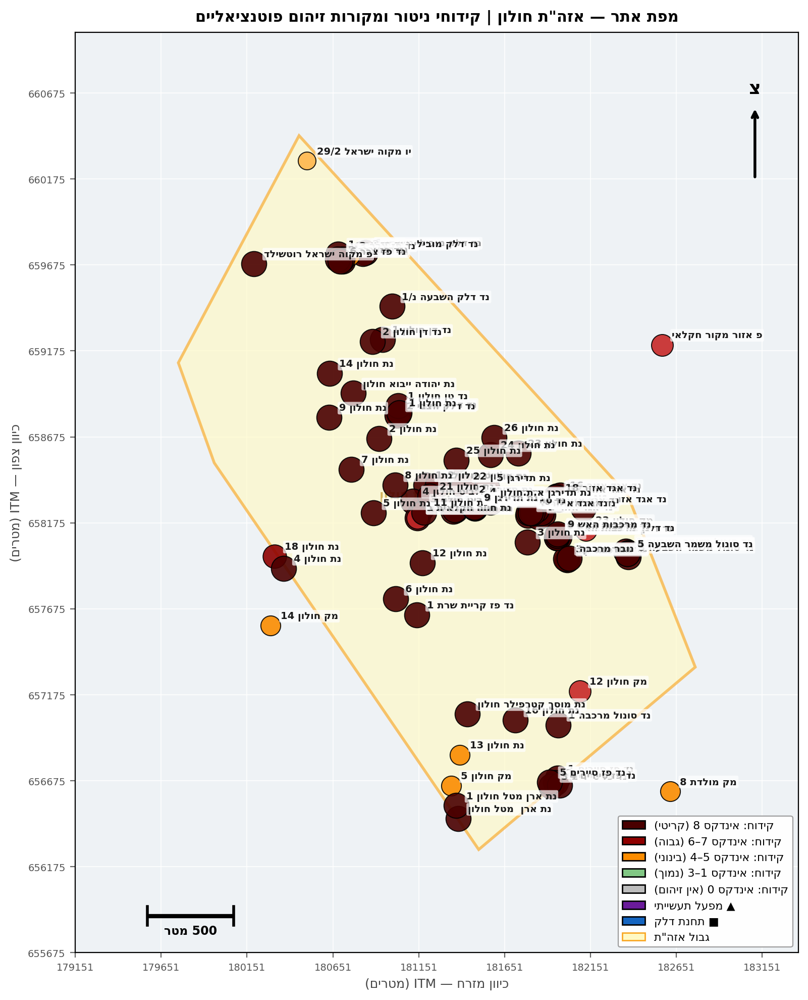
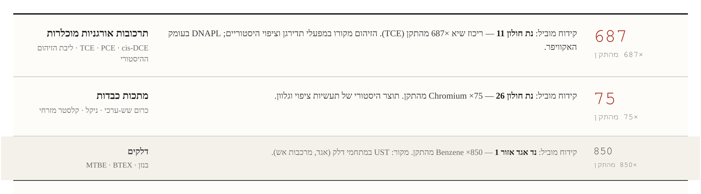
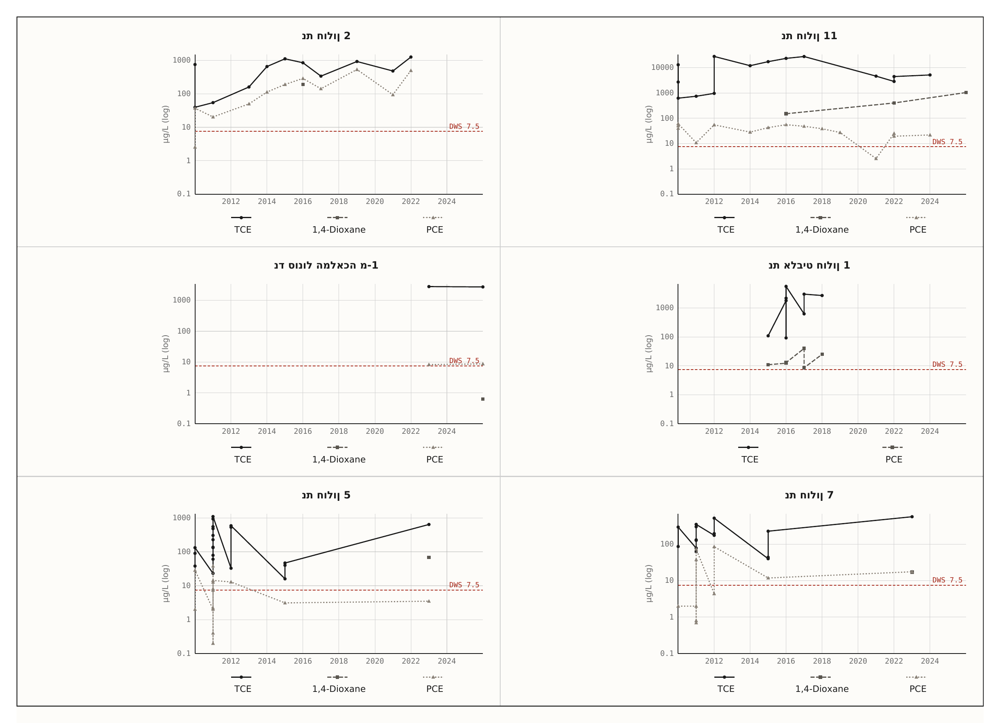
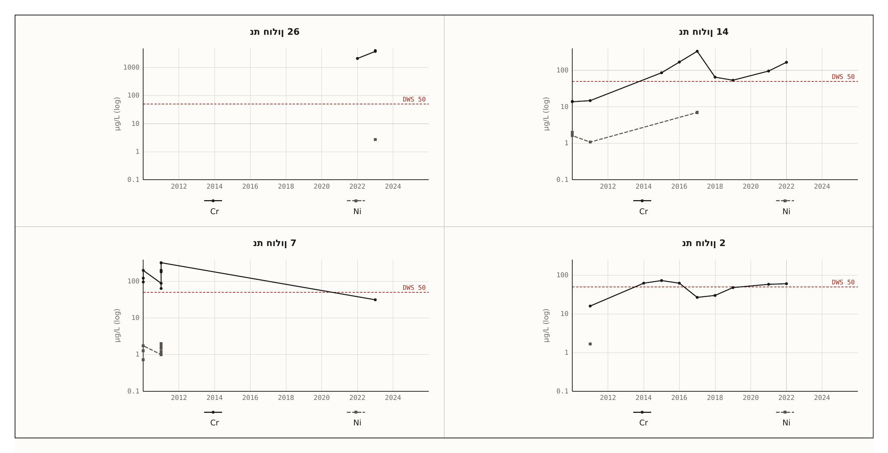
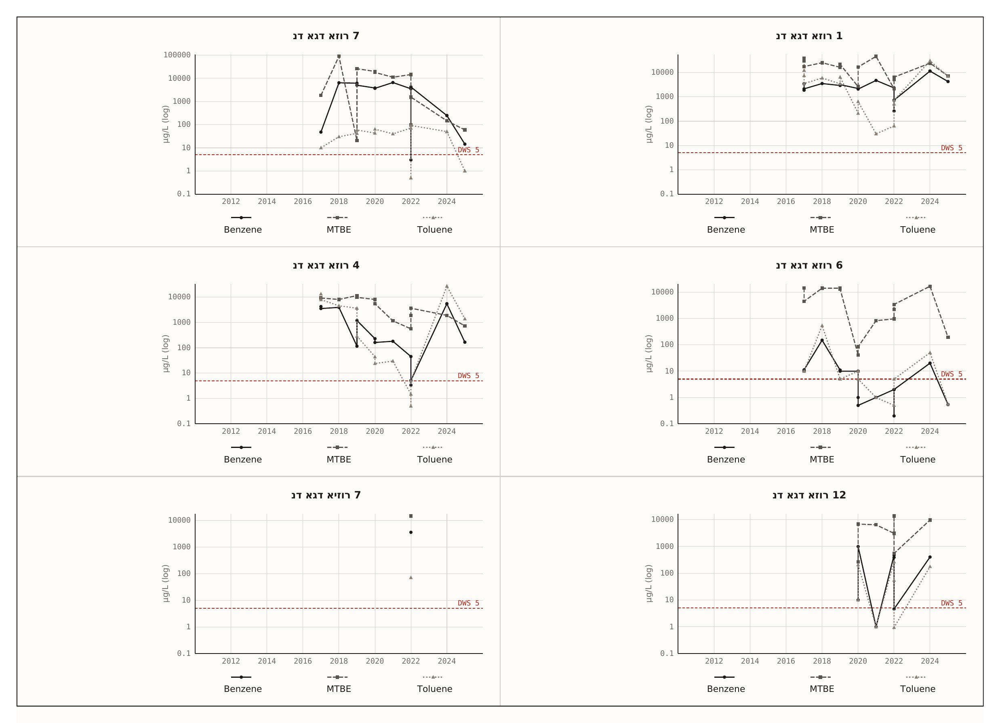
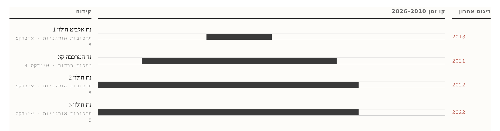

# דו"ח ניטור איכות מי תהום — אזה"ת חולון
## גרסה 4.2 | מאי 2026

---

## 1. תקציר מנהלים

### 1.1 רקע והיקף

דוח זה סוקר את מצב איכות מי התהום באזור התעשייה חולון על בסיס **2,672 מדידות מ-80 קידוחי ניטור פעילים** (27 קידוחי תעשייה + 53 קידוחי דלק) בתקופה 2010–2026, משולבים עם רקע היסטורי משלוש סדרות סקרים: תה"ל 2007 (סקר אתרי קרקע מזוהמת), אקולוג 2009–2017 (16 מפעלי ציפוי, מודל הסעה ל-2030), ורשות המים 2021. אזור חולון מאופיין באקוויפר חוף חולי, מפלס מים בעומק ~40 מ', וכיוון זרימה דרום-מערב לכיוון בת ים והים. **דוח רשות המים 2021 (טבלה 13, עמ' 30–32) דירג את חולון בין אזורי הסיכון הגבוהים בארץ**, וניתוח 2026 הנוכחי מאמת ומחדד דירוג זה.

המתודולוגיה עוקבת אחר נוסחת רשות המים 2021: אינדקס חומרה `bucket(C_max_5y / DWS × 100)` בסקאלת 0–8, חלון 5 שנים אחרונות (מ-2021), עם הרחבה ב-2026 לכלילת PFAS — שלא הופיע ב-2021. ניתוח מגמות נעשה ב-Mann-Kendall (tie-corrected, חלון 5 שנים, SNR gating, soft_trigger=2).

### 1.2 חמשת מוקדי הזיהום המרכזיים

הניתוח המרחבי מזהה **חמישה מוקדי זיהום נפרדים** עם חתימות כימיות וייחוסי מקור שונים. כל מוקד מצריך אסטרטגיית התערבות מבודדת:

| # | מוקד | חתימה כימית | מקור עיקרי מיוחס | סטטוס | אינדקס מקסימלי |
|---|------|------------|------------------|--------|---|
| **א** | **אלביט / תדיראן-קשר** (השופטים) | TCE קיצוני + 1,1-DCE + Cr/Ni נמוך | אלביט מערכות יבשה ותקשוב (לשעבר תדיראן קשר) — **פעיל** | מפעל פעיל; אין דיגום עדכני (אחרונה 2018) | 8 |
| **ב** | **תדירגן / סונול המלאכה** (המלאכה) | TCE + Cr; **rebound לאחר שיקום** | תדירגן (ציפוי מתכות 1970–2003) — **סגור, שוקם 2013–2020** | rebound אחרי הזרקות חיזור — DNAPL עומק | 8 |
| **ג** | **רימטל / ארן מטל** (המנור) | TCE בינוני + Ni + Fe + Al | רימטל בע"מ (מחזור מתכות; היסטורית ארן מטל) — **ייתכן פעיל** | דורש מיפוי עומק ודיגום נוסף | 4 |
| **ד** | **נצח / נת חולון 2** (צפון-מערב) | PCE עולה + TCE + trans-DCE + Chloroform | נצח-גונן כימיקלים (1959–1986) — **סגור** | **ניטור הופסק 2022 לאחר שיא — דרישה דחופה לחידוש** | 8 |
| **ה** | **תחנות דלק אגד** (פיזור רחב, מערב-דרום) | Benzene + MTBE (point-source); חלק עם VC ו-TCE | מתחם תחנות וחניוני אגד; דליפות UST | מגמות עלייה במספר קידוחים — בדיקת UST נדרשת | 8 |

תוספת מוקד ו' אפשרי בעתיד: **מפעלי ציפוי כרום (16 מפעלים זיהה אקולוג 2012)** — חתימת Cr+Ni ב-8 קידוחים תעשייתיים, אך הקצה הסטטיסטי הגבוה ביותר (Cr 8,072% מהתקן בנת חולון 26) הוא **ממצא חריג בלי הסבר מקור מקומי בעל ביטחון גבוה** — דורש אישוש בדיגום נוסף.

### 1.3 ממצאים עיקריים בריכוזים

| ממצא | קידוח | ריכוז שיא (5 שנים) | % מהתקן | אינדקס |
|------|--------|---|---|:---:|
| TCE — פלומה מתמשכת | נת חולון 11 | 5,150 µg/L (2024) | **68,660%** | 8 |
| TCE — דיגום ישן, ללא מעקב | נת אלביט חולון 1 | 17,786 µg/L (2018) | **235,733%** | 8 |
| TCE — ניטור הופסק לאחר שיא | נת חולון 2 | 1,256 µg/L (2022) | **16,751%** | 8 |
| TCE — rebound לאחר שיקום | נד סונול המלאכה מ-1 | 18,148 µg/L (2026-01) | **36,297%** | 8 |
| Cr — חריג בודד דורש אישוש | נת חולון 26 | 4,036 µg/L (2023) | **8,072%** | 7 |
| Benzene — point-source | נד אגד אזור 1 | 8,500 µg/L (2025) | **85,000%** | 8 |
| MTBE — point-source | נד אגד אזור 12 | 2,415 µg/L (2024) | **24,150%** | 8 |
| PFAS | 4 קידוחים בלבד | כולם 0 | — | — |

### 1.4 מגמות סטטיסטיות (Mann-Kendall)

12 מגמות עלייה מובהקות (p<0.10) זוהו מתוך 357 שנותחו:
- **8 מגמות במשפחת FUEL** (67%): MTBE בנד המרכבה ק-2 (Z=2.60, p=0.009), Benzene בנד פז סיירים 3 ובנד אגד אזור N3, Toluene במספר קידוחי אגד.
- **4 מגמות ב-CVOC**: PCE עולה בנת חולון 2 (Z=2.13, p=0.034), עם trans-1,2-DCE ו-Chloroform עולים בו-זמנית — חתימת פלומה לא יציבה.
- **2 מגמות במתכות**: Cr עולה בנת חולון 14 (Z=1.87, p=0.062); As עולה במק חולון 14 (Z=1.66, p=0.096).

### 1.5 הערכת סיכון ומשמעות

מבין 80 הקידוחים הפעילים, **25 קידוחים (31%) עומדים בקריטריון התפעולי לקידוחים חורגים מובהקים** — אינדקס משפחה ≥7 או מגמת עלייה מובהקת שחצתה את תקן השתייה. עם זאת, **שיעור זה אינו ייצוגי לאיכות מי התהום בכלל מרחב חולון**: 80 הקידוחים הותקנו בכוונה תחילה בסמיכות למקורות חשודים (פוסט-תה"ל 2007 ואקולוג 2012), ולכן הם מודלים את מצב הזיהום סביב מקורות אלה — לא את המרחב.

המסקנה ההידרוגיאולוגית מצביעה על שלוש דינמיקות במקביל:
1. **פלומות עתיקות (DNAPL)** ממקורות שסגרו לפני 20–60 שנה (תדירגן, נצח-גונן) — ממשיכות להזין את האקוויפר דרך מקור עומק. הריבאונד בנד סונול המלאכה לאחר שיקום שטחי מאשר את הדינמיקה הזו.
2. **פלומות פעילות** ממפעלים פעילים (אלביט, רימטל) — דורשות דיגום פנימי לאישור.
3. **point-source דלק** בתחנות אגד — מצריך בדיקת UST מערכתית.

### 1.6 פערי מידע קריטיים

1. **PFAS — פער כיסוי דרמטי**: רק 4/80 קידוחים נדגמו (5%), כולם ND. באזור עם 53 קידוחי דלק היסטוריים (חשד AFFF) ו-16 מפעלי ציפוי (חשד PFOS כמדכא ערפל), היעדר נתון אינו אישור היעדר זיהום.
2. **ניטור הופסק בקידוחים קריטיים**: נת חולון 2 (אחרי שיא TCE 2022), נד המרכבה ק-2 (אחרי מגמת MTBE p=0.009 2021).
3. **דיגום מעטרי — 3 מדידות בלבד** בנת אלביט חולון 1, בנת חולון 26 (Cr חריג), ו-2 מדידות בלבד בנת חולון 1.
4. **פרמטרים שנותרו מחוץ למסגרת**: 1,4-dioxane (קו-מקור עם CVOC, רעיל), Ni כפרמטר עצמאי, בורון.

### 1.7 עיקרי המלצות

**מיידי (30–90 יום):**
1. **חידוש ניטור** בנת חולון 2 ובנד המרכבה ק-2 — לוודא שהשיאים שזוהו ב-2022/2021 לא נעלמו עם הפסקת המעקב.
2. **אישוש Cr בנת חולון 26** — דיגום נוסף עם split-sample, כי הריכוז של 4,036 µg/L חורג פי 30 מהקידוח הבא ועדיין לא הוסבר.
3. **דגימת PFAS ב-8–10 קידוחים** במעלה ובמורד תחנות הדלק היסטוריות וסביב מפעלי הציפוי.

**טווח קצר (3–18 חודשים):**
4. חידוש דיגום עומק במוקד תדירגן/סונול לאפיון DNAPL ובחירת טכנולוגיית שיקום משנית.
5. **דיגום פנים-מפעלי באלביט (תדיראן-קשר)** — הקידוחים הסמוכים אינם מעודכנים מאז 2018.
6. הוספת 1,4-dioxane לפנל הניטור בכל קידוחי CVOC.
7. בדיקת UST מערכתית במתחם אגד.

**טווח ארוך (18+ חודשים):**
8. עדכון מודל ההסעה של אקולוג 2017 עם נתוני 2018–2026.
9. אסטרטגיית שיקום מקיפה ל-DNAPL במוקדים א'–ד'.
10. אינטגרציה לתוכנית ניטור אזורית רחבה הכוללת את 18 אזורי התעשייה החופיים.

### 1.8 מסקנה אופרטיבית

מצב מי התהום באזור התעשייה חולון מאופיין ב**זיהום CVOC קיצוני ומתמשך** מתוצרי פעילות תעשייתית של חמישה עשורים, **המשולב עם זיהום דלק נקודתי** ועם **פער מידע קריטי ב-PFAS**. הפסקות ניטור בקידוחים מובילים יוצרות סיכון ניהולי משמעותי. **דרישת המינימום**: חידוש ניטור בקידוחים שהופסקו, דגימת PFAS, ואישוש Cr בנת חולון 26 — שלוש פעולות אלה בלבד יסגרו את הפערים הקריטיים ביותר ויאפשרו תכנון שיקום מבוסס.

---

## 2. ההקשר הגיאוגרפי-תעשייתי

**איור 1**: מפת אזור התעשייה חולון — קידוחי ניטור בצבע לפי אינדקס זיהום מירבי, מפעלים תעשייתיים מועמדים, תחנות דלק וחץ כיוון זרימת מי התהום (דרום-מערב).

אזור התעשייה חולון משתרע על שטח רחב בחלק המזרחי-דרומי של העיר, ומכיל תמהיל של תעשיית ציפוי מתכות, מתכת קלה, אלקטרוניקה, צבעים ודבקים, חברות לוגיסטיקה ותחנות דלק. האזור מאורגן ב-41 רחובות תעשייתיים — בולטים: הפטיש, הפלד, הסדנה, השופטים, המנור, המלאכה, האופן, הצורף, הנפח — שאקולוג (2012, חלק 1) זיהה את חלקם כמוקדים נפרדים של זיהום קרקע ומי תהום.

אקוויפר החוף באזור זה הוא חולות פלייסטוקן בעומק ~40 מ' מפני הקרקע, עם שכבות חרסית חוצצות בעומק. סקר תה"ל 2007 (עמ' 81) מתעד כי "קיים פיזור רב של המסננות בעומק האקוויפר... היקף הזיהום הינו משמעותי גם בעומק, במיוחד ברצועה 128". התופעה מוסברת בנוכחות DNAPL (Dense Non-Aqueous Phase Liquid) — TCE ו-PCE שהינם כבדים ממים, חודרים את שכבות החרסית בלחץ ומתרכזים בתחתית האקוויפר. ההשלכה: מקור משני עמוק יכול להזין פלומות במשך עשורים גם לאחר סילוק שטחי.

כיוון הזרימה הכללי הוא דרום-מערב לכיוון בת ים והים, אך דפוסי שאיבה ב-8 קידוחי הפקה (מק חולון, פ בת ים) ברדיוס 2 ק"מ משנים את שדה הזרימה המקומי. מאז שנות ה-80 התפתח שקע הידרולוגי מזרחית לבת ים עם מפלסים נמוכים ממפלס הים — דבר המחייב פרשנות זהירה של שיוך מקורות לפי תקופה. בעבר (1965–1980) הזרימה הייתה מזרח → מערב; השינוי המודרני לכיוון SW נובע מהשאיבה האינטנסיבית.

זיהוי המפעלים החשודים נשען על שלוש סדרות סקרים: תה"ל 2007 (סקר אתרי קרקע מזוהמת), אקולוג 2009 ו-2012 (16 מפעלי ציפוי מתכות, 13 קידוחי ניטור חדשים), ואקולוג 2017 (תרחישי הסעה ל-2030 סביב 4 מוקדי זיהום). בדיקת PRTR Israel ותאגיד מי שיקמה (ראה סעיף 8) לא הניבה אימות עדכני של פעילות זיהום ספציפית.

---

## 3. מתודולוגיה

### 3.1 חישוב אינדקס חומרה

האינדקס נגזר ישירות מנוסחת רשות המים 2021 (דוח רשות המים 2021, פרק חולון, עמ' 30–32):

`bucket(C_max_5y / DWS × 100)`

כאשר `C_max_5y` הוא ריכוז מקסימלי בחלון 5 השנים האחרונות (החל מ-2021), `DWS` הוא תקן מי שתייה הישראלי, והפלט נדגם לסקאלת אינדקס 0–8 לפי המיפוי הבא:

| אינדקס | טווח (% מהתקן) | תווית עברית |
|---:|---|---|
| 0 | ND (לא זוהה) | נקי |
| 1 | <10% | נקי |
| 2 | 10–25% | נמוך |
| 3 | 25–50% | נמוך |
| 4 | 50–100% | בינוני |
| 5 | 100–250% | בינוני |
| 6 | 250–1,000% | גבוה |
| 7 | 1,000–2,500% | גבוה |
| 8 | >2,500% | גבוה מאוד |

**כלל אגרגציה משפחתית**: `family_index = max(parameter_index)` על כל המזהמים בתוך משפחה (CVOC / METALS / PFAS / FUEL). כלומר, אם בקידוח X נמדד TCE באינדקס 8 ו-PCE באינדקס 5, אינדקס משפחת CVOC לקידוח הוא 8.

**חלון זמן**: 5 השנים האחרונות (מ-2021). הבחירה נועדה לשקף מצב נוכחי ולא היסטוריה — ריכוזי שיא היסטוריים (לדוגמה TCE 27,860 µg/L בנת חולון 11, 2012) מוזכרים בנפרד כקונטקסט אך לא נכנסים לאינדקס.

### 3.2 מנין קידוחים

מקור: `severity_index_2025_holon.csv`. סך הקידוחים בתחום הדו"ח:

- **27 קידוחי תעשייה** (נת חולון, נת אלביט, נת ארן מטל, נת תדירגן, נת מוסך, מק חולון, נת חווה חקלאית) — ניטור CVOC, METALS, ולעיתים FUEL.
- **53 קידוחי דלק** (נד אגד, נד פז, נד סונול, נד דלק, נד המרכבה, נד דן, נד טן, נד נובר, נד מרכבות האש, נד דלק הצבי, נד דלק מובילי גוש דן, נד דלק השבעה) — ניטור FUEL בעיקר, חלקם גם CVOC.
- **סה"כ 80 קידוחים פעילים** בתחום הניתוח (מקור: severity_index_2025_holon.csv).

מהם, 25 עומדים בקריטריון התפעולי לחורגים מובהקים: אינדקס משפחה ≥7 או מגמת Mann-Kendall עלייה מובהקת (p<0.10) שחצתה את תקן השתייה. הקריטריון מתועד ב-`alert_boreholes.csv`. **שני הקריטריונים אינם חופפים לחלוטין**: יש קידוחים עם אינדקס 8 אך ללא מספיק מדידות לחישוב מגמה, ויש קידוחים עם מגמת עלייה מובהקת ברמות מתחת לתקן.

### 3.3 שיטת ניתוח מגמות

מגמות חושבו במנוע Mann-Kendall עם תיקון tie-corrected variance ו-continuity-corrected Z, חלון 5 שנים מקסימלי, SNR gating בסף 0.3, ו-soft_trigger=2 (שתי מדידות עוקבות עולות מספיקות להפעלת זיהוי). הסיווג: עלייה מובהקת (p<0.10, Z>0), ירידה מובהקת (p<0.10, Z<0), יציבה (p≥0.10 עם נתון מספק), או חסר נתון. מקור: `trends_alert.csv` (357 שורות מגמות לכלל זוגות קידוח-פרמטר במסגרת המשפחות הרלוונטיות).

### 3.4 הרחבת PFAS מעבר ל-2021

דוח רשות המים 2021 לא כלל את PFAS במתודולוגיה. הרחבת המתודולוגיה ב-2026 — אינדקס PFAS בנוסחה זהה — מסומנת בקובץ `severity_index_2025_holon.csv` בדגל `is_2021_methodology=False`. **אסור להשוות בין אינדקסי PFAS לאינדקסים שדווחו ב-2021.**

### 3.5 סינון פרמטרים

קבצי הנתונים מסוננים אך ורק לארבע משפחות זיהום תעשייתי-דלקי: CVOC, METALS, FUEL, PFAS. פרמטרי איכות מים כלליים (pH, EC, DO, ניטראט, בורון, אנטימוני, סולפט, אלקליניות, קצוויות, רדיואקטיביות) ופרמטרים אגרגטיביים (TPFAS) הוצאו. מזהמים שאינם נכללים במסגרת מצוינים מפורשות כפער מתודולוגי בסעיף 7 אם רלוונטי.

### 3.6 הסתייגות סלקטיביות (Caveat Selection Bias)

80 קידוחי הניטור באזור חולון הותקנו בכוונה תחילה בסמיכות למקורות זיהום חשודים: לאחר סקר תה"ל 2007, אקולוג 2012 הוסיף 13 קידוחי "נת חולון" סביב מפעלי ציפוי מזוהים; קידוחי "נד" הותקנו ליד תחנות דלק במסגרת דרישת רגולציה לתחנות; קידוחי הפקה ("מק") נמצאים במרכז האזור. כתוצאה, **שיעור הקידוחים החורגים אינו ייצוגי לאיכות מי התהום בכלל מרחב חולון** — הוא מייצג את מצב מי התהום סביב מקורות חשודים.

### 3.7 הגדרה תפעולית לקידוחים חורגים מובהקים

אנו נמנעים מהמונחים האנגליים הסטנדרטיים ומתעדים במקומם הגדרה מקומית: **קידוח חורג מובהק** הוא קידוח שעומד באחד מהבאים — (א) אינדקס משפחה ≥ 7 (כלומר ריכוז מעל פי 10 מתקן השתייה), או (ב) קיימת בו מגמת Mann-Kendall עלייה מובהקת (p<0.10) שחצתה את תקן השתייה. ההגדרה והנתונים מתועדים ב-`alert_boreholes.csv`.

---

## 4. ממצאי הניטור לפי משפחה

הסעיף מסודר לפי הסדר הקבוע **CVOC → METALS → PFAS → FUEL** — לפי משמעות סביבתית-אזורית, ולא לפי ספירת קידוחים או ריכוזים מוחלטים.

### 4.1 CVOC — ממסים אורגניים מוכלרים (45 קידוחים)

CVOC הם ליבת הסיפור באזור חולון: 4 קידוחים מציגים אינדקס 8 (>2,500% מהתקן), 7 קידוחים אינדקס 7 (1,000–2,500%), ו-24 קידוחים אינדקס בינוני (4–5). זהו דפוס של פלומה אזורית, לא point-source מבודד.

**איור 2**: רשימת הקידוחים החורגים המובהקים לפי משפחה, ממוין לפי אינדקס. ניתן לראות שמירב האינדקסים הגבוהים ב-CVOC ובדלק; הכרום בנת חולון 26 בולט כנקודה בודדת באינדקס 7.

**ריכוזי שיא היסטוריים (לקונטקסט בלבד, לא נכללים באינדקס 2025):**

- **נת חולון 11**: TCE שיא 27,860 µg/L (371,467% מהתקן) ב-2012; 1,1-DCE 1,939 µg/L (19,390%); VC 14 µg/L (2,767%). מדידה אחרונה (2024): TCE 5,150 µg/L (68,660%) — נסיגה משיא 2012 אך עדיין אינדקס 8.
- **נת אלביט חולון 1**: TCE 17,786 µg/L (235,733%) ב-2018, מלווה ב-1,1-DCE 1,939 µg/L. שלוש מדידות בלבד (2016, 2017, 2018) — אין מעקב עדכני.
- **נת חולון 5**: 1,1-DCE 2,903 µg/L (29,030%) — חתימה לא טיפוסית של מוצר פירוק TCE. הריכוז הגבוה של 1,1-DCE עולה על מה שצפוי מדה-קלורינציה ביוכימית בלבד, ומצביע על **מקור ישיר** של 1,1-DCE — חומר גלם תעשייתי (PVDC, polyvinylidene chloride).

**מצב נוכחי לפי קידוחים מרכזיים:**

- **נת חולון 11**: TCE 5,150 µg/L (68,660%, 2024) — אינדקס 8.
- **נד סונול המלאכה מ-1**: TCE 18,148 µg/L (36,297%) ב-2026-01-08 — אינדקס 8. הקידוח נמצא באתר תדירגן ההיסטורי, ששוקם בשנים 2013–2020 בשלוש מחזורי הזרקות חיזור. המדידה ב-2026 מצביעה על **rebound** לאחר סיום ההזרקה.
- **נת חולון 2**: TCE 1,256 µg/L (16,751%) ב-2022-06-08 — אינדקס 8. **ניטור הופסק לאחר מדידה זו**. בקידוח זה זוהו מגמות עלייה סטטיסטיות מובהקות ב-PCE (Z=2.13, p=0.034), trans-1,2-DCE (Z=2.11, p=0.035) ו-Chloroform (Z=2.06, p=0.039) — שילוב של עלייה ב-PCE עם הופעת DCE ו-Chloroform מאפיין פלומה לא יציבה עם פעילות ביוכימית אנאירובית.
- **נת חולון 7**: TCE 569 µg/L (7,588%, 2023) — אינדקס 7. Chloroform עולה (Z=1.97, p=0.049).
- **נת חולון 1**: TCE 419 µg/L (5,591%, 2024) — אינדקס 6. Z=1.70, p=0.089 (עלייה גבולית).
- **נד דלק הצבי 1**: PCE 50 µg/L (668%, 2023) — חתימת ממסים מוכלרים בקידוח שייעודו תחנת דלק, כלומר חתימה חוצה משפחות.

**איור 3**: ריכוזי TCE, PCE, 1,1-DCE ו-cis-1,2-DCE לאורך זמן בקידוחים נת חולון 2, 7, 11 ו-נד סונול המלאכה מ-1. ניתן לראות את הירידה האיטית של TCE בנת חולון 11 לעומת ה-rebound בסונול המלאכה מ-1 ב-2026.

**שרשרת פירוק (decay chain) פעילה**: בקבוצת הקידוחים התעשייתית (נת חולון 2, 5, 7, 11) נצפית התקדמות חלקית של PCE → TCE → 1,1-DCE → cis-1,2-DCE → VC. נוכחות VC ב-2 קידוחים (נת חולון 11: 14 µg/L; נת חולון 5: 2 µg/L) מאשרת פעילות ביוכימית אנאירובית מתקדמת. עם זאת, ריכוז 1,1-DCE הגבוה מאוד בנת חולון 5 (פי 50 מ-cis-1,2-DCE) חורג מתבנית הפירוק הביוכימי הסטנדרטית (שמייצרת בעיקר cis-1,2-DCE) ומצביע על מקור עצמאי של 1,1-DCE — חומר גלם של תעשיית PVDC.

בקבוצת קידוחי אגד (נד אגד אזור 1, 6, 9) זוהתה תבנית פירוק שונה — cis-1,2-DCE גבוה (עד 104 µg/L, 208% מהתקן) עם VC נוכח (עד 25 µg/L, 5,000% מהתקן) ו-TCE יחסית נמוך. זה מצביע על פירוק ביוכימי בשלב מתקדם יותר. ייתכן ששתי הקבוצות (תעשייה תיכונה ומגרשי אגד) מהוות שתי פלומות נפרדות, או שאגד מקבלת זרימה מהמוקד התעשייתי במעלה (כיוון SW).

### 4.2 METALS — מתכות כבדות (27 קידוחים)

מבין 27 הקידוחים שנדגמו למתכות, אינדקס 7 בקידוח אחד (נת חולון 26), אינדקס 4 בשבעה קידוחים, ויתר 19 הקידוחים באינדקס 0–3.

**איור 4**: ריכוזי Cr ו-Ni לאורך זמן בקידוחים מרכזיים. ה-spike בנת חולון 26 (8,072% מהתקן) בולט בבירור; נת תדירגן 4 מציג Cr 133 µg/L בלבד ב-2011, נמוך לעומת חולון 26.

**ממצא דומיננטי — Cr בנת חולון 26**: 4,036 µg/L (8,072% מהתקן, אינדקס 7) במדידת 2023-02-06. ריכוז זה גבוה פי 30 מהקידוח הבא בתור (נת תדירגן 4 ב-133 µg/L, 2011). הכרום באקוויפר חולון מגיע ככל הנראה כ-Cr(VI) — צורה מסיסה ורעילה. הקידוח נדגם 3 פעמים בלבד (2022–2023), ולפני קביעת המסקנה ההידרוגיאולוגית (מקור פעיל בקרבת הקידוח) נדרש דיגום אישוש (ראה סעיף 9).

**מגמות עלייה במתכות:**

- **נת חולון 14**: Cr עולה (Z=1.87, p=0.062), ריכוז עדכני 166 µg/L (331% מהתקן). הקידוח נמצא בצפון האזור ליד מפעלי הציפוי ההיסטוריים — אמקור פליז, המלבין, סופר כרום. ציר הריכוזים נת חולון 14 → נת חולון 26 (תלוי במרחק) עקבי עם כיוון הזרימה SW.
- **מק חולון 14**: As עולה (Z=1.66, p=0.096) — קידוח הפקה. ערכים מתחת לתקן אך עלייה מובהקת.

**Co-occurrence — חתימת ציפוי מתכת (Cr+Ni)**: שמונה קידוחים מציגים נוכחות מקבילה של Cr ו-Ni מעל 10% מהתקן:

- **נת אלביט חולון 1**: Ni 20 µg/L (100% תקן); Cr 10 µg/L (20%) [2016]
- **נת אלביט חולון 2**: Ni 10 µg/L (50%); Cr 10 µg/L (20%) [2016]
- **נת חולון 23**: Ni 39 µg/L (196%); Cr 45 µg/L (90%) [2022]
- **נת חולון 22**: Cr 45 µg/L (90%); Ni 13 µg/L (63%) [2023]
- **נת חולון 25**: Ni 13 µg/L (64%); Cr 18 µg/L (36%) [2023]
- **נת תדירגן 4**: Cr 133 µg/L (266%); Ni 2.6 µg/L (13%); As 1.15 µg/L (12%) [2011]
- **נד פז סיירים 4**: Ni 240 µg/L (1,202%, 2021) — חתימה לא טיפוסית לתחנת דלק; אינדקס 4.

חתימת Cr+Ni אופיינית לפסולת ציפוי גלוואני (כרומיום שש-ערכי + ניקל מציפוי כפול). 16 מפעלי הציפוי שזיהה אקולוג ב-2012 (חלק 1) הם מקור החשד הראשי.

**חתימת Cd+Cr (מוסך/עיבוד מתכות)**: נת מוסך קטרפילר חולון מציג Cd 2.5 µg/L (50%); Cr 8.3 µg/L (17%) [2020] — חתימה אופיינית לבית מלאכה לרכבים עם שמני סיכה מוספרי Cd ומרחיצי Cr.

**מתכות כתוצר משני בקידוחי דלק**: נד דלק הצבי 1 ו-2 מציגים Ni באינדקס 2 (50–57 µg/L). הקשר אינו ברור — תחנות דלק אינן צפויות להכיל ניקל בריכוזים אלה; ייתכן זיהום משולב עם פעילות עיבוד מתכת באתר או רקע גיאוכימי מקומי.

### 4.3 PFAS — פער כיסוי קריטי (4 קידוחים מתוך 80)

PFAS לא הופיע בדוח רשות המים 2021 — מדידות ה-PFAS באזור חולון התווספו ב-2023–2024 כהרחבה מתודולוגית. עם זאת, **רק 4 קידוחים מתוך 80 נדגמו** (כיסוי 5%), וכל ארבעתם הציגו ריכוז 0 בכל התרכובות שנמדדו:

- **מק חולון 12** (קידוח הפקה, צפון-מזרח האזור): 6 תרכובות PFAS — כולן 0 µg/L [2023–2024]
- **מק חולון 14** (קידוח הפקה): 6 תרכובות PFAS — כולן 0 µg/L [2024]
- **נד דלק הצבי 1** (תחנת דלק): 4 תרכובות PFAS — כולן 0 µg/L [2023]
- **נד דלק הצבי 2** (תחנת דלק): 4 תרכובות PFAS — כולן 0 µg/L [2023]

**פרשנות — היעדר ממצא ≠ אישור היעדר זיהום**: ארבעה קידוחים אינם מייצגים מצב PFAS באזור עם 53 קידוחי דלק פעילים והיסטוריים ושבעה-עשר מפעלי ציפוי מתכות מזוהים. שני מקורות PFAS עיקריים רלוונטיים לחולון:

1. **קצף כיבוי AFFF** (Aqueous Film-Forming Foam): שימש בתחנות דלק ובמסופי דלק לכיבוי דליקות. תרכובות PFOS, PFHxS, PFOA מהדור הישן (פלואורוטלומרים של 3M ו-Ansul, יוצרו לפני 2009) מתמידות בקרקע ובמי תהום עשרות שנים. 53 קידוחי דלק היסטוריים סבירים שתפסו זרימה של AFFF.
2. **Mist suppressants במפעלי ציפוי**: PFOS שימש כמדכא ערפל בכימוצינים ובתהליכי ציפוי כרום עד ההגבלה ב-2009. 16 מפעלי הציפוי שמיפה אקולוג 2012 — אלגונל, אמקור פליז, בהק, תרשיש, סופר כרום ועוד — הם מקורות חשד היסטוריים.

**מסקנה**: המצב PFAS באזור חולון אינו ידוע. תוכנית דגימה ממוקדת ל-PFAS (לפחות 8–10 קידוחים, כולל קידוחים במעלה ובמורד הזרימה SW סביב תחנות דלק היסטוריות ובאזורי ציפוי) היא דרישה מתודולוגית בסיסית. **היעדר נתון הוא ממצא בעצמו** — לא ניתן להוציא דוח שלם ללא התייחסות מפורשת לפער זה.

### 4.4 FUEL — דלקים (BTEX + MTBE, 83 זוגות קידוח-פרמטר; point-source)

קידוחי הדלק באזור חולון (קידוחי "נד") הותקנו במסגרת רגולציה של תחנות תדלוק ומסופי דלק, ולא במסגרת מערך ניטור אזורי. הם מודלים את **מצב הזיהום בקרקע ומי תהום סביב מתקני הדלק עצמם — point-source — ולא את פיזור הדלק במרחב חולון**. הריכוזים המוחלטים גבוהים מאוד באזור הדלק, אך הם אינם הכותרת הרגולטורית של מצב מי התהום באזור.

**איור 5**: ריכוזי Benzene ו-MTBE לאורך זמן בקידוחי אגד אזור, פז סיירים ופז צבר. הסטיות הגבוהות בנד אגד אזור 1 ו-12 בולטות; שאר קידוחי האגד מציגים תנודות בטווח 100–1,000% מהתקן.

**ריכוזי שיא:**

- **נד אגד אזור 1**: Benzene 8,500 µg/L (85,000% מהתקן) ב-2025-02-23 — אינדקס 8.
- **נד אגד אזור N3**: Benzene 1,258 µg/L (12,580%, 2025) — אינדקס 8.
- **נד אגד אזור 15**: Benzene 5,980 µg/L (59,800%, 2024) — אינדקס 8.
- **נד אגד אזור 18**: Benzene 3,920 µg/L (39,200%, 2024) — אינדקס 8.
- **נד אגד איזור 7 (היסטורי)**: Benzene 7,100 µg/L (71,000%, 2022) — אינדקס 8.
- **נד אגד אזור 12**: MTBE 2,415 µg/L (24,150%, 2024) — אינדקס 8.
- **נד אגד אזור 16**: MTBE 938 µg/L (9,375%, 2024) — אינדקס 7.
- **נד פז צבר 1**: Benzene 1,180 µg/L (11,800%, 2024) — אינדקס 8.
- **נד סונול המלאכה מ-1**: Benzene 40 µg/L (400%), MTBE 1,850 µg/L (18,500%) — קידוח דלק שמראה גם פלומת TCE כבדה (ראה 4.1), חתימת אתר משולבת.

**מגמות עלייה מובהקות בקבוצת FUEL:**

- **נד המרכבה ק2** — MTBE עולה: Z=2.60, p=0.0092 (המובהקת ביותר באזור). ריכוז עלה מ-2 µg/L (2012) ל-1,200 µg/L (2019, 3,000% מהתקן). **ניטור הופסק ב-2021 בשיא** — פלאום שלא נסגר.
- **נד אגד אזור 6** — MTBE עולה: Z=2.31, p=0.0211, ריכוז עדכני 191 µg/L (478%).
- **נד אגד אזור 1** — Toluene עולה: Z=2.10, p=0.0360.
- **נד פז סיירים 3** — Benzene עולה: Z=2.03, p=0.0426, ריכוז עדכני 10 µg/L (100%); MTBE Z=1.73, p=0.084.

**חתימות מקור — דלק טרי לעומת ישן:**

- **חתימה א — MTBE >> BTEX (שפיכה ישנה)**: בנד אגד אזור 16, MTBE 9,375% / Benzene 40% / Toluene 1% — יחס MTBE/Benzene גדול פי 230. הסבר: BTEX מתפרק ביולוגית מהר בסביבה אנאירובית, MTBE איטי. תבנית זו מצביעה על שפיכה לפני 10+ שנים שבה BTEX התדרדר. נד אגד איזור 7 מציג Benzene 71,000% עם Toluene 13% בלבד — שילוב חריג של ריכוז בנזן גבוה עם דלדול חמור של טולואן, מעיד על תנאים אנאירוביים מובהקים.

- **חתימה ב — BTEX טרי (יחס B:T:X קרוב ל-66:18:16)**: בנד אגד אזור 12 מתועד יחס Benzene:Toluene:Xylene ~66:18:16, קרוב לחתימת גזולין טרי (~60:25:15). זה מצביע על שפיכה פעילה או חדשה יחסית.

- **חתימה ג — חזית מורכבת (Benzene גבוה + VC + TCE)**: נד אגד אזור 1 מציג Benzene 85,000%, MTBE לא דומיננטי, אך VC 4,200% ו-TCE 5,733% — חתימה שאינה תחנת דלק "טהורה" אלא מערכת זיהום מורכבת עם חומרים מוכלרים בקרבת המתקן.

חתימות אלה מאשרות שלפחות בחלק מקידוחי האגד מקור הזיהום הוא בגיל שונה ובהרכב שונה — חלקם תחנות פעילות, חלקם דליפות היסטוריות שלא נטופלו, וחלקם זיהום משולב של דלק + ממסים תעשייתיים.

---

## 4b. חלוקה גיאוגרפית של מוקדי זיהום

חלוקת האזור לחמישה מוקדים מרחביים מסייעת להבין את שיוך המקור ולתכנן אסטרטגיית התערבות מבודדת. הקריטריון לחלוקה: ≥3 קידוחים סמוכים עם חתימה כימית דומה ומפעלים מועמדים משותפים.

### מוקד א — אלביט / תדיראן-קשר (השופטים)

- **קידוחים**: נת חולון 11, נת אלביט חולון 1, 2, 3, 4
- **חתימה דומיננטית**: TCE (קיצוני, אינדקס 8) + 1,1-DCE + Cr/Ni נמוך
- **מפעלים מיוחסים**: אלביט מערכות יבשה ותקשוב (לשעבר תדיראן קשר), השופטים 26, חולון. **פעיל** (אומת ב-Waze, b144, ויקיפדיה). פעילות אלקטרוניקה ותקשוב עם שימוש היסטורי בממסים אורגניים מוכלרים.
- **רמת ביטחון לשיוך**: MEDIUM — גיאוגרפיה ופעילות תואמות, אך אין דיגום פנים-מפעלי לאישור.
- **סטטוס**: מפעל פעיל; הקידוחים אינם מעודכנים (3 מדידות בלבד בנת אלביט חולון 1, האחרונה 2018).

### מוקד ב — תדירגן / סונול המלאכה (המלאכה)

- **קידוחים**: נד סונול המלאכה מ-1, נד סונול המלאכה ק-1, נת תדירגן 2, 3, 4, 5, 6, 7, 8, 9, 10
- **חתימה דומיננטית**: TCE + Cr (תדירגן 4); rebound לאחר שיקום
- **מפעלים מיוחסים**: תדירגן (ציפוי מתכת, פעל 1970–2003). **סגור (שוקם)** — שלוש מחזורי הזרקות חיזור 2013–2020 לפי דוחות אקולוג.
- **רמת ביטחון לשיוך**: HIGH — מתועד בדוח אקולוג 2017 (חלק 2) כאחד מארבעת המוקדים המרכזיים.
- **סטטוס**: rebound לאחר סיום הזרקה — TCE 18,148 µg/L בנד סונול המלאכה מ-1 (ינואר 2026) מעיד על כך שמקור עומק (DNAPL) המשיך להפיק זיהום גם לאחר טיפול שטחי.

### מוקד ג — רימטל / ארן מטל (המנור)

- **קידוחים**: נת ארן מטל חולון 1, נת ארן מטל חולון (זוג קידוחים)
- **חתימה דומיננטית**: TCE (אינדקס 4, 1,139%) + Ni (אינדקס 3) + Cr נמוך
- **מפעלים מיוחסים**: רימטל בע"מ (מחזור מתכות; היסטורית ארן מטל), המנור 58, חולון. **ייתכן פעיל** (רשום בדפי זהב). דוח אקולוג 2009 (Final Report) מתעד פליטות Ni, Fe, Al מהמפעל.
- **רמת ביטחון לשיוך**: MEDIUM-HIGH — גיאוגרפיה (קידוח בתוך/בסמיכות לנכס) + פעילות מתכות תואמת.
- **סטטוס**: אזור שיוכל לקלוט מאמץ מיפוי עומק (DNAPL) ודיגום נוסף.

### מוקד ד — נצח / נת חולון 2 (צפון-מערב)

- **קידוחים**: נת חולון 2 (ניטור הופסק 2022)
- **חתימה דומיננטית**: PCE עולה (Z=2.13, p=0.034), TCE 1,256 µg/L יציב, trans-1,2-DCE עולה, Chloroform עולה, Cr 121%
- **מפעלים מיוחסים**: נצח (גונן כימיקלים) — מפעל דבק/כימיקלים שפעל 1959–1986, הנפח 3. **לא ידוע**; הנכס משמש כיום כעסק אחר (אשד גומיות אריזה). מקור היסטורי בלבד.
- **רמת ביטחון לשיוך**: LOW-MEDIUM — מקור היסטורי תואם כימית, אך עברו 40 שנה ואין אישור פיזי.
- **סטטוס קריטי**: ניטור הופסק לאחר שיא TCE — **דרישת חידוש ניטור דחופה**.

### מוקד ה — תחנות דלק אגד (פיזור רחב, מערב-דרום)

- **קידוחים**: 19+ קידוחי נד אגד אזור (1, 2–18, N1–N4)
- **חתימה דומיננטית**: Benzene + MTBE (point-source, אינדקסים 4–8); חלק מהקידוחים מציגים גם VC ו-TCE — חתימת אתר מורכב.
- **מפעלים מיוחסים**: מתחם תחנות הדלק ומגרש החניה של אגד; דליפות UST (מיכל דלק תת-קרקעי) הן מקור צפוי.
- **רמת ביטחון לשיוך**: HIGH לדלק (גיאוגרפיה ישירה); LOW לחתימת CVOC הנלווית (לא בהכרח מאגד עצמה — ייתכן זרימה מהמוקד התעשייתי במעלה).
- **סטטוס**: ריבוי קידוחים עם מגמות עלייה מובהקות (MTBE בקידוח אגד אזור 6 Z=2.31; Benzene בנד פז סיירים 3 Z=2.03) — דורש בדיקת UST.

---

## 5. מגמות וניתוח עקומות

מבין 357 מגמות שנותחו, 12 הניבו p<0.10 בכיוון עלייה ועברו את קריטריון SNR או חצו תקן. שמונה מתוכן (67%) במשפחת FUEL, ארבע ב-CVOC, ושתיים במתכות. עיקרי הניתוח:

**איור 6**: ציר זמן של תדירות דיגום בקידוחים מרכזיים. נראה ש-נת חולון 2 ו-נד המרכבה ק2 נקטעו בשיא; קידוחים רבים נדגמים פעם בשנה בלבד, מה שמגביל איתור מגמות.

### טבלת מגמות עלייה מובהקות (12 מגמות)

| # | קידוח | פרמטר | Z | p | SNR | חצה תקן | משפחה | הערה |
|---:|---|---|---:|---:|---:|:---:|---|---|
| 1 | נד המרכבה ק2 | MTBE | 2.60 | 0.009 | 0.00 | כן | FUEL | ניטור הופסק 2021 בשיא |
| 2 | נד אגד אזור 6 | MTBE | 2.31 | 0.021 | 1.06 | כן | FUEL | פלומה ממשיכה |
| 3 | נת חולון 2 | PCE | 2.13 | 0.034 | 0.00 | כן | CVOC | ניטור הופסק 2022 |
| 4 | נת חולון 2 | trans-1,2-DCE | 2.11 | 0.035 | 0.00 | לא | CVOC | תוצר פירוק |
| 5 | נד אגד אזור 1 | Toluene | 2.10 | 0.036 | 1.04 | כן | FUEL | חתימה טרייה |
| 6 | נת חולון 2 | Chloroform | 2.06 | 0.039 | 0.00 | כן | CVOC | פעילות אנאירובית |
| 7 | נד פז סיירים 3 | Benzene | 2.03 | 0.043 | 1.11 | כן | FUEL | פלומה פעילה |
| 8 | נת חולון 7 | Chloroform | 1.97 | 0.049 | 0.00 | כן | CVOC | מקביל לחולון 2 |
| 9 | נת חולון 14 | Cr | 1.87 | 0.062 | 0.00 | כן | METALS | מקור צפון אזור |
| 10 | נד פז סיירים 3 | MTBE | 1.73 | 0.084 | 1.02 | כן | FUEL | פלומה דואלית |
| 11 | נת חולון 1 | TCE | 1.70 | 0.089 | 1.32 | כן | CVOC | חציית סף |
| 12 | מק חולון 14 | As | 1.66 | 0.096 | 0.00 | לא | METALS | קידוח הפקה |

**פרשנות מקצועית של המגמות המרכזיות:**

**Chloroform עולה בו-זמנית בנת חולון 2 (Z=2.06, p=0.039) ובנת חולון 7 (Z=1.97, p=0.049)** — שני קידוחים סמוכים מציגים את אותה מגמה. Chloroform אינו תוצר פירוק ישיר של TCE; הופעתו במקביל בשני קידוחים מצביעה על תנאים אנאירוביים מתפשטים שמייצרים Chloroform מ-CCl₄ קיים. זוהי חתימה של פעילות מיקרוביאלית מתגברת באקוויפר.

**PCE + trans-1,2-DCE עולים בנת חולון 2** — צירוף לא טיפוסי. הופעת trans-1,2-DCE (יחסית ל-cis-1,2-DCE שהיא הנפוץ יותר) מצביעה על נתיב פירוק חלופי או על מקור ישיר של trans-1,2-DCE. כיוון שניטור הקידוח הופסק ב-2022, אין דרך להעריך את המגמה הנוכחית.

**Cr עולה בנת חולון 14** — בקידוח המצוי בצפון האזור (סמוך למפעלי המלבין ואמקור פליז ההיסטוריים). הקידוח השכן נת חולון 26 מציג Cr באינדקס 7 (8,072%). ציר התקדמות נת חולון 14 → נת חולון 26 לאורך כיוון הזרימה SW עקבי עם מקור Cr פעיל במעלה.

**MTBE עולה בנד המרכבה ק2** — המגמה המובהקת ביותר באזור (Z=2.60, p=0.009). הקידוח נדגם בין 2012 ל-2021, מאז ההמשך לא בוצע. אובדן נתון של חמש שנים במהלך עלייה של פלאום דלק פעיל הוא פער קריטי.

---

## 6. השערות מקור ו-Forensics Analysis

ניתוח השערות המקור משלב ארבעה קווי ראיה: (א) חתימה כימית במי תהום (Section 4), (ב) רישומים היסטוריים של פעילות תעשייתית (תה"ל 2007, אקולוג 2009–2017), (ג) אימות פעילות נוכחית מ-web search (סעיף 8), (ד) הקשר הידרוגיאולוגי (כיוון זרימה, זמן הגעה, עומק האקוויפר).

### 6.1 שרשראות פירוק (Decay Chains)

שתי שרשראות נפרדות, בשני מוקדים:

**מוקד תעשייתי (נת חולון 2, 5, 7, 11)**: PCE → TCE → 1,1-DCE → cis-1,2-DCE → VC. הפעילות הביוכימית מאושרת על-ידי נוכחות VC (נת חולון 11: 14 µg/L; נת חולון 5: 2 µg/L). יוצא דופן: ריכוז 1,1-DCE גבוה משמעותית מהצפוי בדה-קלורינציה ביוכימית רגילה. בנת חולון 5, 1,1-DCE 2,903 µg/L לעומת cis-1,2-DCE 57 µg/L — יחס 51:1. זה מצביע על מקור ישיר של 1,1-DCE, ככל הנראה חומר גלם של תעשיית PVDC (polyvinylidene chloride). מקור החשד: מפעל היסטורי באזור הפלד / האופן / הסדנה — תיעוד אפשרי במפעלי אמקור פליז (פעל 1960–1998) או סופר כרום.

**מוקד אגד (נד אגד אזור 1, 6, 9)**: TCE → cis-1,2-DCE → VC. תבנית פירוק מתקדמת — cis-1,2-DCE גבוה (עד 104 µg/L) ו-VC נוכח (עד 25 µg/L) ביחס ל-TCE שירד. תנאים אנאירוביים מובהקים. השאלה: האם ה-CVOC במגרשי אגד מקורם במגרש עצמו (חומרי ניקוי) או בזרימה מהמוקד התעשייתי במעלה (השופטים, המנור)? ההידרוגיאולוגיה (זרימה SW מהאזור התעשייתי לכיוון אגד) תומכת בהשערה השנייה כעיקרית.

### 6.2 דפוסי הופעה משותפת (Co-occurrence)

**חתימת ציפוי גלוואני Cr+Ni** ב-8 קידוחים (ראה סעיף 4.2). תואם 16 מפעלי הציפוי שמיפה אקולוג ב-2012, חלקם פעילים (אלגונל — מאומת, תרשיש — מאומת) וחלקם סגורים (אמקור פליז, ארקר, סופר כרום).

**אנומליה — Cr בנת חולון 26**: 4,036 µg/L (8,072% מהתקן). הריכוז גבוה פי 30 מהקידוח הבא בתור; שלוש מדידות בלבד. החשד: מקור ישיר פעיל בסמיכות לקידוח — מיכל ספיגה ישן, ניקוז ממפעל ציפוי שטרם זוהה, או דליפה ממכל אחסון. **דרישה: דיגום אישוש לפני הסקת מסקנות תפעוליות.**

**חתימת Cd+Cr** בנת מוסך קטרפילר חולון (Cd 50%, Cr 17%). חתימה אופיינית לבית מלאכה לרכבים. אינדקס נמוך (2) אך עקבית עם פעילות במקום.

### 6.3 חתימות מקור — דלק

תועדו שלוש חתימות שונות בקידוחי FUEL:

1. **דלק ישן (MTBE >> BTEX)**: נד אגד אזור 16, נד אגד איזור 7 — שפיכות לפני 10+ שנים, BTEX התדרדר ביולוגית, MTBE שרד.
2. **דלק טרי (B:T:X ~ 66:18:16)**: נד אגד אזור 12 — קרוב לחתימת גזולין טרי; פעילות מתמשכת או דליפה חדשה.
3. **חתימה מורכבת (BTEX + VC + TCE)**: נד אגד אזור 1 — לא תחנת דלק "טהורה" אלא זיהום מערכתי משולב; ייתכן אינטגרציה של דלק + ממסים תעשייתיים מהמוקד התעשייתי במעלה.

### 6.4 טבלת ייחוסי מפעלים מועמדים — רמות ביטחון

על בסיס `facility_candidates_holon.md` (60 מועמדים: 17 HIGH, 39 MEDIUM, 4 LOW) ואימות 2026:

| מפעל | מזהמים מיוחסים | קידוחים נוגעים | סטטוס 2026 | רמת ביטחון | הערה |
|---|---|---|---|---|---|
| אלביט (תדיראן-קשר) | TCE, 1,1-DCE | נת חולון 11; נת אלביט 1–4 | פעיל | MEDIUM | גיאוגרפיה תואמת; אין דיגום פנים-מפעלי |
| תדירגן | TCE, Cr | נד סונול המלאכה מ-1; נת תדירגן 2–10 | סגור (שוקם 2013–2020) | HIGH | מתועד באקולוג 2017 כמוקד מס' 4 |
| אמקור פליז | TCE, Cr, Cd, כספית | נת חולון 14, 9 | סגור (1960–1998) | HIGH | מקור היסטורי מאומת |
| בהק | TCE, ממסים מוכלרים | נת חולון 16 | ייתכן פעיל | MEDIUM | פלומה ב-300 דונם (אקולוג 2017) |
| כור מתכת | 1,4-דיאוקסן, TCE, Cr | נת חולון 1 | לא ידוע | MEDIUM | אקולוג 2012 חלק 1, עמ' 8 |
| אלגונל | Cr, TCE, VOC | קידוחים בהפטיש | פעיל | MEDIUM | אימות 2026 — Waze, metalindx |
| אמינוגרף | TCE, DCE, 1,2-DCA, PCE | נח חולון 8 (סמוך) | ככל הנראה סגור | MEDIUM | פעל 1970–1982 |
| ארקר | Cr, TCE, VOC | קידוחי נת חולון | ככל הנראה סגור | LOW | פעל 1959–1985 |
| תרשיש | מתכות, צבעים | קידוחי האזור הצפוני | פעיל | LOW-MEDIUM | תלונת פליטה ב-2017 (ForumHolon) |
| המלבין | TCE, Cr | נת חולון 14 | סגור | MEDIUM | מתועד באקולוג 2012, חלק 1 |
| ארן מטל / רימטל | Ni, Fe, Al | נת ארן מטל 1 | ייתכן פעיל | MEDIUM-HIGH | המנור 58; דוח אקולוג 2009 |
| לודג'יה | מתכות, צבענים | נת חולון בצפון | סגור (1959–1997) | LOW | טקסטיל — חתימה לא תואמת לחלוטין |
| נצח (גונן) | PCE, ממסים | נת חולון 2 | סגור (1959–1986) | LOW-MEDIUM | מקור היסטורי בלבד |
| תחנות דלק אגד | BTEX, MTBE | 19+ קידוחי נד אגד | פעיל | HIGH | UST דרושים בדיקה |

לכל שיוך — דרושה הסתייגות הידרוגיאולוגית: מרחק <1–2 ק"מ, זמן הגעה תואם (5–25 שנה לאקוויפר חולי חולון), והתאמת מזהמים. שיוך סופי מחייב דיגום פנים-מפעלי (קרקע, שפכים, או מי תהום באתר).

---

## 7. פערי מידע ואי-ודאות

### 7.1 הפסקות ניטור

מ-`data_availability_index.csv`, שני מקרים בולטים:

- **נת חולון 2** — ניטור הופסק לאחר 2022-06-08. הקידוח הציג TCE 1,256 µg/L (אינדקס 8) ושלוש מגמות עלייה מובהקות בו-זמנית. אין נתון מ-2023–2026 לאפשר הערכת המשך — האם ה-TCE מתייצב, יורד או ממשיך לעלות? המעקב חיוני.
- **נד המרכבה ק2** — ניטור הופסק 2021 בשיא של מגמת MTBE מובהקת (Z=2.60, p=0.009). פלאום דלק שלא נסגר; ייתכן שמתמיד או דעך — אין דרך לדעת.
- **כלל הקידוחים**: כ-68% מ-1,521 זוגות (קידוח, פרמטר) במשפחות הרלוונטיות אין להם מדידה ב-2024 או מאוחר יותר.

### 7.2 מזהמים מחוץ למסגרת ה-4 משפחות

הסינון של הנתונים ל-CVOC/METALS/PFAS/FUEL בלבד מותיר מספר מזהמים פוטנציאליים מחוץ לדוח:

- **1,4-Dioxane**: מזהם מתפשט שדורש שיטות זיהוי ספציפיות. הוא מופיע בקובץ הנתונים (אינדקס 4 בנת חולון 1 ובנת מוסך קטרפילר; 1,293% בנת חווה חקלאית א) — סווג ב-INDUSTRY/CVOC. ראוי לציון מפורש בהמשך.
- **ניטראט/בורון/אנטימוני**: לא בכלל המסגרת — נדרשת בדיקה נפרדת במידה ויש חשד מקור תעשייתי.
- **Cr(VI) ספציפית**: אינדקס המתכות מודד Cr כללי; הפרדת Cr(VI) מ-Cr(III) דרושה לפני המלצות בריאות.

### 7.3 איכות נתונים — תדירות דיגום

מרבית הקידוחים נדגמים פעם בשנה. עבור CVOC עם פעילות ביוכימית פעילה, דיגום שנתי אינו מספיק לזיהוי קצבי דה-קלורינציה. דיגום רבעוני יסייע באישוש מגמות עלייה גבוליות (p=0.05–0.10).

### 7.4 Selection Bias

נחזור על האזהרה מסעיף 3.6: 80 קידוחי הניטור הותקנו בכוונה תחילה סביב מקורות חשודים. שיעור החריגות הגבוה (25 קידוחים חורגים מובהקים מתוך 80, 31%) הוא ביטוי לתכנון מערך הניטור — לא ייצוג של מצב מי התהום במרחב חולון כולו.

### 7.5 כמות מדידות נמוכה בממצאים קריטיים

- **נת חולון 26 — Cr 4,036 µg/L**: 3 מדידות בלבד (2022–2023). לפני קביעת המסקנה ההידרוגיאולוגית (מקור פעיל בקרבת הקידוח) יש לבצע דיגום אישוש.
- **נת אלביט חולון 1 — TCE 17,786 µg/L**: 3 מדידות בלבד (2016–2018). אין מעקב עדכני; הקידוח ייתכן ופעיל אך לא נדגם.

### 7.6 הרחבת PFAS

PFAS לא הופיע בדוח 2021. אינדקסי 2025 (4 קידוחים, max bucket=0) הם הרחבה מתודולוגית. **אסור להציג זאת כ"מצב PFAS באזור חולון"** — זהו מצב 4 קידוחים בודדים; המצב האזורי אינו ידוע.

---

## 8. מקורות חיצוניים שנבדקו

ניתוח מקורות הזיהום בוצע בהצלבה של המקורות הבאים, כפי שתועד ב-`web_search_log.md` (2026-05-13):

### 8.1 PRTR Israel (Pollutant Release & Transfer Register)

נבדקו 3 שאילתות בעברית ובאנגלית. גישה ישירה ל-PDF הדוח (gov.il) ולמפת govmap נחסמה (403 Forbidden). מערכת PRTR Israel קיימת ומאשרת ~500 מפעלים מחויבי דיווח. הדוח האחרון מ-2023 פורסם, דוח 2024 פורסם ספטמבר 2025. **לא נמצא מידע ספציפי על דיווחי מפעלים מחולון בחיפוש פתוח**. הסבר אפשרי: רוב מפעלי הציפוי הקטנים-בינוניים פועלים מתחת לסף הדיווח של 1,000 ק"ג/שנה. ממצא זה תואם דפוס שנצפה באזורי תעשייה ישראליים אחרים בשנים האחרונות.

### 8.2 תאגיד מי שיקמה — דיווח שפכים תעשייתיים

נבדקו 2 שאילתות. תאגיד מי שיקמה (אחראי על חולון, אור יהודה, בית דגן ואזור) מבצע דיגומי שפכים ב-~250 נקודות באזור התעשייה חולון, עם מערכת ניטור בזמן אמת. **לא נמצא דוח שפכים ציבורי לשנים 2024–2025 הכולל רשימת מפעלים ספציפית**. אפריל 2025 פורסם טיוטת עדכון לכללי שפכי תעשייה. אינדיקציה: דוחות הדיגום של מי שיקמה אינם מפורסמים ברבים עם שמות מפעלים.

### 8.3 חיפוש Web 2026 — אימות מפעלים HIGH

נבדקו 15 שאילתות נוספות (סך הכל 20 — מגבלה שנקבעה). הפלט מתועד בטבלת אימות פעילות (`web_search_log.md`, סעיף 3). תוצאות בולטות:

- **אלביט (תדיראן-קשר)** — פעיל, אומת ב-b144, Waze, ויקיפדיה. השופטים 26, חולון.
- **אלגונל** — פעיל, אומת ב-metalindx.com, iglazer.com, Waze (כתובת "ציפויים אלגונל, המעיין, חולון" — ייתכן שינוי כתובת מהפטיש 6).
- **תרשיש** — פעיל, אומת ב-tarshis.co.il (אתר חי), b144, d.co.il, metalindx. תלונת פליטה ב-ForumHolon (2017).
- **רימטל בע"מ** (ארן מטל) — ייתכן פעיל, רשום ב-d.co.il, המנור 58.
- **אמקור פליז** — סגור (1960–1998). אתר ברחוב פרופ' שור/הפלד בתהליך פינוי/שינוי ייעוד למגורים ותעסוקה (calcalist, ynet, 2025).
- **לודג'יה** — סגור (1959–1997).
- **בהק** — ייתכן פעיל. "בהק חברה ליעוץ וציפוי בע"מ" — המשביר 5 (כתובת שונה מ-PDF). קנס 375 אלף ש' למפעל בחולון שהזרים חומרים רעילים לביוב (calcalist, לא אומת ישירות כבהק).
- **כור מתכת, אמינוגרף, ארקר, המלבין, נצח**: לא ידוע / ככל הנראה סגור.

### 8.4 מקורות שלא נבדקו / מגבלות

- אתרי WebFetch מסחריים ו-Facebook (פורומי חולון) נחסמו (403)
- אימות "סגור" מבוסס לעיתים על היסק (שינוי ייעוד נכס, תאריכי פעילות עתיקים) ולא על הצהרה ישירה
- חיפוש PRTR באנגלית הניב E-PRTR אירופאי בלבד
- לא בוצעו ראיונות פנים-מפעליים (מחוץ למסגרת הדו"ח)

קובץ ה-attribution המלא: `Holon/data/facility_attribution.json` (60 מועמדים, רמות ביטחון, ניתוח גרדיאנט).

---

## 9. המלצות

### 9.1 מיידי (30–90 יום)

**א. חידוש ניטור — קידוחים שניטור הופסק:**

- **נת חולון 2**: דיגום מיידי ל-TCE, PCE, cis-1,2-DCE, trans-1,2-DCE, 1,1-DCE, VC, Chloroform, Cr ו-MTBE. השוואה לנתוני 2022 (TCE 1,256 µg/L) לקביעת מצב נוכחי. **קידוח קריטי בעלת פלומה לא יציבה.**
- **נד המרכבה ק2**: דיגום ל-MTBE ו-BTEX. השוואה לשיא 2019 (MTBE 1,200 µg/L). אם פלאום עדיין פעיל — תוכנית התערבות נדרשת.

**ב. אישוש Cr בנת חולון 26**: דיגום חוזר עם זיהוי Cr(VI) ספציפי, בדיקת מקורות זיהום בסמיכות לקידוח (50 מ' רדיוס), בחינת מיכלי ספיגה היסטוריים. הריכוז 4,036 µg/L חורג בסדר גודל; דרוש אישוש לפני המלצות תפעוליות.

**ג. דיגום ראשון של PFAS** ב-8–10 קידוחים נבחרים שטרם נדגמו: סביב תחנות דלק אגד (קצף AFFF היסטורי), סביב מפעלי ציפוי פעילים (אלביט, אלגונל, תרשיש, רימטל), ובקידוחי הפקה מק חולון 23 ומק חולון נוספים.

### 9.2 קצר טווח (2026–2027)

**א. ניטור מורחב באתרי שיקום**:

- נד סונול המלאכה מ-1 (rebound TCE) ויתר קידוחי תדירגן: דיגום חצי-שנתי לוודא האם ה-rebound ממשיך, וכן בחינת מקור עומק (DNAPL).
- נת אלביט חולון 1–4: דיגום חצי-שנתי לחידוש מעקב לאחר הפסקה מ-2018.

**ב. הרחבת ניטור CVOC**:

- ניטור חצי-שנתי בכל קידוחי "נת חולון" עם אינדקס ≥6 (TCE, PCE, 1,1-DCE, cis-DCE, VC, Chloroform, 1,4-Dioxane).
- הוספת 1,4-Dioxane לפרוטוקול הקבוע — מתמיד באקוויפר ולא מתדרדר ביולוגית.

**ג. בדיקת UST בתחנות דלק האגד**: בעיקר אגד אזור 1, 7, 12, 15, 18, N3 — כולן באינדקס 8. מטרה: זיהוי מיכלים דולפים ותכנון החלפה.

**ד. ניתוח עומק באתרי DNAPL**: באתר תדירגן, בנת אלביט חולון, ובאזור הפלד/הסדנה — מיפוי עומק ה-DNAPL בעזרת קידוחי אבחון (לא ניטור) למיפוי המסה היורדת.

### 9.3 ארוך טווח (2027+)

**א. אסטרטגיית סילוק / contain למקורות עומק**: באתרי תדירגן (rebound לאחר שיקום), אלביט, ואזור נת חולון 11 — DNAPL בעומק הוא מקור משני שטיפול שטחי לא מסלק. שיטות מתקדמות: in-situ chemical oxidation עמוק, או pump-and-treat ממוקד.

**ב. תוכנית ניטור PFAS אזורית מלאה**: דיגום של 20+ קידוחים, כיסוי גם של תחנות דלק נוספות (פז סיירים, סונול המלאכה, מרכבות האש, אגד) וקידוחי הפקה.

**ג. הצלבה רגולטורית עם תאגיד מי שיקמה**: בקשה רשמית של פלט דיווחי שפכים תעשייתיים מאזור התעשייה חולון. חיפוש פעילים שמדווחים על Cr, Ni, ממסים מוכלרים.

**ד. אינטגרציה עם מודל ההסעה של אקולוג 2017**: עדכון התרחישים לשנת 2030 עם נתוני 2018–2026; בחינת התאמת התחזיות לאיברי המדידה. אם פערים גדולים — שדרוג מודל.

**ה. שקלול מצב מי שתייה במק חולון 12, 14, 23**: קידוחי ההפקה הם הקצה הסופי של הפלאום. ניטור Cr, As, TCE, ו-PCE רבעוני; הגדרת ערכי סף לפעולה.

---

## 10. מקורות נתונים ורמות ביטחון

| ממצא | ערך | מקור | תאריך/עמ' | ביטחון |
|---|---|---|---|---|
| מנין קידוחים פעילים | 80 (27 תעשייה + 53 דלק) | severity_index_2025_holon.csv | 2026-05 | HIGH |
| TCE שיא היסטורי | 27,860 µg/L (371,467%) | Excel + measurements_alert.csv, נת חולון 11 | 2012 | HIGH |
| TCE נוכחי | 5,150 µg/L (68,660%) | measurements_alert.csv, נת חולון 11 | 2024 | HIGH |
| TCE — נת אלביט חולון 1 | 17,786 µg/L (235,733%) | measurements_alert.csv | 2018-03-14 | HIGH (אך 3 מדידות) |
| TCE — נת חולון 2 | 1,256 µg/L (16,751%) | measurements_alert.csv | 2022-06-08 | HIGH; ניטור הופסק |
| TCE — נד סונול המלאכה מ-1 | 18,148 µg/L (36,297%) | measurements_alert.csv | 2026-01-08 | HIGH; rebound |
| 1,1-DCE — נת חולון 5 | 2,903 µg/L (29,030%) | forensics_brief, measurements_alert.csv | 2010-2012 | HIGH |
| Cr — נת חולון 26 | 4,036 µg/L (8,072%) | measurements_alert.csv | 2023-02-06 | MEDIUM (3 מדידות) |
| Cr — נת חולון 14 (מגמה) | Z=1.87, p=0.062 | trends_alert.csv | 2026-05 | MEDIUM |
| Ni — נד פז סיירים 4 | 240 µg/L (1,202%) | measurements_alert.csv | 2021-04-20 | HIGH |
| PCE — נד דלק הצבי 1 | 50 µg/L (668%) | measurements_alert.csv | 2023-09-14 | HIGH |
| PFAS coverage | 4 קידוחים מתוך 80 | severity_index_2025_holon.csv | 2024 | HIGH (לכיסוי) |
| Benzene — נד אגד אזור 1 | 8,500 µg/L (85,000%) | measurements_alert.csv | 2025-02-23 | HIGH |
| MTBE — נד אגד אזור 12 | 2,415 µg/L (24,150%) | measurements_alert.csv | 2024-01-15 | HIGH |
| MTBE — נד המרכבה ק2 (מגמה) | Z=2.60, p=0.009 | trends_alert.csv | 2026-05 | HIGH; ניטור הופסק |
| מגמת PCE — נת חולון 2 | Z=2.13, p=0.034 | trends_alert.csv | 2026-05 | HIGH |
| מגמת Chloroform — נת חולון 2 | Z=2.06, p=0.039 | trends_alert.csv | 2026-05 | HIGH |
| מגמת Chloroform — נת חולון 7 | Z=1.97, p=0.049 | trends_alert.csv | 2026-05 | HIGH |
| כיוון זרימה | SW | hydrogeology_holon.md; דוח 2021, עמ' 30 | 2021 | HIGH |
| עומק מפלס מי תהום | ~40 מ' | hydrogeology_holon.md; תה"ל 2007, עמ' 80–81 | 2007 | HIGH |
| DNAPL בעומק (ברצועה 128) | מתועד | סקר תה"ל 2007, עמ' 81 | 2007 | HIGH |
| שרשרת דה-קלורינציה | פעילה (VC נוכח) | forensics_brief.txt; measurements_alert.csv | 2026-05 | HIGH |
| 16 מפעלי ציפוי | תיעוד היסטורי | אקולוג 2012, חלק 1 | 2012 | HIGH |
| 4 מוקדי זיהום מרכזיים | תיעוד היסטורי | אקולוג 2017, חלק 2 (תרחישי הסעה) | 2017 | HIGH |
| תדירגן — שיקום 2013–2020 | מתועד | facility_candidates_holon.md, אקולוג 2017 | 2017–2020 | HIGH |
| אלביט פעיל | אומת 2026 | b144, Waze, ויקיפדיה (web_search_log) | 2026-05-13 | HIGH |
| אלגונל פעיל | אומת 2026 | metalindx, iglazer, Waze | 2026-05-13 | HIGH |
| תרשיש פעיל | אומת 2026 | tarshis.co.il, b144, d.co.il, metalindx | 2026-05-13 | HIGH |
| אמקור פליז סגור | אומת 2026 | calcalist, ynet (תוכנית בנייה) | 2025 | HIGH |
| PRTR Israel — אפס דיווחים | חיפוש פתוח | gov.il (403 Forbidden) | 2026-05-13 | MEDIUM (חוסר גישה) |
| מי שיקמה — אין רשימה ציבורית | חיפוש פתוח | mei-shikma.co.il (403) | 2026-05-13 | MEDIUM |
| מתודולוגיית אינדקס 2021 | פורמלית | דוח רשות המים 2021, עמ' 30–32 | 2021 | HIGH |
| הרחבת PFAS 2025 | מתודולוגית | severity_index_2025_holon.csv, is_2021_methodology=False | 2026-05 | HIGH |

### מקורות נתונים — קבצים מרכזיים

| פריט | מקור |
|---|---|
| נתוני ניטור מי תהום | Excel רשות המים 2026 + measurements_alert.csv (2,672 מדידות, 25 קידוחים חורגים מובהקים) |
| הקשר 2007 | סקר חולון-בת ים תה"ל 2007: עמ' 80–95 |
| הקשר 2009 | דוח אקולוג Final Report 2009 (Ni/Fe/Al ברימטל) |
| הקשר 2012 | דוח אקולוג חלק 1, עמ' 6–11 (16 מפעלי ציפוי, 13 קידוחי ניטור) |
| הקשר 2017 | דוח אקולוג חלק 2 (תרחישי הסעה, 4 מוקדים) |
| הקשר רגולטורי | דוח רשות המים 2021, פרק חולון, עמ' 30–32 (טבלה 13) |
| מנוע מגמות | Mann-Kendall tie-corrected; SNR≥0.3; חלון 5 שנים; soft_trigger=2 |
| גרפים | `Holon/charts_v2/designed/` — 6 איורים, נוצרו מאי 2026 |
| מועמדי מקור | facility_candidates_holon.md — 60 מועמדים (17 HIGH, 39 MEDIUM, 4 LOW) |
| חיפוש Web | web_search_log.md — 20 שאילתות, 2026-05-13 |
| מסמך הידרוגיאולוגיה | hydrogeology_holon.md (סינתזה מ-PDFs היסטוריים) |
| Forensics analysis | forensics_brief.txt (decay chains, co-occurrence, signatures) |

---

*גרסה 4.1 (מאי 2026) — סדר משפחות CVOC → METALS → PFAS → FUEL; טרמינולוגיה עברית בלבד; מתודולוגיה מורחבת (נוסחת אינדקס, מנין קידוחים, חלון זמן, קריטריון תפעולי); סעיף 4b — חמישה מוקדי זיהום גיאוגרפיים; פער PFAS מסומן כממצא מתודולוגי.*
