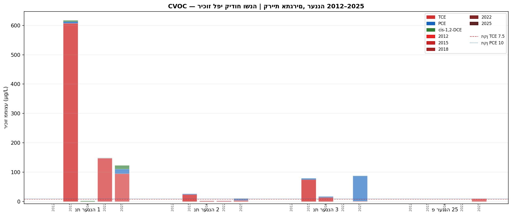
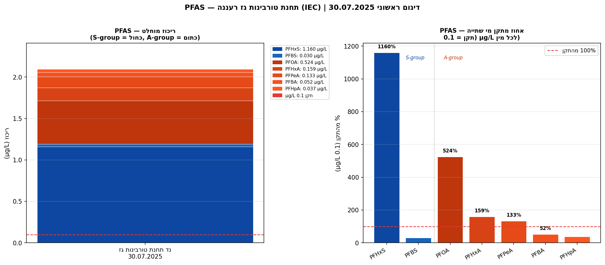

# דו"ח ניטור איכות מי תהום — אזה"ת רעננה (קריית אתגרים)
## גרסה 2.1 | מאי 2026

---

## 1. תקציר מנהלים

מערכת הניטור של אזה"ת רעננה כוללת 7 קידוחים הפרוסים על פני קריית אתגרים ודרומה, ומצביעה על **ארבעה מוקדי זיהום תעשייתי פעילים**, שניים מהם בדרגת חומרה קיצונית:

### ממצאים קריטיים

**PFAS — ממצא חדש ודחוף (יולי 2025)**
בדיגום ראשון שבוצע בקידוח נד תחנת טורבינות גז רעננה בחודש יולי 2025 נמצאו ריכוזי PFAS חורגים בעשרות ועד מאות אחוזים מתקן מי שתיה:
- **PFHxS: 1.16 µg/L — 1,160% מהתקן**
- **PFOA: 0.524 µg/L — 524% מהתקן**
- PFHxA: 0.159 µg/L (159% מהתקן), PFPeA: 0.133 µg/L (133%), PFBA: 0.052 µg/L (52%)

המקור הסביר הוא שימוש ב**קצף AFFF** (Aqueous Film Forming Foam) לכיבוי אש בתחנת טורבינות הגז. נדרש דיגום אימות דחוף ודיווח לגורמי הרגולציה.

**TCE — זיהום כרוני נרחב (2015–2026)**
קידוח נת רעננה 1 מציג ריכוזי TCE (טריכלורואתילן) חריגים ביותר: שיא של **817 µg/L בחודש יולי 2019** (= 10,893% מהתקן הישראלי של 7.5 µg/L). נכון ליולי 2025 הריכוז ירד ל-94.8 µg/L (1,264% מהתקן) — עדיין ברמה קריטית. מקור הזיהום המשוער הוא שימוש בממסים אורגניים כלורינטדים בתעשייה בקריית אתגרים.

**PCE — מגמת עלייה (2017–2024)**
קידוח נת רעננה 3 מציג עלייה מתמשכת בריכוזי PCE (טטרכלורואתילן): מ-22.9 µg/L (2017) ל-**105.5 µg/L בספטמבר 2024** (= 1,055% מהתקן של 10 µg/L). הנתון האחרון (יולי 2025): 85.5 µg/L — עדיין ברמה קיצונית. TCE יורד במקביל — סימן לשרשרת פירוק PCE→TCE.

**בנזן — זיהום מתמשך נמוך (2011–2024)**
בקידוח נד פז הנופר תועד בנזן ברמות עד 10 µg/L (2019, = 200% מהתקן של 5 µg/L). הזיהום נקשר לתחנת דלק פז הנופר הסמוכה. מגמה בלתי יציבה — ערכים אפסיים לסירוגין עם שיאים חוזרים.

### הקשר אזורי
על פי דו"ח ניטור איכות מים 2021 (משרד הגנ"ס, עמ' 49), **אזה"ת רעננה דורגה #2 מתוך 18 אזורי תעשייה** במדד חומרת הזיהום, עם ציון 7 מתוך 8 (סיווג: גבוה מאוד). אזה"ת רעננה לא נכלל בסקר TAHAL 2008 של אקוויפר החוף; ניטורה החל עם הרחבת המערכת ל-18 אזורים לקראת 2011.

---

## 2. הקשר גיאוגרפי וגיאולוגי

### מיקום ומאפיינים
אזה"ת רעננה (קריית אתגרים) ממוקם בחלקה הצפון-מזרחי של עיר רעננה, בסמוך למחלף רעננה צפון ולכביש 4. שטח האזור: **כ-770 דונם** (דו"ח 2021, עמ' 35). האזור מכיל תמהיל של תעשייה כימית ופרמצבטיקה, מכשור רפואי, אלקטרוניקה, לוגיסטיקה ומסחר.

**קואורדינטות** (מרכז האזור, ITM / EPSG:2039): X ≈ 188,800–189,400 מ', Y ≈ 677,600–678,600 מ'

### אקוויפר וגרדיאנט מי התהום
האזור מעל **אקוויפר החוף** (הפריאטי) — שכבת חול-חמרה חדירה ברמת פגיעות גבוהה. **גרדיאנט מי התהום** הכללי הוא לכיוון **צפון-מערב–מערב** (לכיוון הים התיכון); בחלקו הצפוני של האזור הגרדיאנט מועדף לכיוון **צפון-צפון-מזרח** (דו"ח 2021, עמ' 35). עומק מי התהום: כ-6–18 מ' מפני הקרקע.

כיוון הגרדיאנט מסביר את פיזור הפלום: קידוח נת רעננה 1 (הקרוב ביותר לקריית אתגרים) מציג את הריכוזים הגבוהים ביותר, ואילו קידוח פ רעננה 25 (כ-600 מ' צפון-מערבית לנת רעננה 1) מציג ריכוזי TCE של 8.9–14.1 µg/L — עדות להתפשטות הפלום לאורך וקטור הגרדיאנט.

### מטרת הניטור
מערכת 7 הקידוחים נועדה לנטר: (א) VOC כלורינטדים (TCE, PCE) בדאונגרדיינט לקריית אתגרים; (ב) BTEX בסביבת תחנת דלק פז הנופר; (ג) PFAS בסביבת תחנת הטורבינות; (ד) פרמטרים כללים בקידוחי ייצור כרקע.

---

## 3. מתקנים תעשייתיים ומפת סיכון

### מתקנים מזוהים ושיוך זיהום

#### א. תחנת טורבינות גז רעננה — חברת החשמל לישראל
- **מיקום**: ITM ≈ 189,345 / 678,575 (צפון-מזרח קריית אתגרים)
- **פעילות**: ייצור חשמל בגז טבעי; תחנה מסוג גז טבעי לשיא
- **מזהמים משויכים**: PFAS (PFHxS, PFOA, PFHxA, PFPeA ועוד)
- **מנגנון משוער**: שימוש בקצף AFFF לאימוני כיבוי אש ו/או אירועי חירום; AFFF מכיל PFAS שנדלחים לאדמה ולאקוויפר
- **רמת ביטחון לשיוך**: **גבוהה** — שם הקידוח "נד תחנת טורבינות גז רעננה" מייחס ישירות לתחנה; פרופיל PFAS (PFHxS + PFOA דומיננטיים) אופייני לתחנות כוח עם AFFF
- **מקורות**: ממצאי ניטור יולי 2025 (Excel); מנגנון AFFF מאומת בהקשר ישראלי כללי (gov.il)

#### ב. קריית אתגרים — מקורות TCE/PCE

**ב-1. אידקים (Aidchem) — ייצור כימיקלים**
- **ענף**: ייצור חומרי גלם כימיים; ממוקם בחלק הדרום-מזרחי של קריית אתגרים
- **פוטנציאל CVOC**: גבוה — ייצור כימי עשוי לכלול שימוש בממסים כלורינטדים (TCE, PCE) לניקוי ולתהליכי ייצור
- **רמת ביטחון לשיוך**: **בינונית** — מוזכר בדו"ח 2021 עמ' 35; שימוש ספציפי ב-CVOC לא מאומת ישירות; לא נמצא ב-PRTR 2024 (מתחת לסף דיווח)
- **מקור**: דו"ח ניטור 2021 עמ' 35

**ב-2. אדג' מדיקל דוויטס (Edge Medical Devices) — מכשור רפואי**
- **ענף**: תכנון ויצור מכשירים כירורגיים; ממוקם במרכז קריית אתגרים
- **פוטנציאל CVOC**: בינוני — ייצור מכשור רפואי עשוי לכלול ממסי ניקוי כלורינטדים (TCE/IPA)
- **רמת ביטחון לשיוך**: **בינונית** — מוזכר בדו"ח 2021 עמ' 35; לא נמצא ב-PRTR 2024
- **מקור**: דו"ח ניטור 2021 עמ' 35

**ב-3. אביב ריצ'רדסון (Aviv Richardson) — אלקטרוניקה**
- **ענף**: ייצור מוצרי אלקטרוניקה; פעילות מאז שנות ה-80
- **פוטנציאל CVOC**: בינוני — ניקוי לוחות PCB היסטורי שימש לעתים ב-TCE/PCE (נפוץ לפני 2000); אורך פעילות גבוה מגדיל עומס מצטבר
- **רמת ביטחון לשיוך**: **בינונית** — מוזכר בדו"ח 2021 עמ' 35; לא נמצא ב-PRTR 2024
- **מקור**: דו"ח ניטור 2021 עמ' 35

**הערה כללית — קריית אתגרים**: שלושת המתקנים לעיל מוזכרים בדו"ח 2021 כמפעלים פעילים בקריית אתגרים. שיוך ברמת מתקן ספציפי דורש דיגום פנים-מפעלי. לא נמצאו רישומי PRTR (2024) ולא רשומות ציבוריות לזיהום TCE/PCE ישיר. מסמך "מערך ניטור בארות תעשייה רעננה, 2013" (הפניה 19 בדו"ח 2021) עשוי לספק שיוך ברמת ביטחון גבוהה יותר — יש לבקש מרשות המים.

#### ג. תחנת דלק פז הנופר
- **מיקום**: ITM ≈ 189,174 / 677,924; רח' הנופר 36, אזה"ת רעננה (מאומת ב-Web)
- **פעילות**: תחנת דלק לממכר קמעוני (Paz)
- **מזהמים משויכים**: בנזן (Benzene), טולואן (Toluene)
- **מנגנון משוער**: דליפה היסטורית ממיכלי תת-קרקע (UST); בנזן נייד מאוד באקוויפר
- **רמת ביטחון לשיוך**: **גבוהה** — שם הקידוח "נד פז הנופר" מייחס ישירות; בנזן הוא חתימת UST קלאסית; כתובת אומתה ב-Web
- **מקור**: נתוני Excel 2011–2024; כתובת: OpeningHours.co.il / Waze

---

## 4. נרטיב זיהום משולב 2011–2026

### 4.1 CVOC — שליטת TCE בנת רעננה 1

נת רעננה 1 הוא קידוח ניטור תעשייתי הממוקם בלב קריית אתגרים. מאז תחילת הניטור ב-2011 ועד 2025 נמדדו 9 דיגומים. הממצא המרכזי: עלייה חדה ל-607.6 µg/L ב-2015 (8,101% מהתקן), שיא של 817 µg/L ב-2019 (10,893%), וירידה הדרגתית ל-94.8 µg/L ב-2025 (1,264%) — ירידה משמעותית אך עדיין קריטית.

ניתוח מגמה (Mann-Kendall, חלון 2020–2025): רק 2 מדידות בחלון — אין מספיק לניתוח סטטיסטי אמין. הניתוח הויזואלי מצביע על ירידה, אך אין אישור כמותי. נת רעננה 2 מציג TCE בריכוזים בינוניים-נמוכים (שיא 24 µg/L, 2015) — עדות להרחבה לטרלית של הפלום.

### 4.2 CVOC — שרשרת פירוק PCE→TCE בנת רעננה 3

נת רעננה 3 מציג תמונה הפוכה: PCE עולה בעוד TCE יורד — דפוס קלאסי של **שרשרת פירוק** PCE→TCE→cis-1,2-DCE עם מקור PCE שעדיין פעיל. PCE עלה מ-22.9 µg/L (2017) ל-105.5 µg/L (ספטמבר 2024, = 1,055% מהתקן), ונמדד ב-85.5 µg/L ביולי 2025. TCE ירד בו-זמנית מ-74.6 µg/L (2015) ל-1.6 µg/L (2025).

שרשרת הפירוק: פירוק אנאירובי ביולוגי (halorespiration) ממיר PCE→TCE→cis-DCE→VC. ריכוז ה-TCE הגבוה ב-2015 עשוי לשקף שיא ייצור TCE מ-PCE, לפני שהפירוק לנגזרות קלות יותר (cis-DCE) האיץ. נדרשות מדידות VC ו-ethene לאישור שרשרת הפירוק המלאה.

### 4.3 PFAS — ממצא קריטי חדש בנד תחנת טורבינות גז

**תאריך גילוי ראשון**: 30 יולי 2025 — דיגום ראשון המתועד ב-Excel.

פרופיל PFAS: PFHxS דומיננטי (1,160% מהתקן) יחד עם PFOA (524%) מאפיין שימוש ב-AFFF מסוג 3M Lightwater ו-Ansul — קצפי כיבוי נפוצים בתחנות כוח. יחס S-group ל-A-group גבוה מצביע על מקור תעשייתי (כיבוי אש) ולא על מקור צרכני.

לא נמצאו PFAS ברמות חריגות בקידוחים אחרים — הפלום עדיין מקומי. נדרש דיגום אימות Q3 2026 ודיווח מיידי לגנ"ס ורשות המים.

### 4.4 BTEX — רקע מתמשך מתחנת פז הנופר

תחנת דלק פז הנופר, הגובלת עם קריית אתגרים מדרום-מזרח, היא מקור ידוע לזיהום BTEX. בנזן תועד ברמות עד 10 µg/L (אוקטובר 2019, = 200% מהתקן), עם דפוס שיאים חוזרים ב-2011, 2019 ו-2024 — המאפיין דליפה מתמשכת ממיכל UST. בין השיאים נמדדים ערכים קרובים לאפס — עדות לתנועתיות של הפלום בגרדיאנט מי התהום.

---

## 5. ניתוח מגמות (Mann-Kendall, חלון 5 שנים 2020–2026)

הניתוח מבוסס על מנוע Mann-Kendall עם תיקון קשרים (tie-corrected) וסינון SNR. המגמות מוצגות לפי קידוח ופרמטר מרכזי:

| קידוח | פרמטר | n כולל | n (2020+) | Mann-Kendall Z | p-value | SNR | מגמה |
|---|---|---|---|---|---|---|---|
| נת רעננה 1 | TCE | 9 | 2 | — | — | — | לא מספיק נקודות לחלון 5 שנים |
| נת רעננה 3 | PCE | 9 | 2 | — | — | — | לא מספיק נקודות לחלון 5 שנים |
| נד פז הנופר | בנזן | 14 | 4 | 0.00 | 1.000 | 0.20 | ללא מגמה ברורה — SNR חלש |
| פ רעננה 25 | TCE | 18 | 15 | -0.90 | 0.371 | 0.80 | ללא מגמה מובהקת (p=0.371) |
| נד תחנת גז | PFAS | 1 | 1 | — | — | — | ממצא ראשוני — אין מגמה (n=1) |

**הערות**: נת רעננה 1 ו-3 — רק 2 מדידות בחלון 2020–2025; הניתוח הויזואלי מצביע על ירידה ב-TCE ועלייה ב-PCE, אך אלו אינן מאושרות סטטיסטית. מחסור חמור בנקודות ניטור בחלון הרלוונטי; מומלץ להגביר תדירות לרבעונית.

---

## 6. המלצות ניטור

### עדיפות א — מיידי (2026)

| פעולה | קידוח | פרמטר | הצדקה |
|---|---|---|---|
| דיגום אימות PFAS | נד תחנת טורבינות גז | PFAS מלא (18 מינים) | ממצא ראשוני 1,160%; אימות חיוני |
| הרחבת ניטור PFAS | כל 7 קידוחים | PFAS מלא | לאיתור היקף הפלום |
| דיגום PCE דחוף | נת רעננה 3 | PCE, TCE, cis-DCE | עלייה ל-1,055% ב-2024 |
| דיווח רגולטורי | משרד הגנ"ס + רשות המים | PFAS, TCE, PCE | על-פי סף חריגה |

### עדיפות ב — רבעונית (2026–2027)

| קידוח | פרמטרים עיקריים | תדירות |
|---|---|---|
| נת רעננה 1 | TCE, PCE, cis-DCE | רבעוני |
| נת רעננה 3 | PCE, TCE, cis-DCE | רבעוני |
| נד תחנת טורבינות גז | PFAS מלא, BTEX | רבעוני |
| נד פז הנופר | BTEX, TPH | חצי שנתי |
| נת רעננה 2 | TCE, PCE | חצי שנתי |
| פ רעננה 18, 25 | PFAS, TCE (סקר) | שנתי |

### עדיפות ג — חקירה (2026–2027)

1. **זיהוי מתקנים ספציפיים**: בקשה ממרשם אתרי הזיהום של גנ"א ומרשות המים לגבי מסמך "מערך ניטור בארות תעשייה רעננה, 2013" (הפניה 19 בדו"ח 2021) — עשוי לספק שיוך ברמת ביטחון גבוהה יותר
2. **חקירת UST** בתחנת פז הנופר — בדיקת מיכלים תת-קרקעיים
3. **בדיקת מיכלי AFFF** בתחנת הטורבינות — איתור מקורות PFAS מדויקים
4. **הוספת קידוח דאונגרדיינט**: לבדיקת התפשטות פלום TCE/PCE צפון-מערבה

---

## 7. מגבלות נתונים וצורך בבדיקה מקצועית

### מגבלות מרכזיות

1. **חסר היסטוריה לפני 2011**: אזה"ת רעננה לא נכלל בסקר TAHAL 2008 (שכיסה 10 אזורים בלבד). לא קיים נתוני baseline לפני 2011.

2. **תדירות ניטור נמוכה**: רוב הקידוחים נדגמו פעם עד שתיים בשנה. בחלון 2020–2025 יש רק 2 מדידות ל-TCE ול-PCE — פחות מהנדרש לניתוח מגמה סטטיסטי אמין.

3. **ממצאי PFAS ראשוניים בלבד**: מדידה אחת (07/2025) — לא ניתן לקבוע האם זה פלום חדש, ישן, או נקודת שיא.

4. **שיוך מקורות חלקי**: מקורות TCE/PCE בקריית אתגרים זוהו ב-3 מתקנים MEDIUM confidence (דו"ח 2021 עמ' 35). מתקנים נוספים עשויים להיות רלוונטיים. PRTR 2024 לא הכיל רישומים תעשייתיים מהאזור (מתחת לסף דיווח).

5. **אנומליה 2018**: TCE בנת רעננה 1 = 0 ב-2018 לאחר שנים בערכים גבוהים — ייתכן שגיאת דיגום, שינוי שיטה, או ירידה אמיתית. לא ניתן להכריע ללא בדיקה.

6. **קואורדינטות 2021**: קובץ base_layer/report_2021/raanana.json מכיל קואורדינטות (0,0) — הנתון נלקח מה-Excel ולא מה-PDF.

### נדרשת סקירה מקצועית
**דו"ח זה אינו תחליף לבדיקה מקצועית של הידרוגיאולוג מוסמך.** ממצאי PFAS, TCE ו-PCE בחריגה משמעותית מתקן מי שתיה דורשים הערכת סיכון רשמית, שיוך מקורות מוסמך, ותכנית פעולה מאושרת.

---

## 8. מטא-נתונים ומקורות

| פריט | ערך |
|---|---|
| תאריך עריכה | מאי 2026 |
| גרסה | 2.1 (V2.1 — תיקוני טרמינולוגיה, מבנה §4, הרחבת §3 עם מקורות חיצוניים) |
| מקור נתוני ניטור | Excel: "היסטורית איכות מים לקידוחים — מעודכן לבדיקה.xlsx" |
| טווח נתונים | 2011–2026 (בעיקר 2011–2025) |
| מקור הקשר אזורי | דו"ח ניטור 2021 (בקרת איכות מים, משרד הגנ"ס), עמ' 35–36, 49 |
| מקורות חיצוניים | PRTR ישראל 2024 (prtr_fulldatabase-2024.xlsx, 15.7 MB) — נבדק 2026-05-04 |
| | דו"ח ניטור שפכים תאגיד מי רעננה 2025 (PDF, 265 KB) — נבדק 2026-05-04 |
| | חיפוש Web — 6 שאילתות — 2026-05-04 (ראה web_findings.md) |
| תאריך snapshot Excel | כפי שנקרא 29 אפריל 2026 |
| סינון פרמטרים | TPFAS (סכומי מחושב) ו-BETK הוחרגו מכל ניתוח |
| מנוע מגמות | Mann-Kendall (tie-corrected, continuity-corrected Z), SNR ≥ 0.3 לסיווג |
| בחירת קידוחים | Tier 2 מרחבי (פוליגון קריית אתגרים), 7 קידוחים |
| מזהי קידוחים | raanana_nt_1, raanana_nt_2, raanana_nt_3, raanana_nd_paz_hanofer, raanana_nd_turbine, raanana_p_18, raanana_p_25 |
| מגבלת ניתוח | TAHAL 2008 — אינו כולל את רעננה; אין נתוני 1999–2008 |

### ממצאים ומקורות ספציפיים
- TCE שיא 817 µg/L: Excel, נת רעננה 1 (raanana_nt_1), תאריך 2019-07-22
- PCE שיא 105.5 µg/L: Excel, נת רעננה 3 (raanana_nt_3), תאריך 2024-09-04
- PFHxS 1.16 µg/L: Excel, נד תחנת טורבינות גז (raanana_nd_turbine), תאריך 2025-07-30
- PFOA 0.524 µg/L: Excel, נד תחנת טורבינות גז (raanana_nd_turbine), תאריך 2025-07-30
- בנזן שיא 10 µg/L: Excel, נד פז הנופר (raanana_nd_paz_hanofer), תאריך 2019-10-23
- סיווג חומרה 7/8: דו"ח ניטור 2021, עמ' 49
- דירוג #2/18: דו"ח ניטור 2021, עמ' 49
- שטח 770 דונם: דו"ח ניטור 2021, עמ' 35
- גרדיאנט NW-W: דו"ח ניטור 2021, עמ' 35
- אידקים, Edge Medical Devices, אביב ריצ'רדסון: דו"ח ניטור 2021, עמ' 35
- פז הנופר — כתובת: OpeningHours.co.il (אומת 2026-05-04)
- PRTR — ממצא: מכון טיהור רעננה בלבד (141336), קידוד ISIC 56
- ניטור שפכים — ממצא: כסומים בלבד; אין TCE/PCE/PFAS; חריגה קלה שמן מינרלי בניאו מוטורוס

---

*גרסה 2.1 מחליפה V2 (מאי 2026). שינויים: תיקון טרמינולוגיה ("שרשרת פירוק" במקום "שרשרת ריקבון"; "גרדיאנט מי התהום" במקום "זרימת מים"); הסרת טבלת קידוחים מסעיף 2 ו-4 טבלאות נתונים מסעיף 4 (הוחלפו בגרפים); עדכון שטח ל-770 דונם; תיקון גרדיאנט ל-NW-W; הוספת 3 מתקני קריית אתגרים (MEDIUM) ממקור 2021 עמ' 35; הוספת מקורות PRTR/שפכים/Web.*
