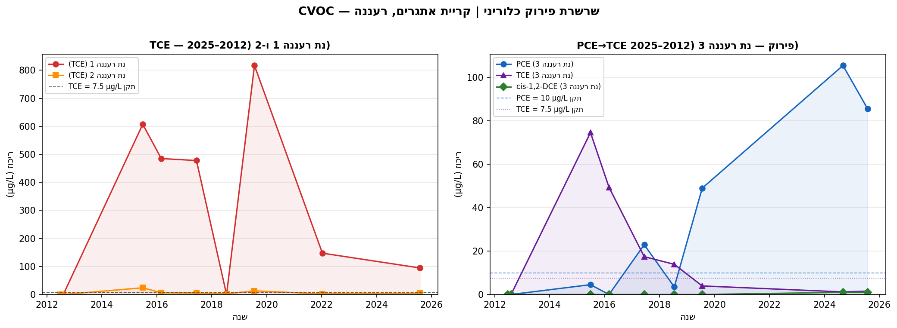
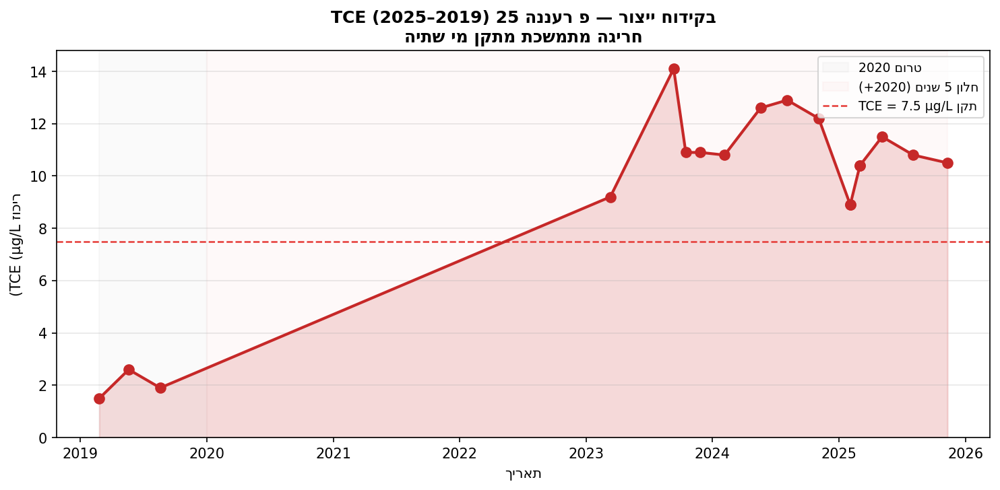
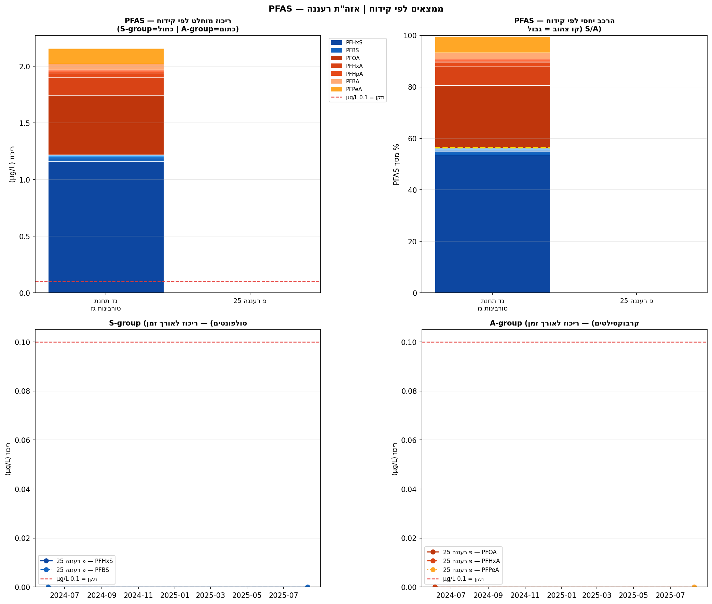
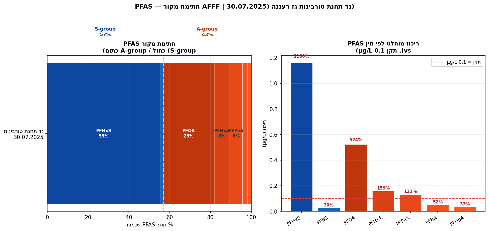
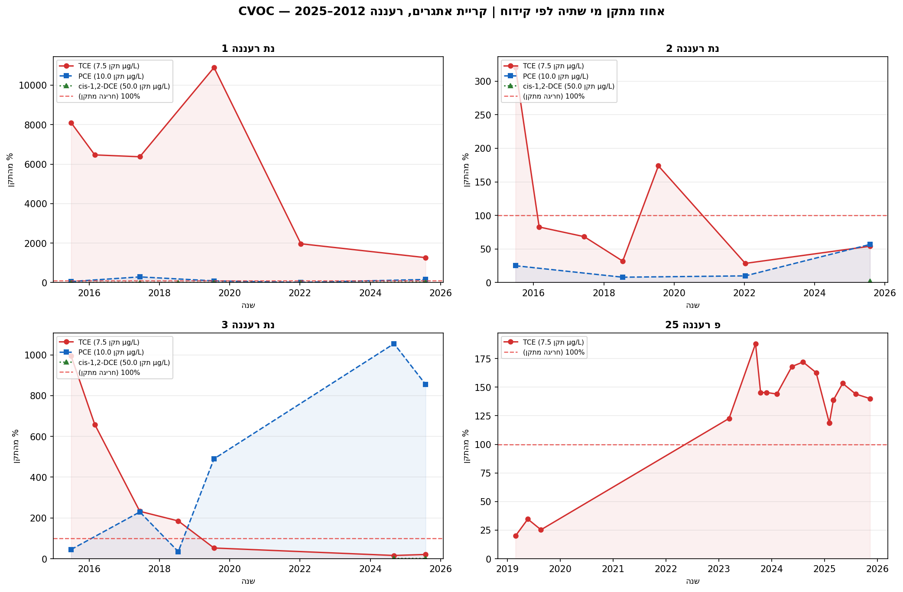
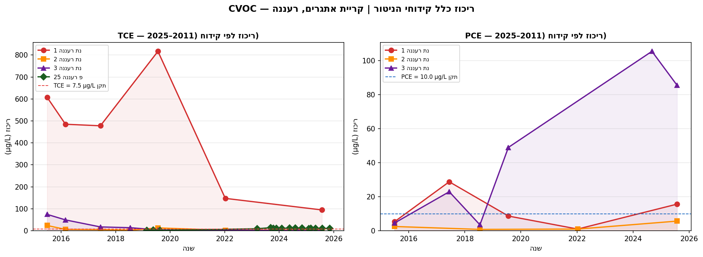
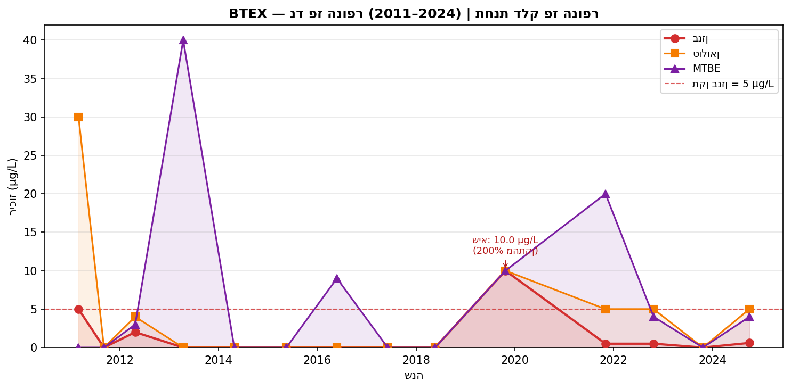
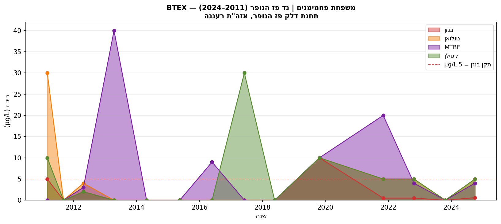

# דו"ח ניטור איכות מי תהום — אזה"ת רעננה (קריית אתגרים)
## גרסה 3 | מאי 2026

---

## 1. תקציר מנהלים

מערכת הניטור של אזה"ת רעננה — שבעה קידוחים הפרוסים על פני קריית אתגרים ודרומה — מזהה ארבעה מוקדי זיהום פעילים, שניים מהם בדרגת חומרה קיצונית. הסקר ההיסטורי של 2013, נתוני הניטור הסדיר 2011–2025 ומדידות PFAS 2025 מצביעים יחד על דינמיקת זיהום רב-שנתית, מרובת מקורות, הנמצאת בשלבי התפתחות שונים בקידוחים השונים.

**ממצאים דחופים:**

1. **PFAS — נד תחנת טורבינות גז** (דיגום ראשון יולי 2025): PFHxS ב-1,160% מהתקן, PFOA ב-524% — חריגה המחייבת דיווח לרשות המים ולמשרד הגנת הסביבה תוך 30 יום ודיגום אישוש ברבעון 3 2026.
2. **TCE — נת רעננה 1** (2015–2025): שיא של 817 µg/L (10,900% מהתקן); ריכוז עדכני 94.8 µg/L (1,264%); פלום שהגיע לקידוח הייצור פ רעננה 25.
3. **PCE — נת רעננה 3** (2017–2024): עלייה מ-22.9 ל-105.5 µg/L (1,055% מהתקן); שרשרת פירוק PCE→TCE פעילה עם מקור שטרם דעך.
4. **בנזן — נד פז הנופר** (2011–2024): שיא 10 µg/L (200% מהתקן) ב-2019; ריכוזים חיוביים גם ב-2024; מקור עדיין פעיל.

על פי דוח ניטור 2021 (משרד הגנת הסביבה, עמ' 49), אזה"ת רעננה דורג **מקום שני מתוך 18 אזורי תעשייה** במדד חומרת הזיהום, עם ציון 7 מתוך 8.

---

## 2. ההקשר הגיאוגרפי-תעשייתי

קריית אתגרים ממוקמת בחלקה הצפון-מזרחי של עיר רעננה, שטחה כ-770 דונם, ומכילה תמהיל של תעשייה כימית ופרמצבטיקה, מכשור רפואי, אלקטרוניקה ולוגיסטיקה (דוח 2021, עמ' 35). מתחתה שוכן **אקוויפר החוף** — שכבת חול-חמרה פריאטית בעלת פגיעות גבוהה, עם מפלס מי תהום בעומק 6–18 מ' מפני הקרקע. **גרדיאנט הזרימה** הכללי הוא צפון-מערב–מערב, עם נטייה צפון-צפון-מזרחית בחלקו הצפוני (דוח 2021, עמ' 35).

הסקר ההיסטורי של רשות המים (דוח 2013, טבלה 3, עמ' 13) זיהה שלושה מפעלים בקריית אתגרים כבעלי פוטנציאל זיהום גבוה: **אידכים** (ייצור כימיקלים אורגניים, ממסים, חומצות ובסיסים), **אדג' מדיקל דוויסס** (מכשור רפואי ותהליכי ניקוי כימי) ו**אביב ריצ'רדסון בע"מ** (אלקטרוניקה, עם שימוש היסטורי בממסים כלוריניים). בגבולות הקריה פועלות גם **תחנת טורבינות הגז** של חברת החשמל בצפון-מזרח (מקור PFAS) ו**תחנת דלק פז הנופר** בדרום-מזרח (מקור BTEX).

**מסלול ההתפשטות**: מזהמים בצפיפות גבוהה (DNAPL) שנחדרים לאקוויפר בלב הקריה נעים עם הגרדיאנט מערבה לעבר קידוחי הייצור שמדרום ומדרום-מערב — ביניהם פ רעננה 25. קידוחי הניטור (נת רעננה 1, 2 ו-3), שהוקמו ב-2012, ממוקמים על מסלול זה כדי לזהות את התפשטות הפלום בטרם יגיע לנקודות ייצור.

---

## 3. ממצאי הניטור

הסקר ההיסטורי שבוצע בידי רשות המים (דוח 2013, טבלה 5, עמ' 19) מתעד נוכחות מזהמים בקריית אתגרים עוד בשנות ה-2000: בתחנת טורבינות הגז נמדדו בין 2003 ל-2006 PCE ב-1.3–10.0 µg/L ו-TCE ב-0.4–3.0 µg/L; בנד פז הנופר תועדו בנזן, טולואן ו-MTBE ברמות ניכרות (דוח 2013, סעיף 3.2, עמ' 13); שש בארות ייצור, ובהן פ רעננה 18 ופ רעננה 25, לא הציגו חריגות. בעקבות ממצאים אלה הוקמו ב-2012 שלושה קידוחי ניטור: נת רעננה 1 בגבולה המערבי של הקריה (דרומית לאדג' מדיקל, מערבית לאביב ריצ'רדסון), נת רעננה 2 ממערב-דרום-מערב, ונת רעננה 3 ממערב לאידכים (דוח 2013, עמ' 14). כל שלושתם נקדחו ל-40 מ' עם מסנן בשכבה 30–40 מ' — עומק המיועד ללכוד מזהמי DNAPL השוקעים בתחתית הרצף הרווי. דיגומי הפתיחה (קיץ 2012) לא הצביעו על זיהום מעל סף הזיהוי.

בדיגום 2015 נמדד TCE ב-607.6 µg/L בנת רעננה 1 (8,101% מהתקן), בעוד נת רעננה 2 רשם TCE עד 24 µg/L ו-PCE החל להופיע בנת רעננה 3. הגרדיאנט בריכוזים בין הקידוחים עקבי עם פלום שמקורו במרכז הקריה ומתפשט מערבה. TCE בנת רעננה 1 הגיע לשיאו ב-**817 µg/L** (יולי 2019; Excel: נת רעננה 1, 2019-07-22) — 10,900% מהתקן. בנת רעננה 3, בו-זמנית, PCE עלה מ-22.9 µg/L (2017) ל-105.5 µg/L (ספטמבר 2024; Excel: נת רעננה 3, 2024-09-04) בעוד TCE יורד — דפוס אופייני לשרשרת פירוק PCE→TCE→cis-DCE עם מקור PCE פעיל. ב-2023 נמדד TCE בפ רעננה 25 ב-9.2 µg/L — חריגה ראשונה מהתקן בקידוח ייצור זה, 600 מ' דרום-מערבית לנת רעננה 1 (Excel: פ רעננה 25, 2023-09-11).

בנד פז הנופר, ריכוזי בנזן מציגים תנודות בין מתחת לסף הזיהוי לשיאים ניכרים, ללא מגמה כיוונית מובהקת (Mann-Kendall Z=0.00, p=1.00) — דפוס אופייני לדליפה כרונית ממיכל תדלוק תת-קרקעי (UST). שיא של 10 µg/L נמדד באוקטובר 2019 (Excel: נד פז הנופר, 2019-10-23) — 200% מהתקן — בנפרד מפלום ה-CVOC. דיגום PFAS ראשון שנערך ב-30 ביולי 2025 בנד תחנת טורבינות גז העלה ריכוזים החורגים משמעותית מהתקן: PFHxS ב-1.16 µg/L (1,160%; Excel: נד תחנת טורבינות גז, 2025-07-30), PFOA ב-0.524 µg/L (524%), ועוד ארבעה מינים מעל התקן. פרופיל ה-PFAS — דומיננטיות PFHxS על פני PFOS יחד עם PFOA גבוה ו-C4 נמוך — תואם חתימת קצף כיבוי AFFF מהדור הישן (3M FC-203 / Ansul AFFF, שיוצרו לפני 2009). ממצאי VOC שתועדו בקידוח זה בסקר 2003–2006 (PCE ב-10 µg/L, TCE ב-3 µg/L; דוח 2013) מחזקים את הדיוקן של אתר עם עומס זיהום מורכב.

נכון לתקופה האחרונה (2022–2025), ארבעה תהליכים פעילים בו-זמנית באזה"ת רעננה: TCE בנת רעננה 1 ממשיך לרדת מהשיא של 2019 ועומד על 94.8 µg/L (2025) — 1,264% מהתקן; PCE בנת רעננה 3 ממשיך לעלות (105.5 µg/L ב-2024) עם שרשרת פירוק פעילה; TCE בפ רעננה 25 נותר בחריגה מתמשכת (8.9–14.1 µg/L, 2023–2025); וממצאי PFAS בנד תחנת טורבינות גז (יולי 2025) ממתינים לאישוש. המגמות הסטטיסטיות המובהקות מחזקות תמונה זו: cis-1,2-DCE עולה בנת רעננה 1 (Mann-Kendall Z=1.92, p=0.055, SNR=1.02); כלורופורם עולה בו-זמנית בנת רעננה 2 (Z=2.26, p=0.024), נת רעננה 3 (Z=2.42, p=0.016) ופ רעננה 25 (Z=2.38, p=0.017) — ממצא המרמז על מקור אזורי משותף. כלל הממצאים מצביעים על כך שמקורות הזיהום העיקריים טרם דעכו.

---

## 4. ניתוח המגמות

### ניתוח CVOC — ריכוזים ומגמות

הפאנל מציג את ריכוזי TCE ו-PCE כאחוז מהתקן לאורך הזמן בארבעת הקידוחים: נת רעננה 1 בשיא 10,900% ב-2019 ובירידה ל-1,264% ב-2025; נת רעננה 3 בעלייה מתמשכת ל-1,055% ב-2024; נת רעננה 2 יציב מתחת ל-400%; ופ רעננה 25 בחריגה מ-2023 ואילך.

מנוע Mann-Kendall, המחשב מגמה בחלון 5 שנים, מוגבל ברוב קידוחי CVOC ממיעוט מדידות (שתי נקודות בלבד לנת רעננה 1 ו-3 בחלון 2020–2025). עם זאת, תוצאות סטטיסטית מובהקות — עלייה ב-cis-DCE (נת רעננה 1), עלייה בכלורופורם (נת רעננה 2, 3, פ רעננה 25) — מצביעות על המשך פירוק ביוכימי פעיל ועל מקורות זיהום שטרם דעכו.

### ניתוח BTEX — נד פז הנופר

ריכוזי בנזן בנד פז הנופר מציגים תנודות בין ריכוז מתחת לסף הזיהוי לשיאים ניכרים, ללא מגמה כיוונית מובהקת (Mann-Kendall Z=0.00, p=1.00). דפוס זה אופייני לדליפה כרונית ממיכל תדלוק תת-קרקעי (UST) עם קצב דליפה משתנה. הירידה ל-0.001 µg/L ב-2023 והחזרה ל-0.6 µg/L ב-2024 מעידות שמקור הזיהום עדיין פעיל.

---

## 5. המלצות

### מיידי — תוך 30–90 יום

ממצאי PFAS בנד תחנת טורבינות גז מחייבים **דיווח לרשות המים ולמשרד הגנת הסביבה** ו**דיגום אישוש** (18 מיני PFAS, מעבדה מוסמכת) ברבעון 3 2026. חריגת TCE הרציפה בפ רעננה 25 (קידוח ייצור) מחייבת **בירור מסלול אספקת המים** — האם מים מקידוח זה מגיעים לרשת שתייה — ודיווח רגולטורי בהתאם.

### ניטור שוטף — 2026–2027

ניטור **רבעוני** של TCE, PCE, cis-1,2-DCE ו-VC בנת רעננה 1, 2 ו-3; ניטור **רבעוני** של PFAS מלא (18 מינים) בנד תחנת טורבינות גז; ניטור **חצי-שנתי** של BTEX בנד פז הנופר; **הרחבת ניטור PFAS לכל 7 קידוחים** לאיתור היקף הפלום. פ רעננה 18, שלא נדגם מאז 2011, זקוק לחידוש ניטור VOC ולדיגום PFAS ראשון.

### חקירה — 2026–2027

**מקור PFAS**: בדיקת מיכלי AFFF, תיעוד אירועי כיבוי ותרגולים בתחנת הטורבינות, הצלבה עם ארכיון חברת החשמל. **מקור CVOC**: דיגום פנים-מפעלי באידכים, אדג' מדיקל ואביב ריצ'רדסון לצמצום אי-הוודאות בשיוך המקור. **מקור BTEX**: בדיקת מיכלי UST בתחנת פז הנופר. **הרחבת מערך**: התקנת קידוח דאונגרדיינט מערבה לנת רעננה 1 לתיעוד היקף ההתפשטות.

---

## 6. מגבלות ומקורות

### מגבלות מרכזיות

לאזה"ת רעננה אין נתוני baseline לפני 2011 (האזור לא נכלל בסקר TAHAL 2008). תדירות ניטור של 1–2 דיגומים לשנה ברוב הקידוחים יוצרת פערים המגבילים את הניתוח הסטטיסטי: בנת רעננה 1 ו-3 נותרות שתי מדידות בלבד בחלון 5 השנים האחרונות. ממצאי PFAS מבוססים על דיגום אחד (07/2025) וממתינים לאישוש. שיוך המקורות לרמת מפעל ספציפי נשמר ברמת ביטחון **בינונית** לכל מפעל בקריית אתגרים — ללא דיגום פנים-מפעלי לא ניתן להכריע. דוח זה אינו תחליף לבדיקה של הידרוגיאולוג מוסמך; ממצאיו מחייבים הערכת סיכון רשמית.

### מקורות

| פריט | ערך |
|---|---|
| נתוני ניטור | Excel: "היסטורית איכות מים לקידוחים — מעודכן לבדיקה.xlsx" (2011–2025) |
| הקשר 2013 | דוח רשות המים 2013: "מערך ניטור בארות תעשייה רעננה" — עמ' 13–19 |
| הקשר אזורי | דוח ניטור 2021 (משרד הגנ"ס) — עמ' 35–36, 49 |
| מנוע מגמות | Mann-Kendall (tie-corrected), SNR ≥ 0.3, חלון 5 שנים |
| גרפים | `Raanana/charts_v2/` — 8 גרפים, נוצרו מאי 2026 |
| ממצאים ספציפיים | TCE 817 µg/L: Excel, נת רעננה 1, 2019-07-22 |
| | PCE 105.5 µg/L: Excel, נת רעננה 3, 2024-09-04 |
| | PFHxS 1.16 µg/L: Excel, נד תחנת טורבינות גז, 2025-07-30 |
| | PFOA 0.524 µg/L: Excel, נד תחנת טורבינות גז, 2025-07-30 |
| | בנזן 10 µg/L: Excel, נד פז הנופר, 2019-10-23 |
| | TCE 14.1 µg/L: Excel, פ רעננה 25, 2023-09-11 |
| דירוג | רעננה #2/18, ציון 7/8: דוח 2021, עמ' 49 |
| שטח | 770 דונם: דוח 2021, עמ' 35 |
| גרדיאנט | NW–W: דוח 2021, עמ' 35 |

---

*גרסה 3 (מאי 2026) — שפה מקצועית, ניתוח משולב ללא חלוקה לתקופות ומקורות, גרפי עקומות ל-CVOC, גרף PFAS רב-קידוחי לפי סקיל S/A.*
