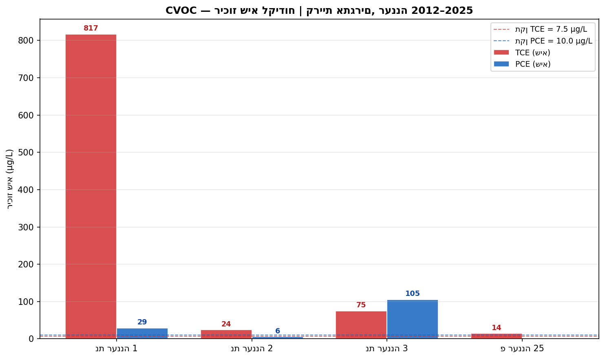

# דו"ח ניטור איכות מי תהום — אזה"ת רעננה (קריית אתגרים)
## גרסה 3 | מאי 2026

---

## 1. תקציר מנהלים

מערכת שבעת הקידוחים של אזה"ת רעננה מצביעה על אזור תעשייה עם זיהום מי תהום רב-שנתי, מרובה מקורות, בחלקו חמור ביותר. ממצאי 2023–2025 מחמירים תמונה שכבר הייתה קשה: פלום TCE שיצא מגבולות הקריה, PCE שעולה ללא הפסקה, ו-PFAS קריטי שגולה לראשונה ב-2025.

**ארבעה ממצאים מחייבים טיפול מיידי:**

1. **PFAS קריטי — תחנת טורבינות גז** (גולה יולי 2025): PFHxS ב-1,160% מהתקן, PFOA ב-524% — מחייב דיווח לרשות המים ולמשרד הגנת הסביבה תוך 30 יום.
2. **TCE כרוני — נת רעננה 1** (2015–2025): שיא של 817 µg/L (10,900% מהתקן), כיום 95 µg/L — פלום שכבר הגיע לקידוח הייצור פ רעננה 25.
3. **PCE עולה — נת רעננה 3** (2017–2024): מ-22.9 ל-105.5 µg/L (1,055% מהתקן) — שרשרת פירוק פעילה עם מקור שטרם דעך.
4. **בנזן כרוני — נד פז הנופר** (2011–2024): שיא 200% מהתקן ב-2019, ריכוזים חיוביים גם ב-2024.

על פי דוח ניטור 2021 (משרד הגנת הסביבה, עמ' 49), אזה"ת רעננה דורג **מקום שני מתוך 18 אזורי תעשייה** במדד חומרת הזיהום, עם ציון 7 מתוך 8.

---

## 2. ההקשר הגיאוגרפי-תעשייתי

קריית אתגרים ממוקמת בחלקה הצפון-מזרחי של עיר רעננה, שטחה כ-770 דונם, ומכילה תמהיל של תעשייה כימית ופרמצבטיקה, מכשור רפואי, אלקטרוניקה ולוגיסטיקה (דוח 2021, עמ' 35). מתחתה שוכן **אקוויפר החוף** — שכבת חול-חמרה פריאטית בעלת פגיעות גבוהה, עם מפלס מי תהום בעומק 6–18 מ' מפני הקרקע. **גרדיאנט הזרימה** הכללי הוא צפון-מערב–מערב (לכיוון הים התיכון), עם נטייה צפון-צפון-מזרחית בחלקו הצפוני (דוח 2021, עמ' 35). כיוון זה הוא מפתח להבנת מסלול התפשטות הפלום.

בטרם הותקן מערך הניטור הנוכחי, הסקר ההיסטורי של רשות המים (דוח 2013, טבלה 3, עמ' 13) זיהה שלושה מפעלים בקריית אתגרים כבעלי פוטנציאל זיהום גבוה במיוחד: **אידכים** (ייצור כימיקלים אורגניים, ממסים, חומצות ובסיסים), **אדג' מדיקל דוויסס** (מכשור רפואי ותהליכי ניקוי כימי) ו**אביב ריצ'רדסון בע"מ** (אלקטרוניקה עם שימוש היסטורי בממסים כלוריניים). בצמוד לקריה פועלות גם **תחנת טורבינות הגז** של חברת החשמל בצפון-מזרח — מקור ה-PFAS — ו**תחנת דלק פז הנופר** בדרום-מזרח — מקור הבנזן. שתיהן מוקדי זיהום עצמאיים, שתועדו לאורך שנות הניטור כחלק בלתי-נפרד מהנוף התעשייתי של האזור.

ההשלכה המרחבית ישירה: מזהמים בצפיפות גבוהה (DNAPL) שנחדרים לאקוויפר בלב הקריה נעים מערבה עם גרדיאנט הזרימה, ומגיעים בסופו של דבר לקידוחי הייצור הפרטיים שמדרום ומדרום-מערב — ביניהם פ רעננה 25. קידוחי הניטור (נת רעננה 1, 2 ו-3), שהוקמו ב-2012 בדיוק על מסלול זה, נועדו לזהות את התפשטות הפלום לפני שיגיע לנקודות ייצור.

---

## 3. סיפור הזיהום — מ-2003 ועד היום

### הטרם-ניטור: עדויות שנחשפו בדיעבד (2003–2011)

הסקר ההיסטורי שתיעד רשות המים לפני התקנת מערך הניטור (דוח 2013, טבלה 5, עמ' 19) מגלה שהזיהום קדם לניטור בשנים. בתחנת טורבינות הגז, בדיגומים שנערכו בין 2003 ל-2006, נמצאו PCE ב-1.3–10.0 µg/L ו-TCE ב-0.4–3.0 µg/L. ב-2011 הם לא נמדדו עוד — שיפור לכאורה שיתברר בדיעבד כחלקי: ב-2025 נגלה בקידוח זה זיהום PFAS חמור שנצטבר מתחת לפני השטח כל אותן שנים ללא שאף אחד חיפש. בנד פז הנופר תועד בנזן, טולואן ו-MTBE ברמות ניכרות כבר בראשית שנות ה-2000 (דוח 2013, סעיף 3.2, עמ' 13). ושש בארות ייצור שנסקרו — כולל פ רעננה 18 ופ רעננה 25 — נמצאו נקיות לחלוטין אותה תקופה.

### הקמת המערך ושקט מדומה (2012)

בין מארס למאי 2012 הוקמו שלושה קידוחי ניטור — נת רעננה 1 בגבולה המערבי של הקריה, דרומית לאדג' מדיקל ומערבית לאביב ריצ'רדסון; נת רעננה 2 ממערב-דרום-מערב; ונת רעננה 3 ממערב לאידכים (דוח 2013, עמ' 14). כל שלושתם נקדחו ל-40 מטר, עם מסנן בשכבה 30–40 מ' — עומק שנועד ללכוד DNAPL השוקע בחלק התחתון של הרצף הרווי. הדיגומים הראשונים של קיץ 2012 לא העלו דבר. הדממה הייתה זמנית.

### גל הזיהום הראשון: TCE ו-PCE עולים (2015–2019)

ב-2015 נעצרה הדממה. נת רעננה 1 הציג לפתע TCE ב-607.6 µg/L — יותר מפי 80 מהתקן. במקביל, נת רעננה 2 רשם TCE של עד 24 µg/L, ו-PCE החל להופיע בנת רעננה 3. שלושה קידוחים, שלושה ריכוזים שונים בסדרי גודל שונים — תמונה עקבית עם פלום שיצא ממרכז הקריה ומתפזר מערבה, מדוּלל עם המרחק.

בין 2016 ל-2019 נת רעננה 1 נשאר ברמות קיצוניות — 478–817 µg/L — עם שיא של **817 µg/L ביולי 2019** (10,900% מהתקן). נת רעננה 3 הציג PCE עולה. ובנד פז הנופר, אותה שנה, שיא עצמאי של בנזן ב-10 µg/L — לא קשור לפלום ה-CVOC, אלא לדליפה מחודשת ממיכל תדלוק תת-קרקעי.

### TCE יורד, PCE עולה, הפלום מגיע לייצור (2019–2024)

מ-2019 ואילך נת רעננה 1 מתחיל לרדת: 148 µg/L ב-2022 ו-94.8 µg/L ב-2025 — ירידה נצפית, אם כי עם רק שתי מדידות בחלון 5 השנים האחרונות אי-אפשר לאשרה סטטיסטית. בו-זמנית, נת רעננה 3 מציג דפוס הפוך: **PCE עלה מ-22.9 µg/L (2017) ל-105.5 µg/L (ספטמבר 2024)** — 1,055% מהתקן — בעוד ה-TCE בו יורד. זהו דפוס קלאסי של שרשרת פירוק PCE→TCE→cis-DCE: מקור PCE פעיל שהתוצר שלו (TCE) בדיוק עדיין רמה גבוהה, בעוד עצמו כבר מצטבר.

לאורך כל התקופה מתרחש גם תהליך ביוכימי עמוק: cis-1,2-DCE — תוצר הפירוק הבא — מציג מגמת עלייה גבולית בנת רעננה 1 (Mann-Kendall Z=1.92, p=0.055, SNR=1.02), המאשרת שפירוק אנאירובי פעיל מתחולל בגוף האקוויפר. עוד ממצא מקביל: כלורופורם עולה בשלושה קידוחים בו-זמנית — נת רעננה 2 (Z=2.26, p=0.024), נת רעננה 3 (Z=2.42, p=0.016) ופ רעננה 25 (Z=2.38, p=0.017) — ממצא שרומז על מקור כלורופורם אזורי משותף.

ב-2023, הפלום הגיע לנקודה חדשה: **פ רעננה 25, קידוח ייצור פרטי 600 מ' דרום-מערבית לנת רעננה 1**, הציג TCE ב-9.2 µg/L — חריגה ראשונה מהתקן בקידוח שממנו מסופקים מי שתייה. ב-2024–2025 הריכוזים נעים ב-8.9–14.1 µg/L, יציבים ברמת חריגה. הפלום הגיע למים שעשויים לשתות אותם.

### הממצא הקריטי החדש: PFAS בתחנת הטורבינות (יולי 2025)

ב-30 ביולי 2025, בדיגום PFAS ראשון שנערך אי-פעם בנד תחנת טורבינות גז, התגלה זיהום חמור לחלוטין: PFHxS ב-1.16 µg/L (1,160% מהתקן), PFOA ב-0.524 µg/L (524%), ועוד ארבעה מינים מעל התקן. שום ממצא קודם לא רמז על כך — לא כי הזיהום לא היה, אלא כי איש לא חיפש.

פרופיל ה-PFAS — דומיננטיות PFHxS על פני PFOS, יחד עם PFOA גבוה ו-C4 נמוך — הוא חתימת קצף כיבוי AFFF מהדור הישן (3M FC-203 / Ansul AFFF, שיוצרו לפני 2009). המשמעות: זיהום שנצטבר על פני עשרות שנים של אימוני כיבוי ושריפות בתחנה, ועלה למי התהום ללא ידיעה. ממצאי VOC שתועדו באותו קידוח בשנות ה-2000 (PCE, TCE ברמות 1.3–10 µg/L) מחזקים את התמונה של אתר עם כרוניקה ארוכה של זיהום.

---

## 4. ניתוח המגמות — מה הנתונים מלמדים

### תמונה משולבת: ארבעת קידוחי CVOC

הפאנל הזה מסכם את נרטיב ה-CVOC: נת רעננה 1 בשיא מעל 10,000%, יורד אך נשאר ב-1,200%; נת רעננה 3 עולה בהתמדה שמונה שנים; נת רעננה 2 יציב בינוני; ופ רעננה 25 מתייצב מעל התקן אחרי פער של ארבע שנים. ארבע נקודות, מערכת אחת.

מנוע Mann-Kendall, המחשב מגמה בחלון 5 שנים, מוגבל ברוב קידוחי CVOC ממחסור במדידות (רק שתי נקודות ל-TCE ו-PCE בנת רעננה 1 ו-3 בחלון 2020–2025). עם זאת, מה שמובהק סטטיסטית — עלייה ב-cis-DCE בנת רעננה 1, עלייה בכלורופורם בנת רעננה 2, 3 ופ רעננה 25 — מאשש שתהליכי פירוק ביוכימי ממשיכים ושמקורות הזיהום פעילים.

### BTEX: שיא וחזרה

בנזן בנד פז הנופר מציג דפוס שונה מה-CVOC — תנודות חדות בין אפס לשיא, ללא מגמה כיוונית (Mann-Kendall Z=0.00, p=1.00). דפוס זה אופייני לדליפה ממיכל UST עם קצב דליפה לא אחיד: שקט לסירוגין ושיאים בלתי-צפויים. ירידה ל-0.001 µg/L ב-2023 הכשילה את ההתרשמות של "נוטרל", וב-2024 חזר הבנזן ל-0.6 µg/L — המקור עדיין פעיל.

---

## 5. המלצות

### מיידי — תוך 30–90 יום

ממצא ה-PFAS בנד תחנת טורבינות גז, שריכוזיו עולים פי עשרה על התקן, מחייב **דיווח מיידי לרשות המים ולמשרד הגנת הסביבה**, ודיגום אישוש (18 מיני PFAS, מעבדה מוסמכת) ברבעון 3 2026. במקביל, חריגת TCE הרציפה בפ רעננה 25 (קידוח ייצור) מחייבת **בירור מסלול אספקת המים** — האם מים מקידוח זה מגיעים לרשת שתייה, ואם כן, מה הסיכון לאוכלוסייה — ודיווח רגולטורי בהתאם תוך 30 יום.

### ניטור שוטף — 2026–2027

ניטור **רבעוני** של TCE, PCE, cis-1,2-DCE ו-VC בנת רעננה 1, 2 ו-3 לאישור או הפרכת מגמות; ניטור **רבעוני** של PFAS מלא (18 מינים) בנד תחנת טורבינות גז; ניטור **חצי-שנתי** של BTEX בנד פז הנופר; **הרחבת ניטור PFAS לכל 7 קידוחים** לאיתור היקף הפלום. פ רעננה 18, שלא נדגם מאז 2011, זקוק לחידוש ניטור VOC מיידי ולבדיקת PFAS ראשונה — 15 שנות שקט אינן ערובה לניקיון.

### חקירה — 2026–2027

נדרשת חקירה מקצועית של שני נושאים מרכזיים: **מקור ה-PFAS** — בדיקת מיכלי AFFF, תיעוד אירועי כיבוי ותרגולים בתחנת הטורבינות, והצלבה עם ארכיון חברת החשמל; ו**מקור ה-CVOC** — דיגום פנים-מפעלי בשלושת המפעלים בעלי הסיכון הגבוה (אידכים, אדג' מדיקל, אביב ריצ'רדסון) לצמצום אי-הוודאות בשיוך המקור מרמת ביטחון בינונית לגבוהה. כמו כן, **בדיקת מיכלי UST** בתחנת פז הנופר לאישור או שלילה של מקור הבנזן, והתקנת קידוח דאונגרדיינט מערבה לנת רעננה 1 לתיעוד היקף ההתפשטות.

---

## 6. מגבלות ומקורות

### מגבלות מרכזיות

אין נתוני בסיס (baseline) לפני 2011 לאזה"ת רעננה — הסקר של 2013 נתן תמונת מצב, אך הזיהום קדם לניטור בשנים. **תדירות ניטור נמוכה** (1–2 דיגומים לשנה ברוב הקידוחים) יוצרת פערים רב-שנתיים המגבילים את הניתוח הסטטיסטי: בנת רעננה 1 ו-3 נותרות רק שתי מדידות בחלון 5 השנים האחרונות — מתחת למינימום לניתוח מובהק. **ממצא ה-PFAS** מבוסס על דיגום אחד בלבד (07/2025) וממתין לאישוש. **שיוך המקורות** לרמת מפעל ספציפי נשמר ב**רמת ביטחון בינונית** לכל מפעל בקריית אתגרים — ללא דיגום פנים-מפעלי לא ניתן להכריע. דוח זה אינו תחליף לבדיקה מקצועית של הידרוגיאולוג מוסמך; ממצאיו מחייבים הערכת סיכון רשמית.

### מקורות

| פריט | ערך |
|---|---|
| נתוני ניטור | Excel: "היסטורית איכות מים לקידוחים — מעודכן לבדיקה.xlsx" (2011–2025) |
| הקשר 2013 | דוח רשות המים 2013: "מערך ניטור בארות תעשייה רעננה" — עמ' 13–19 |
| הקשר אזורי | דוח ניטור 2021 (משרד הגנ"ס) — עמ' 35–36, 49 |
| מנוע מגמות | Mann-Kendall (tie-corrected), SNR ≥ 0.3, חלון 5 שנים |
| גרפים | `Raanana/charts_v2/` — 9 גרפים, נוצרו מאי 2026 |
| ממצאים ספציפיים | TCE 817 µg/L: Excel, נת רעננה 1, 2019-07-22 |
| | PCE 105.5 µg/L: Excel, נת רעננה 3, 2024-09-04 |
| | PFHxS 1.16 µg/L: Excel, נד תחנת טורבינות גז, 2025-07-30 |
| | PFOA 0.524 µg/L: Excel, נד תחנת טורבינות גז, 2025-07-30 |
| | בנזן 10 µg/L: Excel, נד פז הנופר, 2019-10-23 |
| | TCE 14.1 µg/L: Excel, פ רעננה 25, 2023-09-11 |
| דירוג | רעננה #2/18, ציון 7/8: דוח 2021, עמ' 49 |
| שטח | 770 דונם: דוח 2021, עמ' 35 |
| גרדיאנט | NW–W: דוח 2021, עמ' 35 |

---

*גרסה 3 (מאי 2026) — כתיבה מחדש בסגנון נרטיבי, שילוב נתוני 2013, הסרת טבלת מגמות לטובת ניתוח פרוזה עם גרפים.*
