# דוח סיכום אזה"ת רעננה
## בקרת איכות מים תת-קרקעיים — מצב ומגמות

**כותרת**: בקרת איכות מי תהום — אזור תעשייה רעננה  
**תאריך**: מאי 2026  
**תקופת נתונים**: 2011–2026 (ניטור שוטף), 1999–2008 (רקע היסטורי — TAHAL 2008)  
**מסגרת ניתוח**: מנגנון Mann-Kendall + SNR, מתודולוגיית דוח 2021  
**מצב הדוח**: טיוטה לבדיקת מומחה

**מקורות**:
- Excel ניטור: `Water Quality Data/...xlsx` — 7 קידוחים, 181 פרמטרים, 2,613 מדידות (2011–2026)
- דוח 2021: *בקרת איכות מים במערך ניטור אזורי תעשייה באקויפר החוף 2021* (עמ' 35, 49)
- TAHAL 2008: *הערכת פוטנציאל והיקף זיהום מי תהום מתעשייה באקויפר החוף* חלק ב' (עמ' 53–67)

---

## 1. תקציר מנהלים

אזה"ת רעננה הוא אחד מ-18 אזורי התעשייה המנוטרים באקויפר החוף. ניטור 2011–2026 מגלה **ארבעה מוקדי זיהום פעילים** בעצימות שונה:

| מוקד | מזהם מרכזי | ריכוז מקסימלי | אחוז מתקן | סטטוס |
|------|------------|----------------|------------|--------|
| נת רעננה 1 | TCE (טריכלורואתילן) | 817 µg/L (2019) | **10,893%** | פעיל, ירידה אטית |
| נת רעננה 3 | PCE (טטרכלורואתילן) | 105 µg/L (2024) | **1,055%** | פעיל, עדיין עולה |
| נד תחנת טורבינות | PFHxS / PFOA | 1.16 / 0.524 µg/L (2025-07) | **1,160% / 524%** | גילוי חדש |
| נד פז הנופר | בנזן | 10 µg/L (2019) | **200%** | מתמשך 2011–2024 |

**ממצא קריטי חדש**: בדיגום יולי 2025 בתחנת טורבינות הגז התגלה לראשונה זיהום PFAS (פלואורוכימיקלים) ביותר מפי 10 מתקן מי השתיה. מקור סביר: קצף כיבוי אש מסוג AFFF. המידע הועבר לרגולטור (**נדרשת בדיקה מומחה**).

**מדד חומרה (דוח 2021)**: מדד מקסימלי 7/8 — מהגבוהים בין 18 אזורי התעשייה.  
**המלצת עדיפות**: ניטור מוגבר מיידי בתחנת טורבינות (PFAS), המשך ניטור רבעוני ב-נת רעננה 1 ו-3.

---

## 2. תיאור האזור ומבנה הניטור

### 2.1 מיקום ואופי האזור
אזה"ת רעננה ממוקם בצפון-מזרח רעננה, בתוך אקויפר החוף (חול קורקר, שכבה A2). כיוון זרימת מי התהום כללי מזרח–מערב. האזור כולל תעשיות כימיות, פרמצבטיקה ושירותים; בסמיכות — תחנת דלק (פז) ותחנת טורבינות גז.

### 2.2 רשת הניטור

| קידוח (canonical_id) | שם עברי | סוג | קואורדינטות ITM (מ') | תקופת ניטור | מדידות |
|----------------------|---------|-----|----------------------|-------------|---------|
| raanana_nt_1 | נת רעננה 1 | ניטור תעשיה | E 188,515 / N 677,986 | 2012–2025 | 557 |
| raanana_nt_2 | נת רעננה 2 | ניטור תעשיה | E 188,709 / N 677,884 | 2012–2025 | 557 |
| raanana_nt_3 | נת רעננה 3 | ניטור תעשיה | E 188,888 / N 678,207 | 2012–2025 | 519 |
| raanana_nd_paz_hanofer | נד פז הנופר | ניטור דלק | E 189,174 / N 677,924 | 2011–2024 | 154 |
| raanana_nd_turbine | נד תחנת טורבינות גז | ניטור דלק | E 189,345 / N 678,575 | 2011–2025 | 121 |
| raanana_p_18 | פ רעננה 18 | ייצור פרטי | E 188,944 / N 677,740 | 2011–2018 | 98 |
| raanana_p_25 | פ רעננה 25 | ייצור פרטי | E 187,951 / N 677,569 | 2019–2026 | 607 |

**מקור**: Excel ניטור שוטף; קואורדינטות מנורמלות ל-ITM (EPSG:2039).

### 2.3 מדד חומרה (דוח 2021)
- **מדד מקסימלי לבאר**: 7 (סולם 0–8; מקור: דוח 2021 עמ' 35, טבלה 14)
- **חציון אזורי**: 5.0
- **מספר קידוחי ניטור פעילים (2021)**: 3

---

## 3. זיהויים עיקריים לפי משפחת מזהמים

### 3.1 תרכובות כלורינטיות נדיפות (CVOC)

**נת רעננה 1 — TCE (טריכלורואתילן)**

TCE הוא המזהם הדומיננטי באזור. הריכוז הפסגי (817 µg/L, יולי 2019) עולה פי **109** על תקן מי השתיה (7.5 µg/L). בדיגום האחרון (יולי 2025): 94.8 µg/L — ירידה ניכרת מהשיא אך עדיין **1,264% מהתקן**.

יחד עם TCE מזוהים: PCE (28.79 µg/L = 288% בשיא), מה שמעיד על מקור ראשוני עשיר ב-PCE עם הפיכה חלקית ל-TCE. שרשרת ריקבון תגובתי מוחשית.

מגמה (Mann-Kendall, רשומה מלאה): z=0.21, p=0.83 — אין מגמה סטטיסטית ברורה. הנתון האחרון (2025) נמוך ב-36% מהנתון שלפניו (147 µg/L → 94.8 µg/L), אולם מספר מדידות ב-5 שנים האחרונות (n5=2) אינו מספיק לניתוח MK. **סיווג: NONE** (אין מספיק נקודות בחלון 5 שנים).

> **מגבלה**: מדידות TCE ב-נת רעננה 1 דלילות (n=9 ב-13 שנה), מה שמגביל את כוח הניתוח הסטטיסטי.

**נת רעננה 3 — PCE (טטרכלורואתילן)**

הפסגה העדכנית (ספטמבר 2024): 105.5 µg/L = **1,055% מתקן מי השתיה** (10 µg/L). בשנת 2015 נמדד TCE גם כן (74.6 µg/L = 995%), מה שמצביע על מגוון תרכובות CVOC. MK ברשומה מלאה: z=2.55, p=0.011 — **עלייה סטטיסטית מובהקת ברשומה הכוללת**. שתי המדידות האחרונות (5 שנים): 105 µg/L → 85.5 µg/L (ירידה מסוימת לאחרונה).

**נת רעננה 2 — TCE נמוך יחסית**

שיא: 24 µg/L (320% בשיא 2015). בנוסף: NO₃ 121 mg/L (173%).

> **נספח — חריגת בורון**: ב-2019-07-22 נמדד בורון (B) ב-נת רעננה 2 ו-3 בריכוזים 61 ו-82 mg/L (תקן 1 mg/L). ריכוזים אלו גבוהים בסדרי גודל מכל מדידה אחרת וסביר שהם שגיאת מעבדה או זיהום דגימה. **מסומנים לאימות מומחה.**

**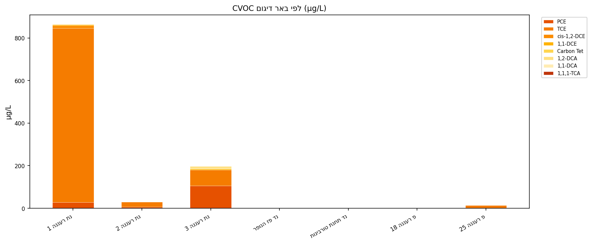**  
**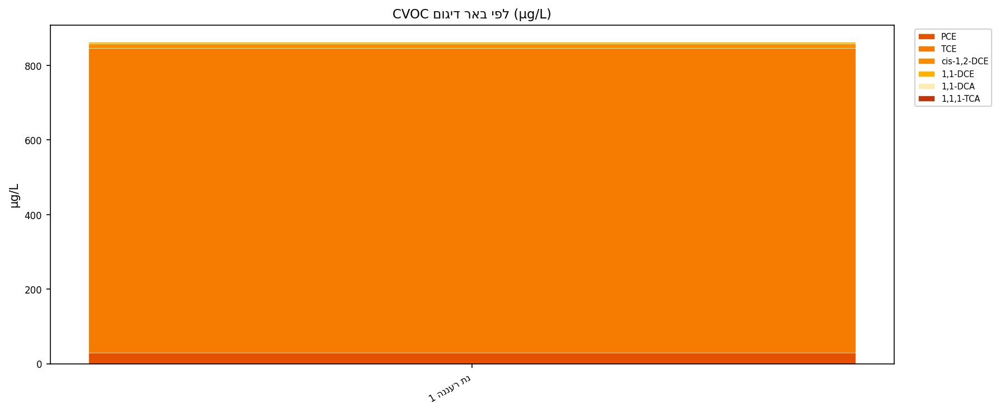**  
**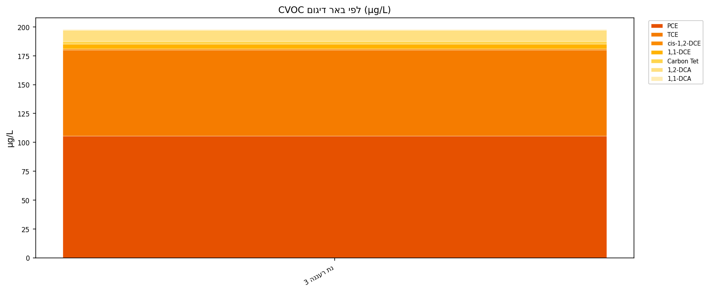**

---

### 3.2 PFAS (פלואורוכימיקלים)

**ממצא חדש קריטי — נד תחנת טורבינות גז (יולי 2025)**

בדיגום אחד (2025-07-30) — הראשון שכלל בדיקת PFAS בתחנה — נמצאו:

| מין | ריכוז (µg/L) | תקן מי שתיה (µg/L) | אחוז מתקן |
|-----|-------------|---------------------|------------|
| PFHxS | 1.160 | 0.1 | **1,160%** |
| PFOA | 0.524 | 0.1 | **524%** |
| PFHxA | 0.159 | 0.1 | **159%** |
| PFPeA | 0.133 | 0.1 | **133%** |
| PFBA | ~0.052 | 0.1 | **~52%** |

**חתימת המקור**: הדומיננטיות של מינים מסוג S-chain (PFHxS) ו-A-chain (PFOA) יחד — תואמת לחתימת קצף AFFF (Aqueous Film-Forming Foam) המשמש לכיבוי דלק. תחנות כוח/טורבינות ידועות כמשתמשות בקצף זה.

**TPFAS (סכום כולל) — מוחרג**: ה-TPFAS הוא פרמטר מחושב (סכום המינים הבודדים) ומוחרג מהניתוח למניעת ספירה כפולה.

**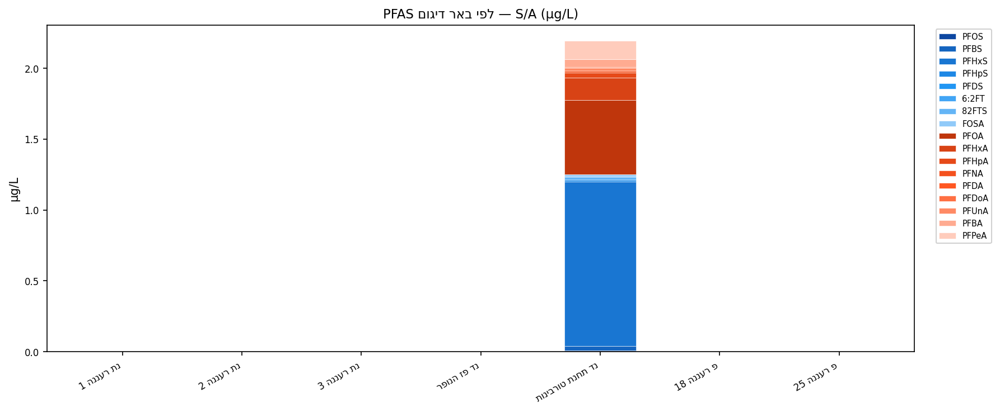**  
**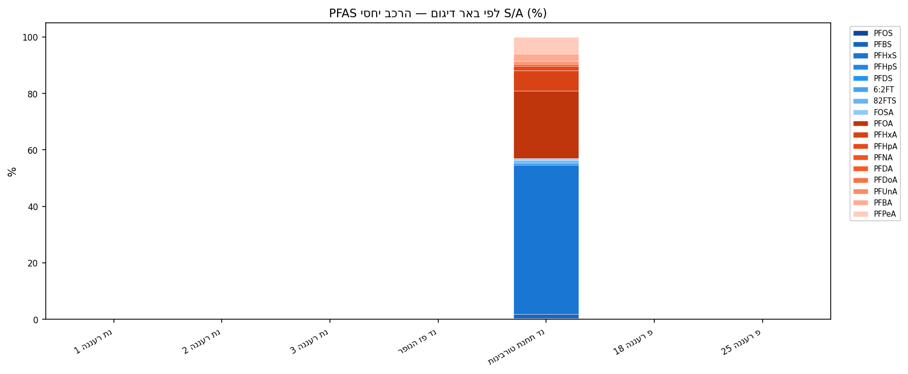**

> **מגבלה**: מדידה בודדת (n=1) — לא ניתן לחשב מגמה. נדרש דיגום חוזר מיידי.

---

### 3.3 BTEX (בנזן, טולואן, אתילבנזן, קסילן)

**נד פז הנופר — בנזן**

בנזן זוהה לאורך כל שנות הניטור (2011–2024). שיא: 10 µg/L (אוקטובר 2019) = **200% מתקן מי השתיה** (5 µg/L). בדיגום האחרון (2024): 0.6 µg/L — ירידה ניכרת מהשיא, אולם המגמה לא ידועה (SNR=0.20, מתחת לסף 0.3).

חתימת מקור: תחנת הדלק פז הסמוכה. שרשרת BTEX (בנזן + ETBN) תואמת ל-Fuel_station signature (רמת ביטחון בינונית — MEDIUM).

**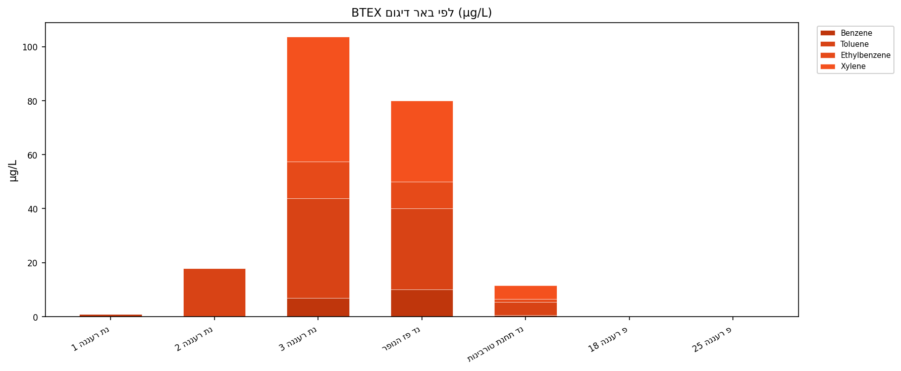**

---

### 3.4 ניטרטים (NO₃)

**פ רעננה 25 — ALERT**

NO₃ מסווג **ALERT** (MK z=7.32, p<0.001, SNR=0.57, n5=85). ריכוז אחרון: 69.1 mg/L (ינואר 2025), **קרוב לתקן 70 mg/L**. המגמה העולה המובהקת מצריכה עקב.

**פ רעננה 18**: NO₃ 166.7 mg/L (238%) — נמדד ב-2011. הקידוח לא פעיל מ-2018.

---

### 3.5 תרוכבות הלוגן-מיתן (THM)

**פ רעננה 25 — כלורופורם WATCH**

כלורופורם (CHLF) מסווג **WATCH** (MK z=2.38, p=0.017, n5=8). ריכוז אחרון: 0.5 µg/L (תקן 80 µg/L) — ריכוז נמוך בהרבה מהתקן, אולם מגמת העלייה ראויה למעקב.

**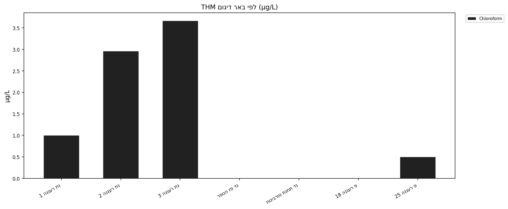**

---

## 4. ניתוח Forensics — שרשראות ריקבון ומקורות

### 4.1 שרשרת ריקבון PCE→TCE→DCE (ניתוח ריקבון תגובתי)

**נת רעננה 1, 2, 3**: בכל שלושת קידוחי הניטור מזוהים גם PCE וגם TCE, תוך שמינים ביניים (cis-1,2-DCE, 1,2-DCA) מזוהים ברמות נמוכות יחסית. מבנה זה תואם לשרשרת ריקבון אנאיוביים מסוג PCE→TCE→cis-DCE→VC:

- PCE (מקור ראשוני)
- TCE (תוצר ביניים עיקרי, מצטבר)
- cis-1,2-DCE: זוהה ב-נת רעננה (2014–2016)
- 1,2-DCA: 9.4 µg/L (235%) ב-נת רעננה 3

**פרשנות**: קיים מקור CVOC פעיל (תעשייה כימית/פרמצבטיקה) במעלה הזרימה של קידוחי נת רעננה 1 ו-3. רמות TCE גבוהות מ-PCE ב-נת רעננה 1 עשויות להצביע על מקור TCE עצמאי או על ריקבון מתקדם יותר.

### 4.2 חתימת מקור PFAS — AFFF

פרופיל PFAS בתחנת הטורבינות: S-chain דומיננטי (PFHxS) לצד A-chain (PFOA) — חתימה אופיינית ל-AFFF (קצף כיבוי תעשייתי). תחנות כוח וטורבינות נחשבות למשתמשות מרכזיות בקצף זה.

רמת ביטחון Attribution: **MEDIUM** (מדידה בודדת; נדרש אישור מדגמים נוספים).

### 4.3 חתימת מקור BTEX — תחנת דלק

בנזן ב-נד פז הנופר בלבד (לא ב-7 קידוחים אחרים): תואם לדליפה מתחנת דלק ממוקמת.

### 4.4 Co-occurrence — פרמטרים נלווים

ניתוח שיתוף הופעה (758 זוגות, ≥2 קידוחים) מגלה:
- TCE + PCE + DCE — שלישיית CVOC מרכזית (nt_1, nt_2, nt_3)
- NO₃ + Ca + Hardness — נראה כרקע גיאוכימי טבעי (p_25)
- Benzene + Turbidity (paz) — חתימת תחנת דלק

**מקור**: `Raanana/forensics/contamination_families.json`

---

## 5. ניתוח מגמות — סיכום

### 5.1 מתודולוגיה

ניתוח מגמות מבוסס:
- **Mann-Kendall** עם תיקון tie ותיקון continuity
- **SNR Gating**: SNR≥1.0 → כוח חזק; 0.3–1.0 → כוח בינוני; <0.3 → NONE
- **חלון 5 שנים** (2020+) מניע סיווג; n5≥3 נדרש לחישוב MK בחלון
- **Soft Trigger**: עלייה בשתי מדידות אחרונות בחלון → ALERT/WATCH

### 5.2 טבלת סיווגים

| קידוח | פרמטר | n | n5 | מגמה | הערות |
|-------|--------|---|----|-------|-------|
| פ רעננה 25 | NO₃ | 86 | 85 | **ALERT** | z=7.32, p<0.001, SNR=0.57 |
| פ רעננה 25 | CHLF | 11 | 8 | **WATCH** | z=2.38, p=0.017, SNR=1.50 |
| נד פז הנופר | ORP | 14 | 4 | **WATCH** | z=1.02, p=0.31, SNR=1.58 |
| נת רעננה 1 | TCE | 9 | 2 | NONE | n5 אינסופי לחלון |
| נת רעננה 3 | PCE | 9 | 2 | NONE | n5 אינסופי לחלון |
| נד תחנת טורבינות | PFOA | 1 | 1 | NONE | מדידה בודדת — crossed std ✓ |
| נד תחנת טורבינות | PFHxS | 1 | 1 | NONE | מדידה בודדת — crossed std ✓ |

**גרפי מגמה**:

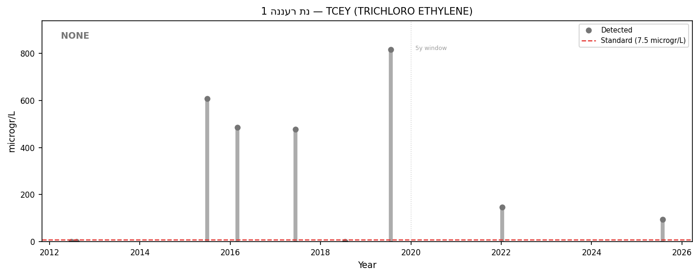
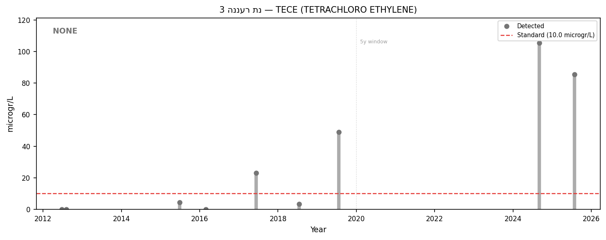
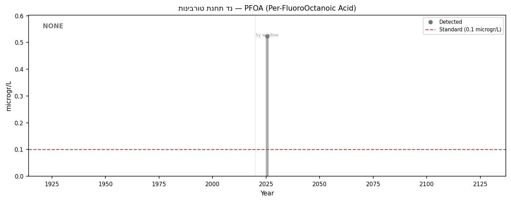
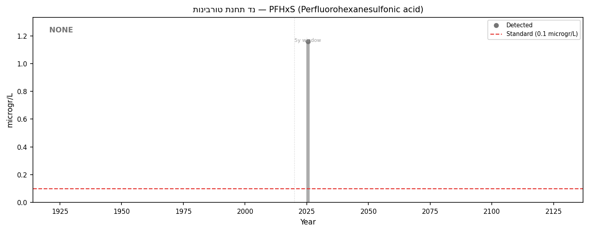
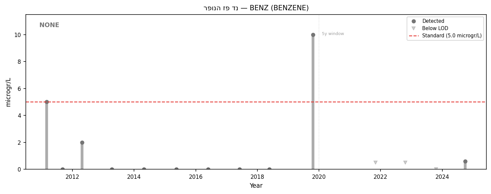
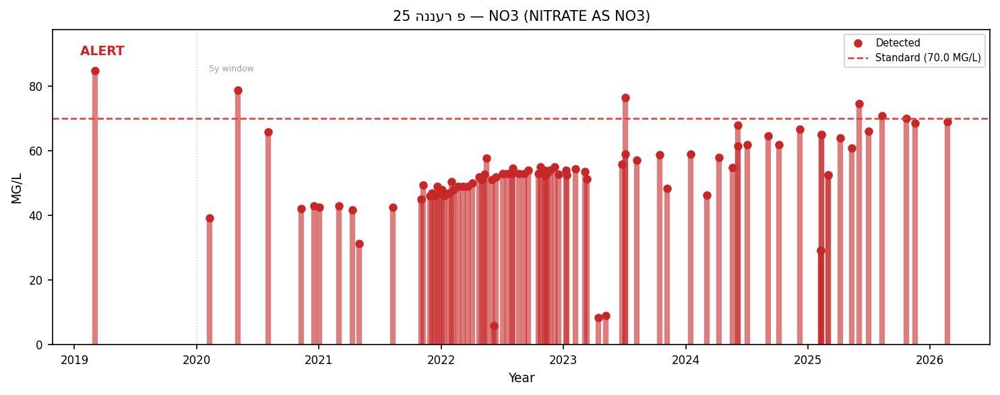

---

## 6. פערי נתונים ומגבלות

| פער | תיאור | השלכה |
|----|--------|--------|
| **PFAS — מדידה בודדת** | תחנת טורבינות נדגמה ל-PFAS פעם אחת בלבד (יולי 2025) | לא ניתן לחשב מגמה; לא ידוע מתי החל הזיהום |
| **TCE nt_1 — דיגום דליל** | רק 9 מדידות ב-13 שנה, n5=2 | MK לא אפשרי בחלון 5 שנים |
| **פ רעננה 18 — הפסקת ניטור** | אחרונה 2018; NO₃ גבוה ב-2011 | לא ידועה ההתפתחות העדכנית |
| **בורון nt_2, nt_3 (2019)** | 61–83 mg/L — חשד לשגיאת מדידה | מחייב אימות מעבדה |
| **PCE nt_3 — מגמה לא חד-משמעית** | MK full record מובהק (z=2.55, p=0.01) אך שתי אחרונות יורדות | מגמה קצרת-טווח אינה ברורה |

---

## 7. המלצות

### מיידי (2026)
1. **דיגום PFAS חוזר — תחנת טורבינות גז**: מדידה מיידית (לא לפני Q3 2026 ולא אחרי). כולל בדיקה מורחבת של פרופיל PFAS מלא. **דיווח לרגולטור** (משרד להגנת הסביבה, רשות המים).
2. **אימות חריגת בורון**: שליחת הדגימות מ-2019-07-22 לבדיקה מחודשת, או השוואה עם תיעוד שטח.
3. **הגברת תדירות דיגום nt_3**: לפחות 3 מדידות PCE ב-2026 לאפשר ניתוח MK בחלון 5 שנים.

### קצר-טווח (2026–2027)
4. **חקירת מקור TCE/PCE**: קידוחי nt_1 ו-nt_3 — זיהוי מתקן תעשייתי ספציפי כמקור ראשוני; תיאום עם משרד הגנת הסביבה.
5. **הפעלה מחדש של פ רעננה 18** (או בקידוח חלופי סמוך): לאמוד עדכניות זיהום NO₃ בצדו הדרום-מזרחי של האזור.
6. **תיחום plume TCE**: הוספת קידוח ניטור בין nt_1 ל-nt_2 לצורך אפיון מרחבי.

### ארוך-טווח (2027+)
7. **הערכת חלופות שיקום**: לאחר אישור מומחה — Pump & Treat, Enhanced Biodegradation, או Natural Attenuation עם ניטור.
8. **הרחבת ניטור PFAS** לכל קידוחי האזור: לברר האם ה-plume מוגבל לתחנת הטורבינות בלבד.

---

## 8. מטא-נתונים

| פריט | ערך |
|------|-----|
| Excel snapshot | עדכני לאפריל 2026 |
| מדידות (לאחר סינון TPFAS) | 2,613 |
| קידוחים | 7 |
| תקופת ניטור | 2011–2026 |
| גרסת קוד | parse_excel.py, preprocess.py, forensics_analyzer.py |
| ספריות מרכזיות | scipy (MK), matplotlib (גרפים), arabic_reshaper+bidi (עברית) |
| ניתוח הופק | מאי 2026 |
| מקור: דוח 2021 | עמ' 35 (טבלה 14 — רעננה), עמ' 49 (טבלה 19 — סיכום 18 אזורים) |
| מקור: TAHAL 2008 | חלק ב', עמ' 53–67 |

---

*כל הממצאים המתבססים על מדידה בודדת (PFAS) וכל ייחוס פורנזי מסומנים לאישור מומחה לפני פרסום.*
