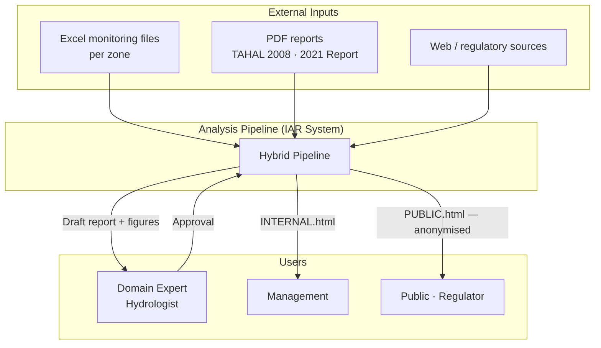
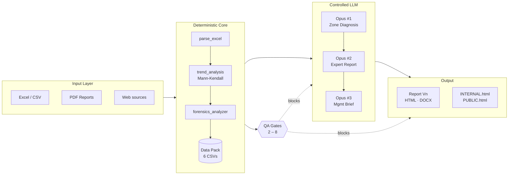
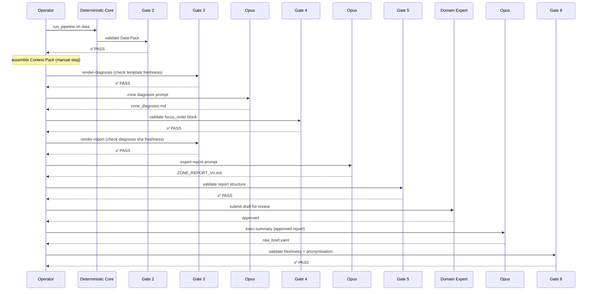
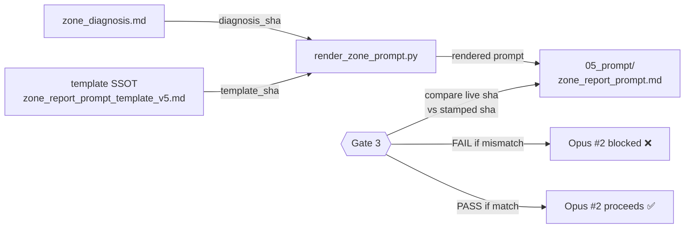

# Groundwater Contamination Analysis System — Architecture

> Technical reference · Hydrological Service · 06/2026 · `IAR/TECH/2026-01`  
> Validated on two zones (Raanana, Holon) · Generic for all 18 coastal-aquifer zones

---

## 1. Introduction and Goals

The system produces **structured expert reports on groundwater contamination** for industrial monitoring zones along the Israeli coastal aquifer. It replaces a manual, weeks-long analysis workflow with a hybrid pipeline that runs in hours and produces a draft the domain expert *edits* rather than *writes from scratch*.

### Quality Goals

| Priority | Goal | Metric |
|----------|------|--------|
| 1 | **Reproducible** — same input always yields same deterministic output | byte-identical re-runs for all non-LLM steps |
| 2 | **Auditable** — every data point traceable to source document | `source_file + page/row` on every measurement row |
| 3 | **Scalable** — one pipeline for all 18 zones | `--zone <id>` flag; no hardcoded zone logic |
| 4 | **Controllable** — LLM output blocked from publication unless QA passes | 8 blocking gates in `qa_pipeline.py` |

---

## 2. Architecture Constraints

| Constraint | Rationale |
|------------|-----------|
| Statistical calculations are **never delegated to the LLM** | Must be byte-identical, verifiable against the 2021 Water Quality Report methodology |
| Report language: **Hebrew** (RTL) | Regulatory requirement; Opus output in Hebrew |
| **Zone-generic codebase** — no zone-specific logic in scripts | Same pipeline for Raanana (7 wells) and Holon (111 wells) without branching |
| **No interpolation of missing data** | Expert decision; gaps flagged explicitly |
| **Expert must approve before publication** | System produces a draft; human remains in the loop |

---

## 3. System Context



---

## 4. Solution Strategy

Three layers, each doing what it does best, bound by an enforced contract:

| Layer | Responsibility | Why this layer |
|-------|---------------|----------------|
| **Deterministic core** | Trend analysis, severity indexing, forensics, Data Pack CSV generation | Must be exact, repeatable, verifiable — LLM cannot guarantee this |
| **Controlled LLM** (3 Opus calls) | Geographic clustering, mechanism linking, professional Hebrew narrative | Requires contextual judgment — deterministic code cannot do this |
| **QA gates** (8 blocking checks) | Enforce the contract between layers; block on any violation | LLM output is "almost right" by nature; gates make it production-safe |

**Core design principle: every step is either fully deterministic or an explicit, documented LLM boundary. No grey areas.**



---

## 5. Building Blocks

### 5.1 Input Layer

| Source | Format | Role | Future path |
|--------|--------|------|-------------|
| Monitoring measurements | Excel / CSV | Time-series of contaminant concentrations per well × parameter | Direct DB connection |
| Previous reports | PDF | Historical context, hydrogeology, prior findings | Tagged document store / RAG |
| Contamination sources | PDF / web | Facility identification, contaminant signatures | Structured candidates index |

**Isolation principle:** the input layer is isolated behind `parse_excel.py` + `extract_zone_pdfs.py`. Swapping the source (files → DB) affects only this layer; the rest of the pipeline consumes the standardised Data Pack and is source-agnostic.

**PDF idempotency:** each file is registered in `_pdf_index.json` with `extraction_ok` + timestamp. Re-runs skip already-extracted files unless `--force`.

### 5.2 Deterministic Core — Structured Data Pack

Produces **6–7 standardised CSVs** in `{Zone}/02_data/`. This is the **contract** between the deterministic layer and everything downstream (LLM + report generators). Full schema: `DATA_PIPELINE_SPEC.md`.

| CSV | Content | Key |
|-----|---------|-----|
| `measurements_scoped` | All measurements for zone wells + source (`source_file`, `page/row`) | well × parameter × date |
| `latest_results` | Most recent result per well × parameter + standard ratio + severity | well × parameter |
| `severity_by_well_family` | Severity index by **C_max_5y** (5-year window), not latest value | well × family |
| `trends_by_well_parameter` | Mann-Kendall results (Z, p, SNR, soft_trigger) | well × parameter |
| `monitoring_gaps` | Spatial / parametric coverage gaps | well / parameter |
| `figure_ready_series` | Plot-ready series (no calculation in the renderer) | well × parameter × date |

**Statistical methodology (fixed — no changes without expert approval):**

- **Trends:** Mann-Kendall (tie-corrected variance, continuity-corrected Z), SNR gating ≥ 0.3, `soft_trigger` = 2 consecutive rising values in a 5-year window. Not linear regression. Not ML.
- **Severity:** `bucket(C_max_5y / DWS × 100)`, 0–8 scale.
- **Forensics:** decay chains, source signatures, co-occurrence pairs — probabilistic, with confidence level (HIGH / MEDIUM / LOW).
- **Exclusions:** TPFAS and BETK always excluded (calculated sums). Individual PFAS species (PFHxS, PFOA…) are the canonical representation.

```bash
parse_excel.py → trend_analysis.py → forensics_analyzer.py → generate_zone_data_pack.py
# all scripts accept --zone <id>
```

### 5.3 Controlled LLM Boundaries — Three Opus Calls

| Call | Input | Output | Why LLM |
|------|-------|--------|---------|
| **#1 — Zone Diagnosis** | Data Pack + Context Pack | `zone_diagnosis.md` (8 professional questions + Focus Order table) | Geographic clustering + mechanism linking are not deterministic from CSV |
| **#2 — Expert Report** | Data Pack + diagnosis + precedent | `{ZONE}_REPORT_Vn.md` (6 chapters + appendices) | Synthesis of findings, professional narrative, RTL Hebrew |
| **#3 — Management Brief** | Approved report | `raw_brief.yaml` → management reports | Distilling a rich report into a dual-audience summary |

**Prompt derivation — critical design point**

The LLM never receives a free-form question. Every prompt is a **derived artifact** built by `render_zone_prompt.py` from the canonical template + live zone artifacts:

| Injection token | Source (SSOT) | What is injected |
|----------------|---------------|-----------------|
| `{TOTAL_ACTIVE}` · `{N_MEASUREMENTS}` · `{YEAR_*}` | `02_data/measurements_scoped.csv` | Well and measurement counts, year range — from Data Pack, never entered manually |
| `{FOCUS_ORDER_LIST}` | `## סדר מוקדים` table in `zone_diagnosis.md` | Sorted geographic foci — the inter-stage contract between diagnosis and report |
| `{TERMINOLOGY_BLOCK}` | `docs/STYLE_GUIDE.md §B.5` | Mandatory substitutions — the same SSOT that Gate 5 enforces |
| `{ZONE}` · `{PRECEDENT_ZONE}` | CLI args | Zone name, style-precedent zone |

The rendered prompt carries a provenance stamp:

```
<!-- RENDERED ARTIFACT — DO NOT EDIT BY HAND.
     Generated by scripts/render_zone_prompt.py --step report …
     template=zone_report_prompt_template_v5.md
     template_sha256_12=a1b2c3d4e5f6
     diagnosis_sha256_12=9f8e7d6c5b4a
     total_active=111  measurements=15173  years=2008-2025
     Re-run after ANY change to the template or the zone diagnosis. -->
```

The two SHA stamps are exactly what Gate 3 compares against the live SSOT files — a stale snapshot is blocked automatically.

### 5.4 QA Gates Layer

`scripts/qa_pipeline.py` runs automated gates that **block** (not warn) if any contract is violated.

| Gate | Stage checked | What is enforced | On violation |
|------|--------------|-----------------|--------------|
| Gate 2 | Data Pack | 6 CSVs present, schema valid, every row has a source, no silent gaps | **FAIL** |
| Gate 3 | Prompt layer | `template_sha` + `diagnosis_sha` match live SSOT (freshness) | **FAIL** |
| Gate 4 | Diagnosis | `## סדר מוקדים` block present, parseable, sorted by focus severity descending | **FAIL** |
| Gate 5 | Expert report | 6-chapter structure, well count consistent, terminology, focus-first order, PFAS in coverage-gaps section | **FAIL** |
| Gate 6 | HTML / Word | ≥ 80% of in-scope wells have map markers; bounds computed dynamically from data | **FAIL** |
| Gate 8 | Management reports | brief↔report sha match (freshness); facility names absent from PUBLIC version | **FAIL** |

*(Gate 7 = `--gate all` = runs all gates.)*

---

## 6. Runtime View

### 6.1 Full Execution Sequence



### 6.2 Shell Commands (Holon example)

```bash
ZONE_NAME_HE='אזה״ת חולון' scripts/run_pipeline.sh Holon data
#   parse_excel → trend_analysis → forensics → data_pack → Gate 2
# … assemble 03_context/ (manual, NotebookLM-like) …

scripts/run_pipeline.sh Holon render-diagnosis   # Gate 3 freshness check
# … OPUS #1 → zone_diagnosis.md … ; qa_pipeline --gate 4

scripts/run_pipeline.sh Holon render-report      # Gate 3 freshness check
# … OPUS #2 → HOLON_REPORT_Vn.md … ; qa_pipeline --gate 5

scripts/run_pipeline.sh Holon html               # auto-detect Vn ; Gate 6
scripts/run_pipeline.sh Holon validate           # Gate all

# … after expert approval only: …
scripts/run_pipeline.sh Holon exec-summary       # prepare → OPUS #3 → finalize → Gate 8
```

**Opus boundaries** (cannot be automated): `render-diagnosis` → #1, `render-report` → #2, `exec-summary` → #3. The driver halts at each and waits for the human-in-the-loop Opus invocation.

---

## 7. Crosscutting Concepts

### 7.1 Staleness Contracts — Two Documented Footguns



1. **`diagnosis → prompt` (Gate 3):** Re-running Step 4 (zone diagnosis) without re-rendering the report prompt causes Opus to consume a stale `focus_order` snapshot. **Enforced:** the prompt stamps `diagnosis_sha256_12`; Gate 3 compares against the live diagnosis file.

2. **`report → brief` (Gate 8):** Modifying the source report without refreshing the brief causes stale management outputs to circulate. **Enforced:** the brief carries `source_report_sha256_12`; Gate 8 compares against the latest report.

### 7.2 Anonymisation Enforcement (Gate 8)

The PUBLIC version is scanned against a blocklist (`sources[].name_internal`):

| Finding | Result |
|---------|--------|
| Facility name in PUBLIC | **FAIL** — blocks publication |
| Real borehole name in PUBLIC | **WARN** — recommend code B-NN; approved exceptions permitted |

This eliminates reliance on human memory for information security.

### 7.3 Audit Trail

Every artifact carries full provenance:

| Artifact | Provenance stamp |
|----------|-----------------|
| Every measurement row | `source_file + page/row` |
| Every rendered prompt | `template_sha256_12` + `diagnosis_sha256_12` |
| Every report version | `V-number` |
| Every generated file | `DO NOT EDIT BY HAND` header |

### 7.4 Zone-Genericity

All scripts accept `--zone <id>` and derive all paths from the zone name. Validated on Raanana (7 wells) and Holon (111 wells). Gate 6 threshold is zone-relative (≥ 80% of in-scope wells), not a fixed constant. Map bounds are computed dynamically from ITM coordinates, not hardcoded.

**Known `--zone` casing convention debt (REQ #28):** core scripts accept lowercase (`--zone holon`); V5 tools accept title-case (`--zone Holon`). Documented in `ORCHESTRATION.md`.

---

## 8. Architecture Decisions

### ADR-001 · Hybrid approach — not all-deterministic, not all-LLM

**Context:** Producing a professional contamination analysis report requires both exact numerical computation (trend statistics, severity indices) and contextual judgment (geographic clustering, narrative synthesis).

**Decision:** Strict separation. The deterministic core handles everything that must be reproducible; the LLM handles everything that requires judgment. No mixing.

**Consequences:**
- ✅ Full audit trail possible for every number
- ✅ LLM output is bounded and constrained by deterministic inputs
- ✅ LLM failures are localised to documented boundaries
- ⚠ More complex architecture than a pure-LLM approach
- ⚠ Requires maintained templates, gate logic, and rendering scripts

---

### ADR-002 · Prompt as derived artifact, not hand-edited file

**Context:** A rendered prompt is a *materialized copy* of a template. It drifts silently from the SSOT unless actively managed. A stale prompt causes the LLM to produce a report that does not reflect the current zone diagnosis — without any visible error.

**Decision:** Prompts are never hand-edited. They are generated by `render_zone_prompt.py` from the canonical template + live zone artifacts. Staleness is detected at Gate 3 via SHA comparison.

**Consequences:**
- ✅ Prompt drift is structurally impossible
- ✅ Template changes propagate automatically on next render
- ✅ Provenance is machine-verifiable
- ⚠ Adds a mandatory rendering step before each Opus call

---

### ADR-003 · Blocking gates, not advisory warnings

**Context:** LLM output is "almost right" by nature. Advisory warnings are routinely ignored under time pressure. A report with a subtle structural defect or a stale prompt can pass human review and reach publication.

**Decision:** Gate violations are blocking FAILs that halt the pipeline. The operator cannot proceed to the next step until the contract is satisfied.

**Consequences:**
- ✅ "Almost right" cannot reach publication
- ✅ Forces explicit acknowledgement of every quality issue
- ✅ Provides a clear, auditable go/no-go record
- ⚠ Requires disciplined gate implementation to avoid false positives

---

## 9. Risks and Technical Debt

| Item | Status | Component |
|------|--------|-----------|
| Direct DB connection | Planned | Input layer (§5.1) |
| RAG over document store | Deferred (documented) | Context Pack assembly |
| OCR for scanned PDFs | Blocking data gap (TAHAL 2008) | `extract_zone_pdfs.py` |
| `--zone` casing convention unification | REQ #28 debt | `cli_common.py` + core scripts |
| Basemap tile integration | Deferred (environment blocked) | `svg_charts.py` |

### Reusable Components

The architecture is decomposable. Each component can be extracted and applied to a different domain:

| Component | Reuse beyond groundwater monitoring |
|-----------|-------------------------------------|
| Deterministic analysis engine (trend / severity) | Any environmental time-series with a regulatory standard |
| Controlled-LLM pattern (structured prompt + blocking gates) | Any repeatable classification, summarisation, or drafting task |
| Dual-audience generator (INTERNAL + PUBLIC from one source) | Any regulated output requiring a published version with anonymisation |
| QA layer (audit trail, anonymisation enforcement, staleness detection) | Any regulatory workflow where "almost right" is not acceptable |

---

## 10. Glossary

| Term | Definition |
|------|-----------|
| **Data Pack** | The 6–7 standardised CSVs in `{Zone}/02_data/` that form the deterministic-to-LLM contract |
| **Context Pack** | Manually assembled documents in `{Zone}/context_pack/03_context/` — previous reports, hydrogeology, source candidates |
| **Zone Diagnosis** | Opus call #1 output: answers to 8 structured professional questions + Focus Order table |
| **Focus Order** | Sorted list of geographic contamination foci (by focus severity, descending) — the inter-stage contract between Zone Diagnosis and Expert Report |
| **C_max_5y** | Maximum concentration over the most recent 5-year window; basis for severity indexing |
| **DWS** | Drinking Water Standard (Israeli regulatory threshold per parameter) |
| **Mann-Kendall** | Non-parametric monotonic trend test; tie-corrected variance, continuity-corrected Z |
| **SNR gating** | Signal-to-noise ratio threshold (≥ 0.3) applied before Mann-Kendall to suppress low-quality series |
| **soft_trigger** | 2 consecutive rising values in the 5-year window; supplementary trend signal (not a substitute for MK) |
| **SSOT** | Single Source of Truth — the authoritative location for a given piece of information; all derived copies must reference back |
| **Staleness contract** | SHA-based enforcement that a derived artifact matches the current version of its source |
| **PFAS** | Per- and polyfluoroalkyl substances; coverage gap in most zones (< 5% of wells monitored) |
| **CVOC** | Chlorinated Volatile Organic Compounds — dominant contaminant family in the coastal aquifer |
| **ADR** | Architecture Decision Record — a short document capturing the context, decision, and consequences of a significant architectural choice |

---

*Canonical pipeline template:* `scripts/templates/zone_report_prompt_template_v5.md`  
*Prompt rendering:* `scripts/render_zone_prompt.py`  
*Pipeline SSOT:* `ZONE_REPORT_PROCESS_GUIDE.md §VIII`  
*Execution map:* `ORCHESTRATION.md`  
*Data schema:* `DATA_PIPELINE_SPEC.md`  
*Report schema:* `REPORT_V5_SCHEMA.md`
